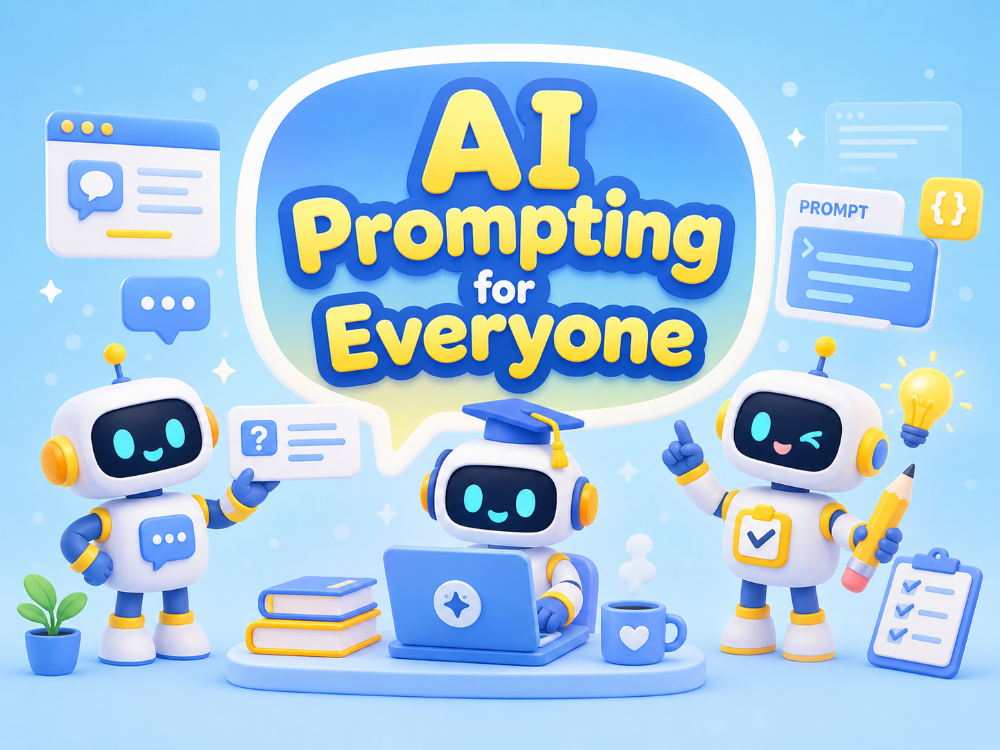

  
  <h1>agent-skills-with-anthropic</h1>

# ai-prompting-for-everyone

## 项目简介

**在线视频课程地址：** [DeepLearning.AI - ai-prompting-for-everyone](https://www.deeplearning.ai/courses/ai-prompting-for-everyone/)

本项目整理自吴恩达老师在 DeepLearning.AI 平台推出的 **AI Prompting for Everyone** 课程，主要面向中文学习者，提供课程内容翻译、知识点梳理和示例说明。

这门课程偏入门，重点不是讲复杂的模型原理，而是讲普通用户如何更好地向 AI 提问，如何把任务说清楚，如何让 AI 给出更符合需求的回答。

本项目希望把课程内容整理成更适合中文阅读的学习资料，方便大家在学习、办公、写作、编程和资料整理等场景中参考使用。

如果你正在学习 AI 提示词，或者想系统了解如何更有效地使用  ChatGPT、Gemini、Claude 等AI工具，可以从这个项目开始。

## 项目受众

- 想了解 AI 提示词基础用法的初学者；
- 希望用 AI 辅助学习、写作和资料整理的学生；
- 希望在日常办公中使用 AI 提高效率的职场人士；
- 需要借助 AI 进行选题、文案、脚本或内容整理的创作者；
- 想了解 Prompt 在产品设计、运营分析、用户研究中如何使用的产品和运营人员；
- 对 AI 工具、智能体应用和提示词设计感兴趣的开发者。

## 项目亮点

- 项目会对课程内容进行中文整理，尽量保留原课程的思路，同时使用更符合中文阅读习惯的表达，减少直接机翻带来的理解成本。

- 每一部分内容会围绕课程中的重点进行整理，包括提示词的基本写法、任务描述方式、上下文补充、输出格式控制、示例引导等内容，方便学习和复习。

- 课程中的示例会结合中文说明进行解释，包括这个 Prompt 想解决什么问题、为什么这样写、可以怎样调整，以及在实际场景中如何使用。

⭐ 欢迎 Star、Fork 与 PR，一起打造最好的 AI 学习资源！

## 项目友链

**agent-skills-with-anthropic：** 围绕 Agent Skills 的概念、使用方式、代码实践与课程内容进行翻译和梳理，帮助学习者更系统地学习 Claude Agent Skills。 （[agent-skills-with-anthropic](https://github.com/datawhalechina/agent-skills-with-anthropic)）

**agentic-ai：** 围绕智能体工作流、反思模式、工具调用和自主 Agent 构建等内容进行翻译、梳理与代码解读，帮助学习者系统掌握 Agentic AI 的核心方法与实践应用。 （[agentic-ai](https://github.com/datawhalechina/agentic-ai)）

## 项目规划

| 章节 | 负责人 | 状态 |
| --- | --- | --- |
| Module 1| 李智江 | ✅ |
| Module 2| 柴承清 | ✅ |
| Module 3| 陈辅元 | ✅ |

## 致谢

- 特别感谢 [@Datawhale](https://github.com/datawhalechina) 对本项目的支持
- 如果有任何想法可以联系我们，也欢迎大家多多提出 issue
- 特别感谢以下为教程做出贡献的同学！

  

## 关注我们

扫描下方二维码关注公众号：Datawhale

## Star History

## License

 本作品采用<a rel="license" href="http://creativecommons.org/licenses/by-nc-sa/4.0/">知识共享署名-非商业性使用-相同方式共享 4.0 国际许可协议</a>进行许可。

