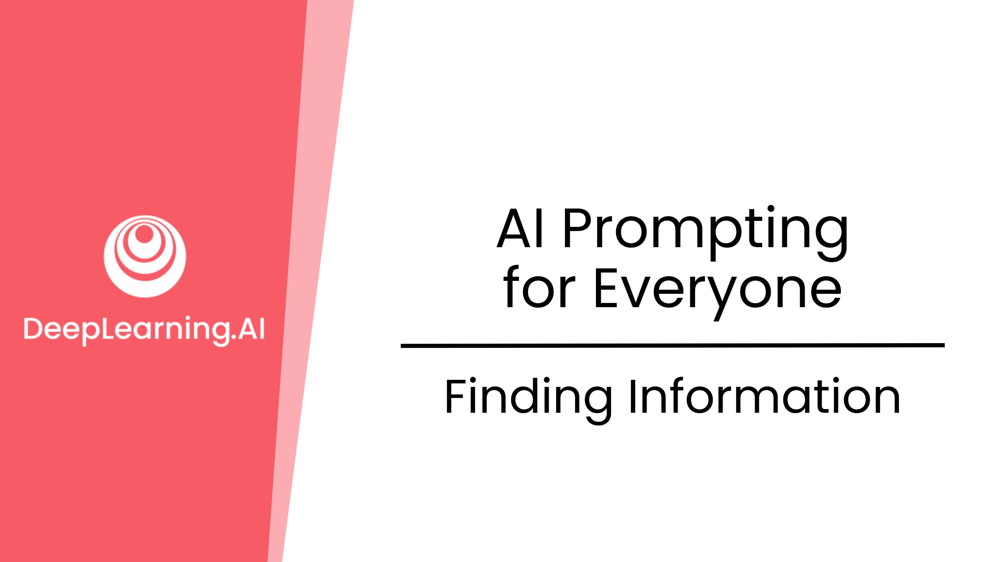
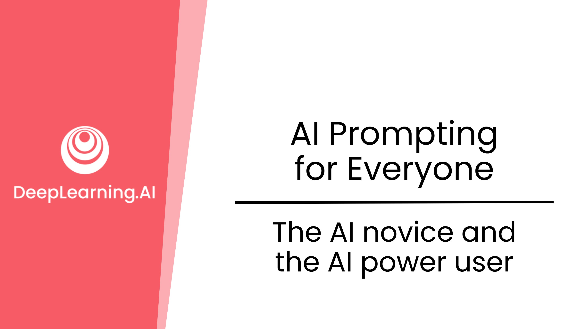
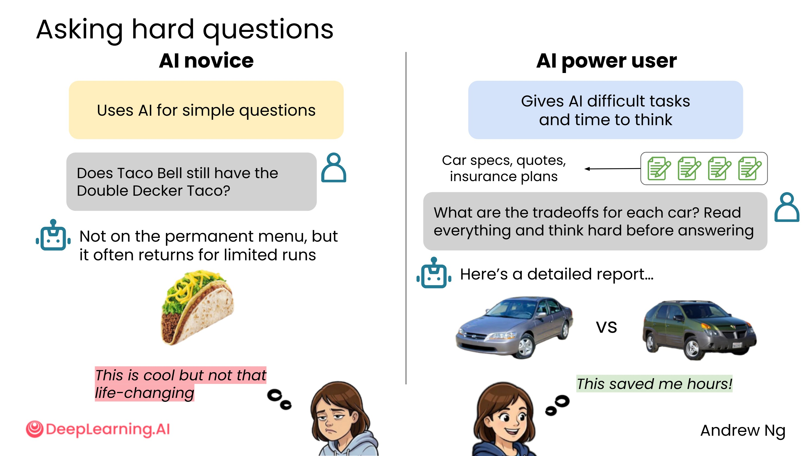
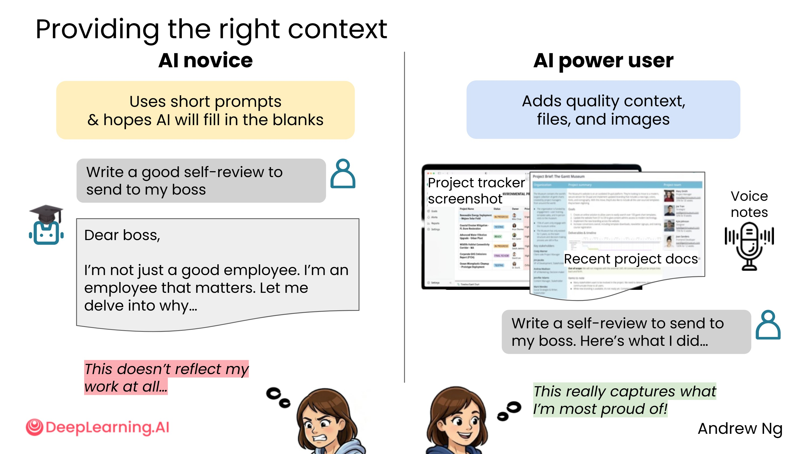
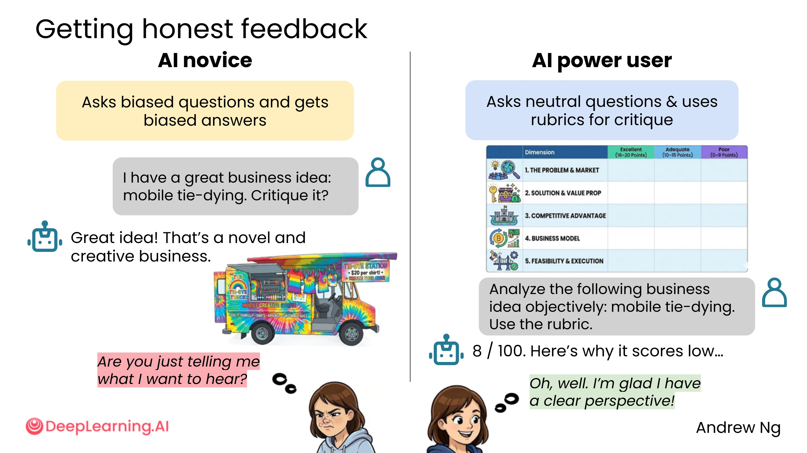
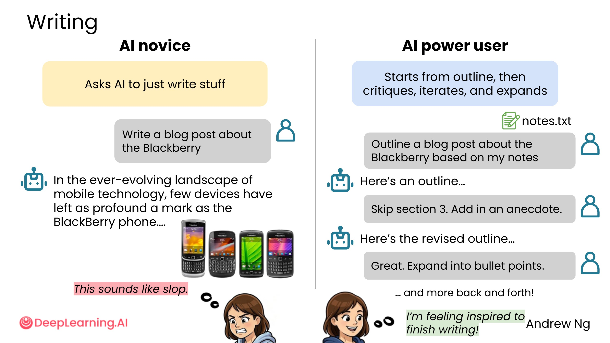
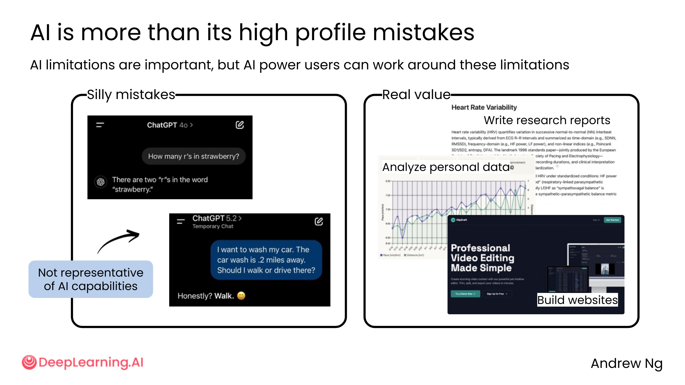
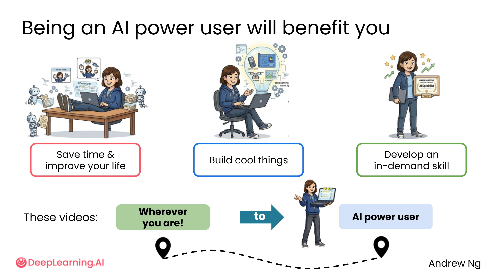

# 1.1 AI新手与AI高级用户 [The AI novice and the AI power user]

> **主题：** 了解 AI 新手与 AI 高级用户在使用方式上的核心差异，掌握让 AI 产出更高质量结果的基本思路。

现在是 2026 年，提示 AI 模型的方式与 ChatGPT 在 2022 年首次出现时已大不相同。善用 AI 是你能培养的最有影响力的技能之一，而那些还没掌握的人，在使用 AI 时经常遭遇令人沮丧的输出。

AI 新手和 AI 高级用户之间的差距，不在于智力，而在于使用方式。下面从四个维度来对比两者的不同。

>我见过挺多人在使用 AI 之后说很傻，但仔细一想，他们的提示词只有半句话。这就像雇了一个顾问，然后只告诉他"帮我做点什么"——结果当然让人失望。AI 的能力上限远比大多数人体验到的要高，真正的门槛不是技术，而是你愿不愿意认真对待这次"对话"。

---

## 差异一：提问的深度

**AI 新手** 习惯用 AI 回答简单问题，就像在谷歌搜索一样提示它。例如：

> 塔可钟还有双层塔可吗？

这类问题没什么问题，但如果你有更难的问题，也可以问 AI，并给它时间思考。

**AI 高级用户** 会把 AI 当作深度分析工具。例如，想买车时，可以上传一组文档（汽车规格、报价、保险计划），然后问：

> 这些车的权衡是什么？告诉它仔细阅读所有内容，回答前要好好思考。

这可能导致 AI 花费数秒甚至数分钟来思考，并编译出详细的分析报告，大大节省你自己做研究的时间。

>我把这种用法叫做"把 AI 当分析师用"。你不是在问它一个问题，而是在委托它完成一项任务。区别在于：问题期待一个答案，任务期待一份交付物。当你开始用"任务思维"来构建提示词，AI 的输出质量会有质的飞跃。买车分析只是一个例子——合同审查、竞品对比、职业规划，都可以用同样的方式来做。

---

## 差异二：提供上下文的多少

**AI 新手** 倾向于用简短提示，希望 AI 能帮你填补空白。例如：

> 请写一篇好的自我评价发给我的老板。

AI 并不知道你过去一年里做过什么，因为你还没告诉它。结果往往是非常普通的自我评价，没什么帮助。

**AI 高级用户** 几乎对 AI 产生了一种"同理心"——设身处地为 AI 着想：如果你是那个接到任务的人，你真的了解足够多，能做好这项任务吗？

高级用户可能会上传：

- 项目跟踪器的截图（展示你做了什么）
- 最近的项目文档
- 语音备忘录（讲解项目内容）

然后再说：写一篇自我评价发给我的老板。这样能更好地捕捉你最引以为傲的成果。

>我喜欢用一个比喻来解释这件事：你不会在第一天上班就让新同事独立完成一份重要报告，你会先给他背景、讲清楚目标、分享相关资料。对 AI 也一样。它不是搜索引擎，不会自动猜测你的处境——你给的信息越完整，它能做的事情就越接近你真正需要的。"上下文"不是可选项，它是质量的基础。

---

## 差异三：如何获得诚实反馈
AI 的一个大问题是它常常想要取悦你。许多 AI 系统被训练成试图让用户满意，如果你问带有偏见的问题，它通常会给出有偏见的回答。

**AI 新手** 可能会这样问：

> 我有个很棒的商业点子：移动扎染。批评它。

因为你说了"很棒的商业点子"，AI 自然会想取悦你，说"多么棒的主意"。这种现象有时被称为**谄媚（Sycophancy）**——即使你稍微透露了你希望得到的答案，AI 很可能只是反映并支持你的偏好。

**AI 高级用户** 倾向于提出中立问题，不给 AI 任何暗示。或者给它一个评分标准，告诉 AI 如何形成答案的基础，迫使它更加客观。例如：

> 请客观地分析以下商业理念：移动扎染。使用以下评分标准：有问题吗？有市场吗？我有竞争优势吗？

这样 AI 不知道你是希望它告诉你这是个好主意，还是希望它帮你避免在糟糕的点子上浪费时间。结果更可能是客观的评分，比如"这个想法是 8 分（满分 100 分）"，并说明原因。

>谄媚是 AI 最容易被忽视的缺陷之一。很多人用 AI 验证自己的想法，却不知道 AI 其实在"迎合"他们。我的建议是：每当你想让 AI 评价你自己的东西时，先把"我觉得这很好"这类话从提示词里删掉，换成中立的描述。更进一步，可以明确告诉 AI："不要顾及我的感受，我需要的是真实的分析，哪怕结论是否定的。"这一句话，往往能让输出质量大幅提升。

---

## 差异四：写作工作流程

**AI 新手** 只会让 AI 直接写，例如：

> 写一篇关于黑莓的博客文章。

AI 会生成一堆普通文本，听起来像 AI 写的，没什么意思，而且占用大量空间。

**AI 高级用户** 通常不会直接让 AI 写，而是先让 AI 做大纲，批评大纲，迭代几次，只有在大纲满意之后，才让 AI 开始起草最终文章。

典型工作流程如下：

1. 上传笔记作为背景，让 AI 根据笔记写博客大纲
2. 给 AI 反馈你喜欢和不喜欢大纲的哪些方面
3. 经过几轮来回，确认大纲满意
4. 将大纲扩展成要点
5. 批评要点，再次迭代
6. 将要点扩展成最终文本

这种工作流程更有可能生成你满意的文本，而不是 AI 的"烂泥"。在这种工作流程中，你把 AI 当作思考伙伴，帮你头脑风暴，探索你想写的各种选项。

>这个工作流程背后有一个更深的道理：写作的本质是思考，而不是打字。当你让 AI 先出大纲，你其实是在用 AI 帮你"想清楚"——哪些内容值得写，哪些顺序更合理，哪些角度你没想到。很多人跳过这一步，直接要成品，结果拿到一篇结构混乱的文章，再花大量时间修改。倒不如一开始就慢下来，把结构做对，后面反而更快。这个原则不只适用于写作，做方案、做决策、做产品规划，都一样。

---

## 关于 AI 犯错的误解

AI 系统确实会犯错，但可能比大多数人想象的要少，尤其是当你主动提示时。它们在 2022 年或 2023 年犯的错误比现在多得多。

一些广为流传的 AI 错误案例（如"strawberry 有几个 R"、"我想洗车，应该步行还是开车去"）在社交媒体上迅速传播，让人们觉得 AI 可能犯的错误比实际还多。这些病毒式传播的例子并不代表 AI 的整体能力。

相比之下，AI 高级用户知道 AI 能在以下任务中带来显著价值：

- 进行深入研究、撰写研究报告
- 分析个人数据（如健康状况、心率、跑步时间）
- 为你搭建网站或原型

>我见过太多人因为早期的几次糟糕体验就放弃了 AI。但那些体验往往不是 AI 的问题，而是提示方式的问题。AI 的能力在过去几年里提升了很多，但更重要的是：你的提示方式决定了你能解锁多少能力。那些病毒式传播的"AI 犯蠢"截图，大多数是在刻意构造边缘情况，或者用了极其糟糕的提示词。不要让这些噪音影响你对 AI 真实能力的判断。

---

## 小结

AI 高级用户与新手的核心差距在于：

| 维度 | AI 新手 | AI 高级用户 |
| --- | --- | --- |
| 提问深度 | 简单搜索式提问 | 上传文档，要求深度分析 |
| 上下文 | 简短提示，期待 AI 填空 | 提供充分背景，让 AI 有足够信息 |
| 获取反馈 | 带偏见的提问，得到谄媚回答 | 中立提问或给出评分标准 |
| 写作流程 | 直接让 AI 写 | 先大纲，再迭代，最后成文 |

能够以专家级水平提示 AI 是一项非常抢手的工作技能，无论你从事什么岗位。接下来的内容将帮助你从今天的起点，成长为 AI 高级用户。

>学会用 AI 不是一件一蹴而就的事，但它的学习曲线比大多数技能都平缓。你不需要懂技术，不需要会编程，你只需要学会"好好说话"——清楚地表达你想要什么、你是谁、你有什么背景。这门课接下来要教的，本质上就是这件事。

---

