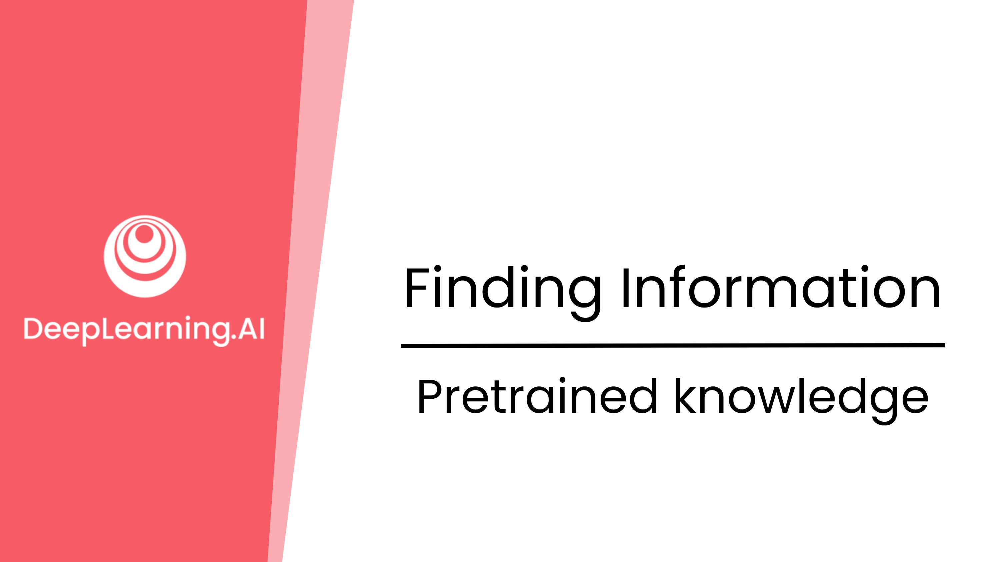
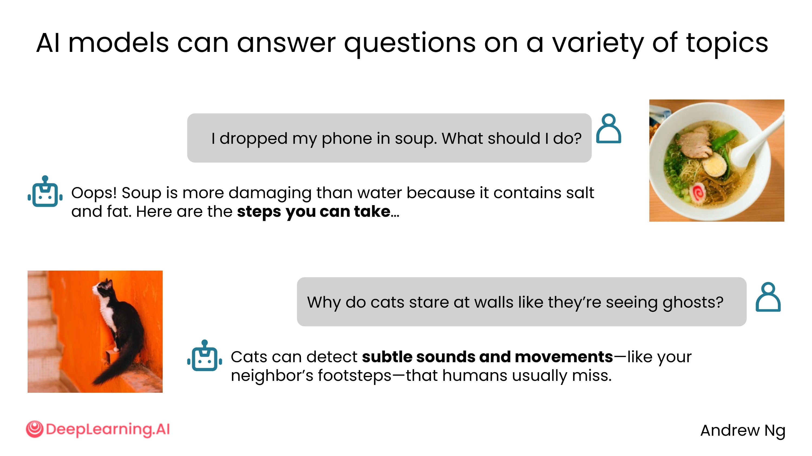
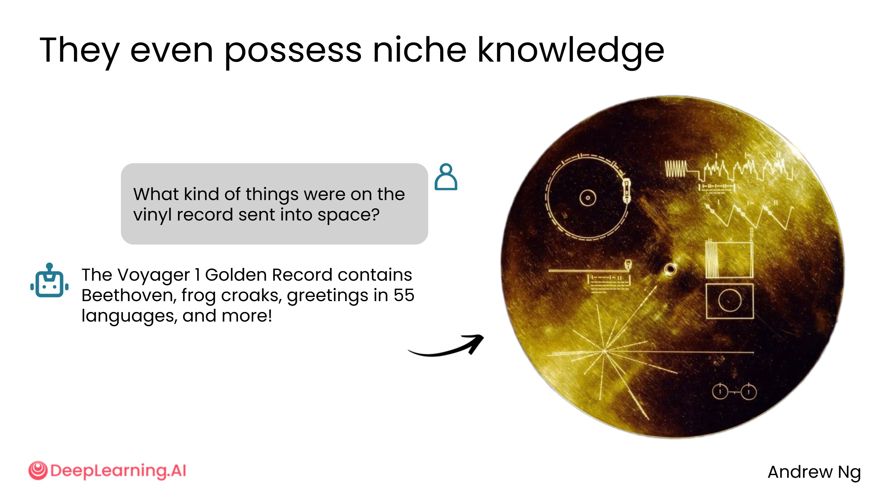
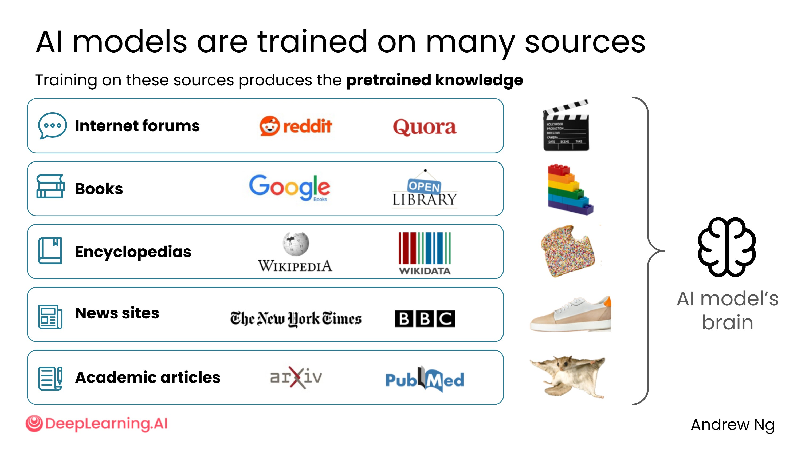
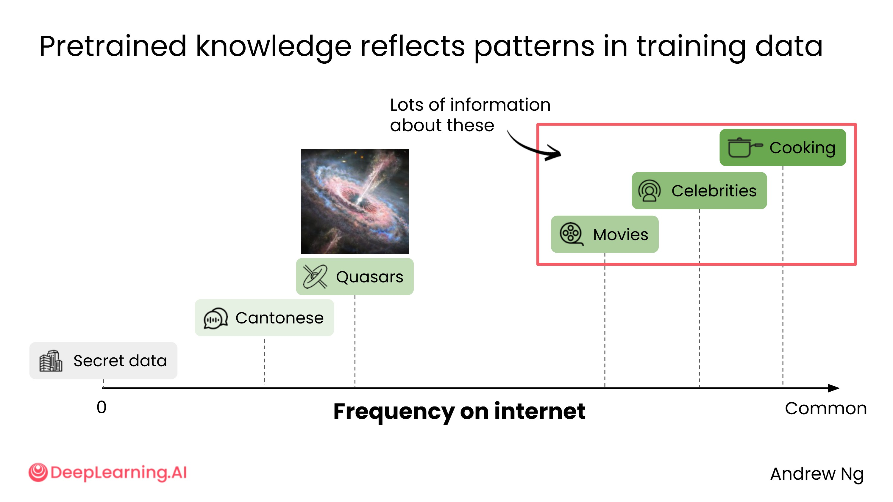
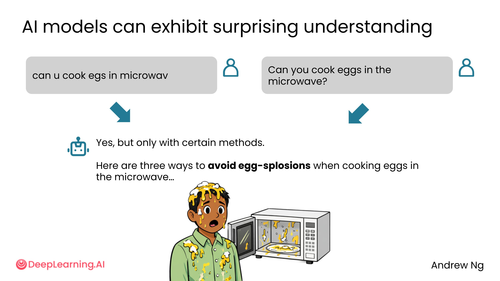
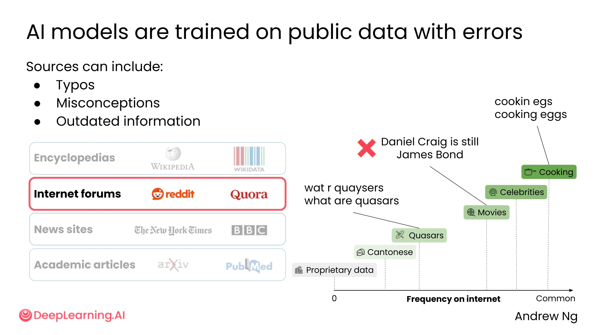

# 1.2 预训练知识（Pretrained Knowledge）

## 什么是预训练知识？

你小时候是怎么学会写作的？大概是通过大量阅读。

AI 也是一样——AI 系统通过阅读来自互联网的海量文本，学习其中的语言模式。理解 AI 读过哪些内容，能帮助你更好地预测它的行为。

AI 模型可以回答各种各样的问题，例如：

- "我把手机掉进汤里了，该怎么办？"
- "为什么猫会盯着墙看，好像在看鬼一样？"（原来猫能感知人类察觉不到的细微声音和动静）
- "发射到太空的那张黑胶唱片上录了什么？"（NASA 的旅行者 1 号飞船，1970 年代发射，如今距地球约 250 亿英里，唱片上收录了 55 种语言的问候语）

---

## AI 的知识来源

AI 模型从多种多样的来源中学习，主要包括：

| 来源类型 | 示例 |
|----------|------|
| 社交媒体与论坛 | Reddit、Quora 等 |
| 书籍 | 各类出版物 |
| 百科全书 | Wikipedia 等 |
| 新闻网站 | 各大媒体 |
| 学术研究文章 | 论文、期刊 |
| 其他互联网内容 | 博客、网页等 |

这些来源合计包含数万亿甚至数十万亿个词，共同构成了 AI 模型的"大脑"。

---

## 知识频率与可靠性

互联网上不同类型的内容出现频率不同，AI 的预训练知识也因此反映了这种分布规律。

**知识丰富的领域（互联网内容多）：**

- 烹饪（普遍的人类经验，相关文章极多）
- 娱乐、电影、名人

**知识相对有限的领域（互联网内容少）：**

- 专业术语，如"类星体"（quasar）——由超大质量黑洞驱动的极亮天体，相关文章远少于烹饪类内容

**语言分布：**

- 互联网内容以英语为主
- 其他语言如粤语（全球超过 8000 万人使用）的内容占比不足 0.1%

**AI 完全不了解的内容：**

- 你公司的私有数据、内部文件等未公开在互联网上的信息

> **实用规则：** 某类信息在互联网上出现的频率越高，AI 对该话题的回答通常越可靠。

---

## AI 对拼写错误的容忍度

由于 AI 从包含大量拼写错误的互联网内容中学习，它对错别字有很强的理解能力。例如：

- `can you cook eggs in microwave`（有拼写错误）
- `can you cook eggs in the microwave`（标准写法）

两者对 AI 来说几乎没有区别。因此，使用 AI 时不必花太多时间纠正每一个语法错误，快速输入即可。

---

## 预训练知识的局限性

预训练知识并非万能，主要存在以下局限：

1. **包含误解和过时信息**：互联网上本身存在大量错误内容，AI 也会从中学习
2. **缺乏实时信息**：预训练知识有截止日期，无法获取最新动态

掌握如何提示 AI 以减少误解、避免过时信息，是使用 AI 的重要技能之一。

---

## 小结

- AI 的预训练知识来自互联网上的海量文本
- 知识的可靠性与该话题在互联网上的内容丰富程度正相关
- AI 对拼写错误有较强容忍度，无需过度纠正
- 预训练知识不包含私有数据，也不具备实时信息能力
- 对于需要实时信息的场景，需要结合**网络搜索**功能使用

下一节将介绍如何通过网络搜索弥补预训练知识的不足。

---

预训练知识这个概念，让我想到一个很贴切的比喻：AI 就像一个博览群书、见多识广的人，但他在某个时间点之后就与世隔绝了，不再接触新信息。他能流利地谈论历史、科学、文化，但对昨天发生的事一无所知。

有几点值得特别关注：

**"互联网偏见"问题**：AI 的知识分布并不均匀，它更擅长英语、更了解西方文化、更熟悉热门话题。这意味着当你用中文问一个小众的本地问题时，AI 的回答质量可能远不如用英文问一个全球性话题。这不是 AI 的"错"，而是训练数据本身的结构性偏差。

**拼写容忍度的背后逻辑**：AI 之所以能理解错别字，是因为它见过无数人犯同样的错误——这其实是一种"群体智慧"的体现。但这也意味着，如果某个错误写法在互联网上极为普遍，AI 可能会把错的当成对的。

**私有数据的边界**：公司内部文档、个人日记、未发布的代码——这些 AI 完全不知道。这既是隐私保护的优点，也是使用 AI 处理专业工作时需要额外补充上下文的原因。在实际工作中，我们往往需要把相关背景信息"喂给"AI，才能得到真正有用的答案。
