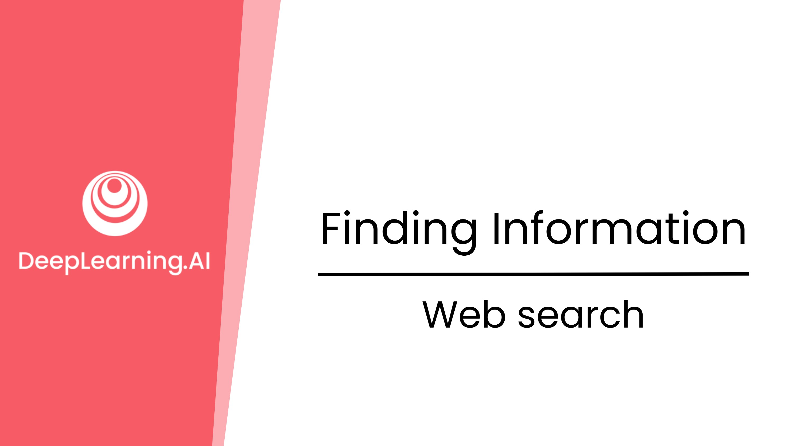
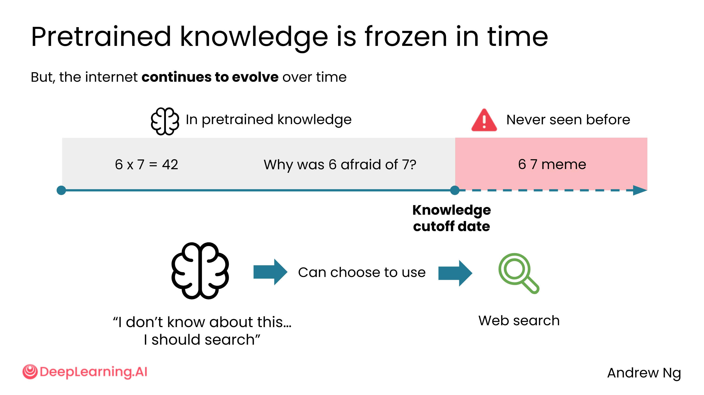
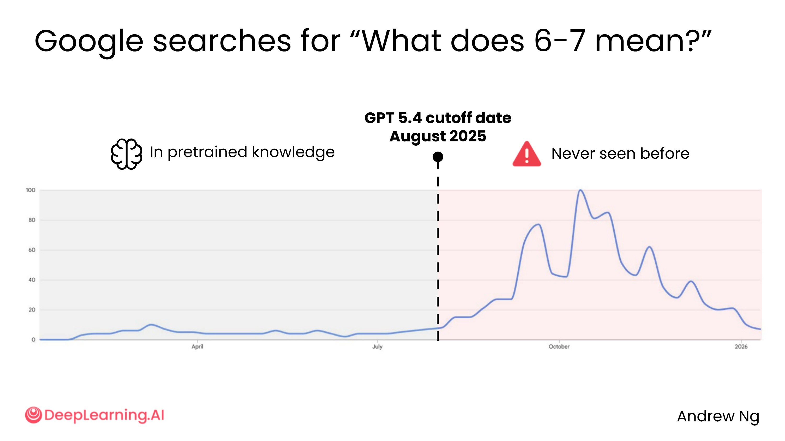
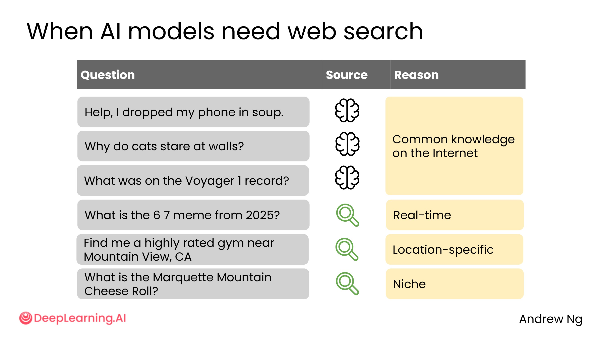

# 1.3 网络搜索

## 知识截止日期

AI 模型的训练在某个时间点停止，因此它的知识存在一个"截止日期"——也就是说，AI 只读取了截止日期之前的互联网内容，之后它的知识便被冻结在那个时间点上。

但世界不会停止运转，新的事件不断发生，新的电影上映，新的梗图诞生……

## 网络搜索的触发

以"6 7 梗"为例：如果你问 AI"2025 年的 6 7 梗是什么"，它很可能会主动进行网络搜索，然后告诉你这是一个在多个社交媒体平台上广泛流传的网络流行语。

触发网络搜索的关键在于提示词中的"2025"——这让 AI 意识到，这条信息可能出现在它的知识截止日期之后，因此需要从网络获取更新的内容。

**举例说明：**

- GPT-4.5 模型的知识截止日期是 2025 年 8 月
- "6 7 梗"的搜索热度在该截止日期之后才开始爆发

- 因此，该模型对这个梗并不了解，需要借助网络搜索来回答

## 哪些问题会触发网络搜索？

| 类型 | 示例 | 是否触发搜索 |
| --- | --- | --- |
| 通用常识 | 手机掉进汤里怎么办？ | 通常不触发 |
| 通用常识 | 猫为什么盯着墙看？ | 通常不触发 |
| 历史知识 | 旅行者 1 号金唱片上有什么？ | 通常不触发 |
| 实时信息 | 最近发生了什么新闻？ | 触发搜索 |
| 位置信息 | 山景城附近评分最高的健身房？ | 触发搜索 |
| 小众信息 | 马凯特山奶酪滚坡赛是什么？ | 触发搜索 |

> 马凯特山奶酪滚坡赛是一项有趣的活动——参与者追着一个滚下山坡的奶酪轮子跑。

## 触发网络搜索的两种方式

1. **AI 自动判断**：模型识别到问题可能需要实时或小众信息，自动发起搜索
2. **用户主动触发**：
   - 点击 AI 界面中的搜索按钮
   - 在提示词中明确写出"请搜索网络"或"请联网查询"

> 注意：并非所有 AI 模型都支持网络搜索，但目前主流的 AI 产品（如 ChatGPT、Gemini、Claude）大多已具备这一能力。

## 网络搜索的局限性

网络搜索能让 AI 用更新的信息来补充其预训练知识，从而在许多任务上表现更好。

但和普通网络搜索一样，它也可能返回**不可靠的来源**。

因此，在使用 AI 进行网络搜索时，需要注意：

- 引导 AI 使用更权威、更可靠的信息来源
- 对搜索结果保持批判性思维
- 必要时核实 AI 给出的信息

---

网络搜索功能让 AI 从"百科全书"升级成了"实时记者"，但这个升级并不是无代价的。

**关于"年份触发"的技巧**：文中提到在提示词里加上年份（如"2025 年"）可以触发网络搜索，这是一个很实用的小技巧。更广泛地说，任何暗示"时效性"的词语都能起到类似效果，比如"最新的"、"现在"、"今年"、"近期"等。养成这个习惯，能让 AI 主动去获取更新的信息，而不是依赖可能已经过时的预训练知识。

**AI 搜索 vs. 自己搜索**：两者最大的区别在于，AI 会帮你"消化"搜索结果，而不是把一堆链接甩给你。这在需要综合多个来源时特别有价值——但也意味着你看不到原始信息，AI 的"消化"过程可能引入偏差或遗漏细节。

**一个反直觉的现象**：有时候，不触发网络搜索反而更好。如果你问的是一个经典的、稳定的知识点（比如某个数学定理或历史事件），预训练知识往往比网络搜索更可靠——因为网络上可能充斥着质量参差不齐的二手解读，而 AI 的预训练知识来自大量高质量文本的综合提炼。
