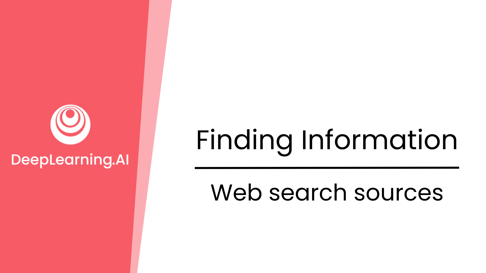
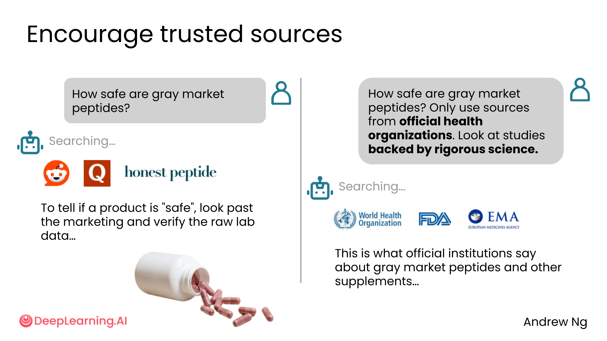
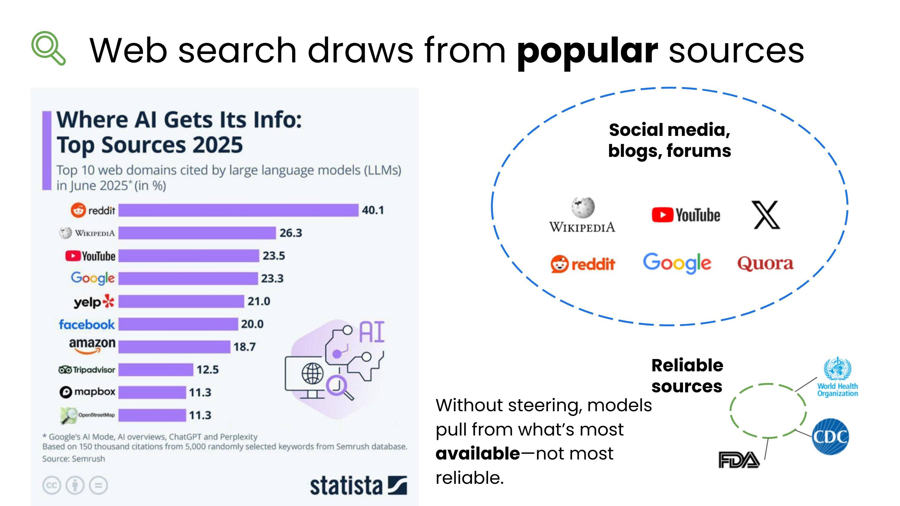
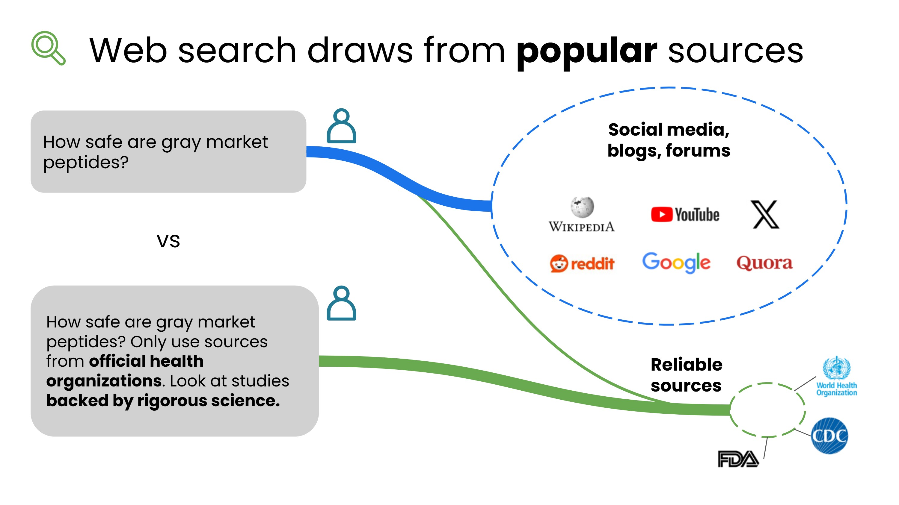
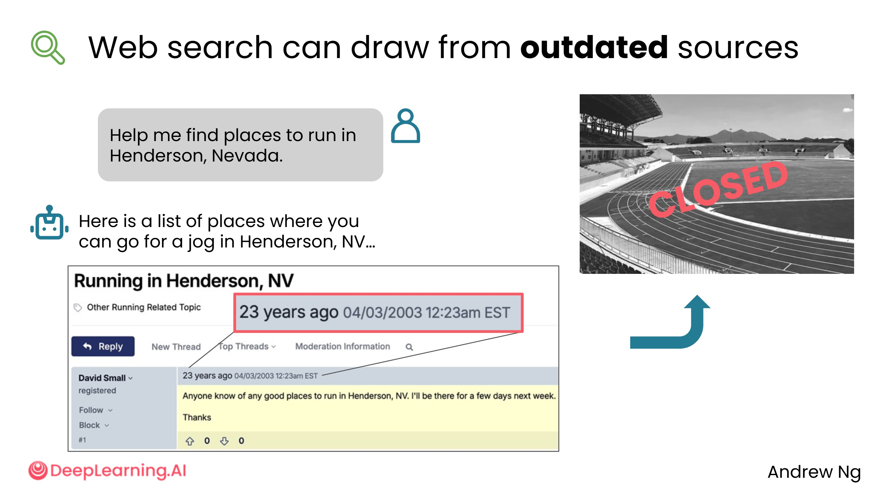
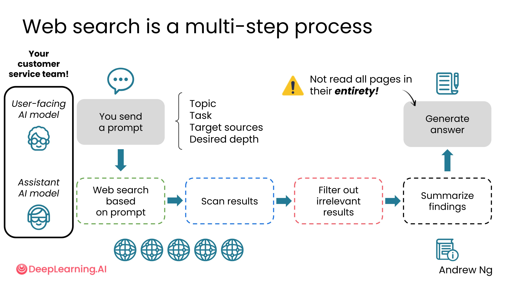
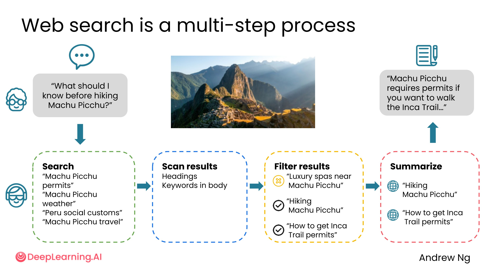

# 1.4 网络搜索的来源与局限

## 网络搜索并不完美

网络搜索是一个非常有价值但并不完美的工具。就像你自己搜索网络时，不一定总能找到想要的内容——它同样存在找到过时或不准确来源的局限性。

但你可以通过一些方法绕过这些局限，让 AI 给出更准确、更新的答案。

## 来源质量的问题

以"绿色市场肽类补充剂是否安全"为例，AI 可能会搜索到：

- 社交媒体帖子
- Reddit、Quora 等公共论坛
- 销售肽类产品的商业网站（这类网站有倾向性地声称产品安全）

这些来源的可靠性参差不齐。

**更好的做法**：引导 AI 使用来自官方机构的来源，例如：

- 世界卫生组织（WHO）
- 美国食品药品监督管理局（FDA）
- 欧洲药品管理局（EMA）

这样更有可能获得可靠、有科学依据的答案。

## 为什么 AI 倾向于引用热门来源？

根据一份报告，AI 模型引用最多的网站依次是：

1. Reddit
2. Wikipedia
3. YouTube
4. Google
5. Yelp

互联网上来自社交媒体、博客、论坛的文本数量庞大，而来自高度可靠、经过科学验证的来源的文本相对较少。

如果你不指定偏好的来源类型，AI 往往会倾向于引用数量最多的内容，而不是最可靠的内容。

**结论**：在提示词中明确要求使用权威来源，可以显著提升答案质量。

## 网页过时的问题

网络搜索的另一个局限是：网页内容可能已经过时。

**真实案例**：有人让 AI 推荐内华达州亨德森市的跑步地点。这是一个位置相关的小众查询，触发了网络搜索。AI 给出了一份地点列表，但其中一个推荐地点来自二十多年前的网页——那是一所学校，如今已不再对公众开放。

## 网络搜索的工作原理

理解 AI 如何进行网络搜索，有助于更好地使用它。整个过程可以类比为一个两人客服团队：

**重要提示**：用户端 AI 模型并没有完整阅读它所引用的网页，它只看到了这些网页的摘要。这就是为什么有时 AI 引用某个网页作为依据，但你实际去看那个网页，会发现内容并不支持 AI 的结论。

**示例**：如果你问"徒步马丘比丘前需要了解什么"，助手模型可能会搜索：

- "马丘比丘许可证"
- "马丘比丘天气"
- "马丘比丘社交礼仪"

然后筛选结果、摘要最相关的网页，再由用户端模型生成最终答案。

## AI 模型 vs. 搜索引擎：如何选择？

| 场景 | 推荐工具 |
| --- | --- |
| 快速浏览多个来源 | 搜索引擎 |
| 找到某个忘记名字的网站 | 搜索引擎 |
| 查看原始数据（如购买特定商品） | 搜索引擎 |
| 综合多个来源的信息 | AI 模型 |
| 分析复杂问题的利弊 | AI 模型 |
| 对比多个来源得出结论 | AI 模型 |

## 好习惯同样适用

你在使用 Google 等搜索引擎时养成的好习惯，在使用支持网络搜索的 AI 模型时同样有效：

- 关注来源的可靠性
- 对结果进行二次核实

## 下一步：深度研究

如果你想超越搜索几个网页的范畴，AI 模型还具备一种更强大的能力——**深度研究（Deep Research）**。这是一个被很多人低估的强大功能，下一节我们将介绍它是什么，以及何时、如何使用它。

---

这一节揭示了一个很多人没意识到的问题：AI 的网络搜索并不是"读完整篇文章"，而是基于摘要来回答。这个细节非常重要。

**"摘要陷阱"**：AI 引用了某个网页，但实际上只看了摘要——这就像一个学生引用了一本书，但只读了封底简介。结论可能是对的，也可能完全偏离原文的意思。当 AI 给出的信息对你很重要时，最好点进原始链接自己确认一下。

**为什么 Reddit 排第一？**：AI 引用最多的是 Reddit，这其实很合理——Reddit 上有大量真实用户的第一手经验，覆盖话题极广，而且内容往往比官方文档更"接地气"。但问题在于，Reddit 上的信息没有经过专业审核，质量差异极大。一个高赞回答不等于正确答案。

**主动指定来源是一种"提示词技巧"**：与其让 AI 自由发挥去找来源，不如直接告诉它"请参考 WHO 或 FDA 的官方信息"。这个小改动能显著提升答案的可信度，尤其是在医疗、法律、金融等高风险领域。把这个习惯固化到你的提示词模板里，是很值得的投资。

**搜索引擎和 AI 的分工**：两者不是竞争关系，而是互补的。当你需要"找到某个具体的东西"时，搜索引擎更直接；当你需要"理解某个复杂问题"时，AI 更擅长综合和解释。学会在两者之间切换，是现代信息获取的核心技能。
