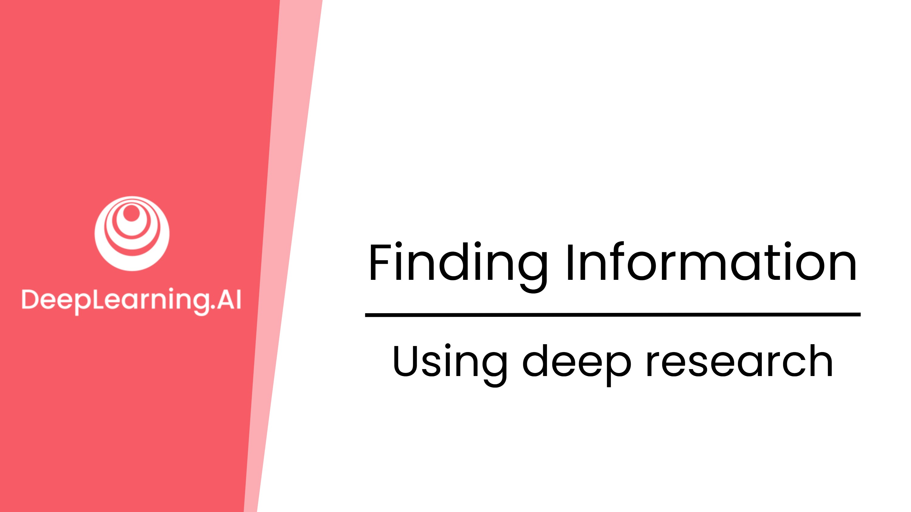
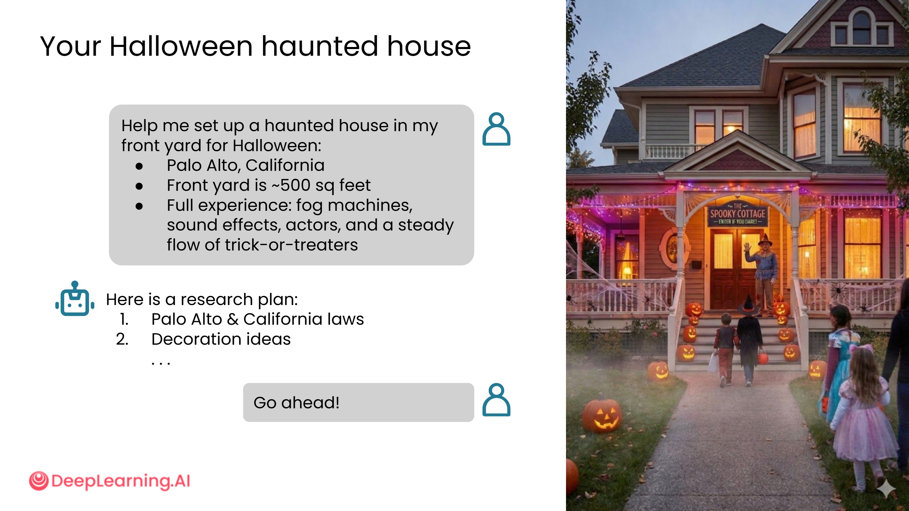
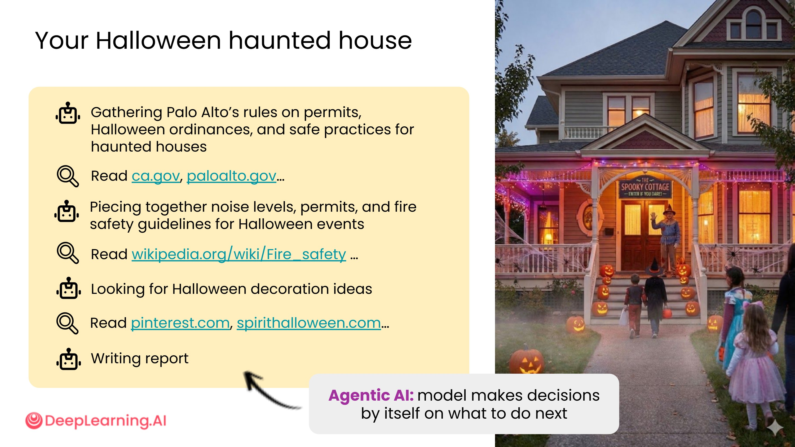
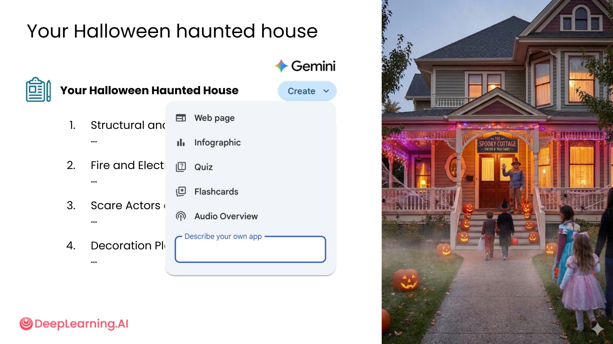
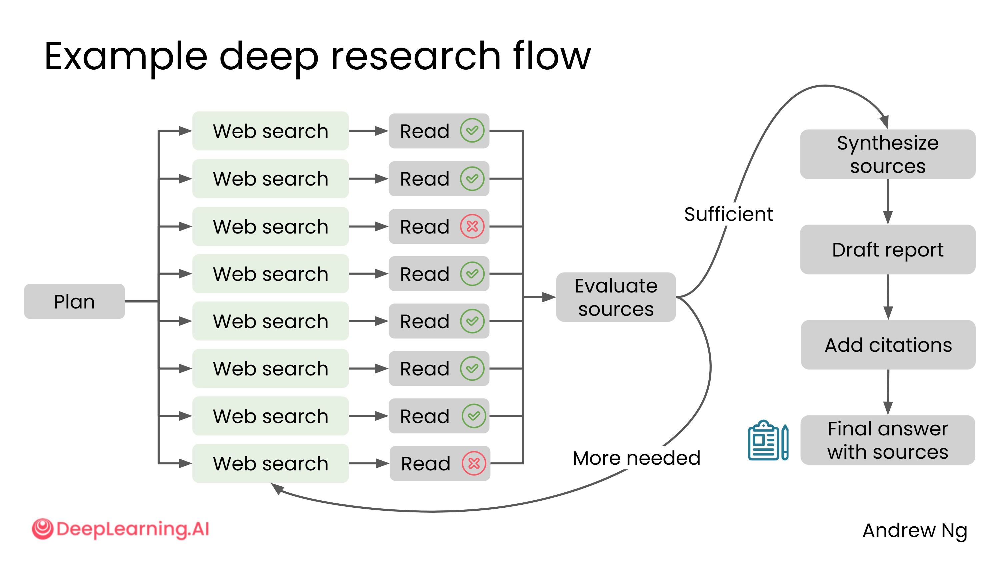
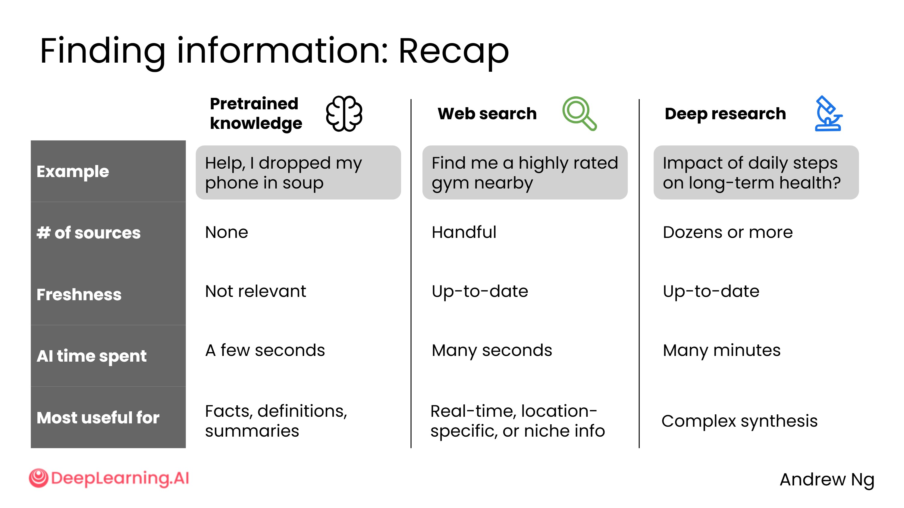

# 1.5 使用深度研究

## 什么是深度研究？

有时候，你希望 AI 不只是综合几个来源，而是综合几十个来源，并进行大量思考，给出对某个问题最深入、最全面的研究答案。

ChatGPT、Gemini、Claude 等主流 AI 聊天界面都提供了**深度研究模式**。这是一个非常有价值却常被低估的工具。

## 深度研究的使用示例

以"规划万圣节鬼屋"为例，你可以给 AI 提供详细的背景信息：

- 所在地点
- 前院面积
- 期望的体验效果

AI 会据此制定一个研究计划，思考需要查阅哪些类型的来源。

**研究流程示例：**

1. 查询当地（如帕洛阿尔托）的许可规定和万圣节法规
2. 阅读相关网页，综合已获取的信息
3. 进一步搜索消防安全指南
4. 搜索装饰创意

研究过程会大致遵循原始计划，但也有灵活性——如果某个方向需要深入，它会继续挖掘。

经过数分钟的搜索后，AI 会生成一份详细的研究报告，涵盖结构与法规框架、安全注意事项等多个板块。

## 深度研究与智能体 AI

深度研究是**智能体 AI（Agentic AI）**的一个典型例子。在这个过程中，AI 模型有一定的自主决策能力，例如自行判断是否需要进行额外搜索。

## Gemini 的特色功能

使用 Google Gemini 进行深度研究时，它可以将研究结果转化为：

- 网页
- 信息图表
- 其他多种形式

例如，Gemini 生成的万圣节鬼屋规划网页包含：

- 四个内容板块
- 预算饼图
- 噪音法规可视化图表
- 可用于活动规划的检查清单

## 深度研究的工作原理

深度研究的一大优势是可以**同时**发起多个搜索，而不是逐一进行，因此在获取大量网页时效率极高。

## 普通网络搜索 vs. 深度研究

| 场景 | 推荐方式 |
| --- | --- |
| 查找附近评分高的健身房 | 普通网络搜索 |
| 查询迪拜本周天气 | 普通网络搜索 |
| 每日步数对长期健康的影响（需综合科学文献） | 深度研究 |
| 天气对迪拜旅游业的影响（需多维度分析） | 深度研究 |

## 三种信息获取方式对比

| 方式 | 来源数量 | 信息时效性 | 响应时间 | 适用场景 |
| --- | --- | --- | --- | --- |
| 预训练知识 | 无需联网 | 截止日期前 | 几秒 | 常见事实、定义、摘要 |
| 普通网络搜索 | 少量（几个） | 较新 | 数秒至数十秒 | 实时信息、位置查询、小众信息 |
| 深度研究 | 大量（几十个以上） | 最新 | 数分钟以上 | 复杂问题、多来源综合分析 |

**触发方式的区别**：

- 普通网络搜索：可由 AI 自动触发，也可由用户主动触发
- 深度研究：通常需要用户在界面中**明确选择**，AI 不会自动启动（否则你可能要等好几分钟才能得到回答）

## 小结

找信息是人们使用 AI 最常见的任务之一。你现在掌握了三条路径：

1. **预训练知识**：快速回答常见问题
2. **普通网络搜索**：获取实时、位置相关或小众信息
3. **深度研究**：深入综合多来源，回答复杂问题

下一节将通过实践练习，帮助你建立对何时使用这三种方式的直觉。

---

深度研究是目前 AI 工具中最被低估的功能之一，它本质上是把"研究助理"这个角色自动化了。

**时间成本的重新定价**：深度研究需要等几分钟，这在习惯了即时响应的今天感觉很慢。但换个角度想：如果让你自己去读几十篇文章、综合出一份有结构的报告，可能需要几个小时甚至几天。几分钟换几小时，这个交易非常划算——前提是你问的问题值得这样深入研究。

**"智能体 AI"的意义**：文中提到深度研究是智能体 AI 的典型例子，这个概念值得多想一想。普通 AI 是"你问我答"，而智能体 AI 是"你给目标，我自己规划步骤去完成"。这是一个质的飞跃——AI 从工具变成了能自主行动的协作者。深度研究只是这个方向的起点。

**什么问题适合深度研究？** 一个简单的判断标准：如果这个问题的答案需要你综合多个不同来源、权衡不同观点，那就值得用深度研究。反之，如果只是查一个事实，普通搜索就够了。比如"今天天气怎么样"用普通搜索，"气候变化对农业的长期影响"就值得深度研究。

**Gemini 的可视化输出**：把研究结果转化为信息图表和检查清单，这个功能看似是锦上添花，实际上解决了一个真实痛点——大段文字很难快速消化，而结构化的可视化输出能让你在几秒内抓住重点。这提醒我们：AI 的输出格式和内容本身同样重要，要学会要求 AI 以最适合你使用场景的形式呈现信息。
