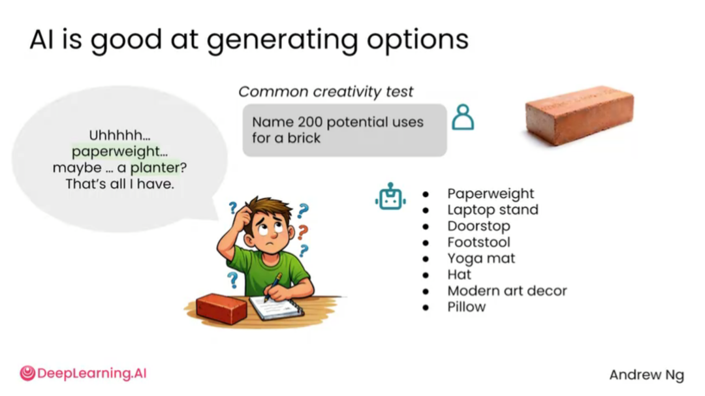
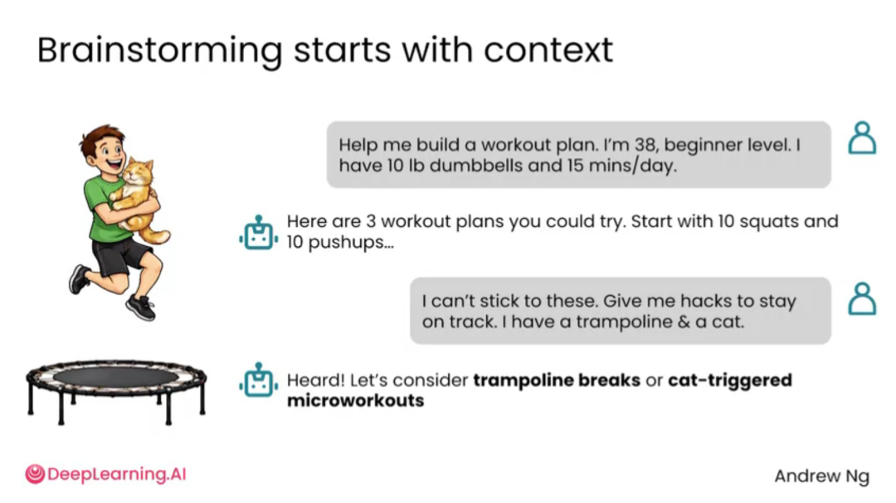
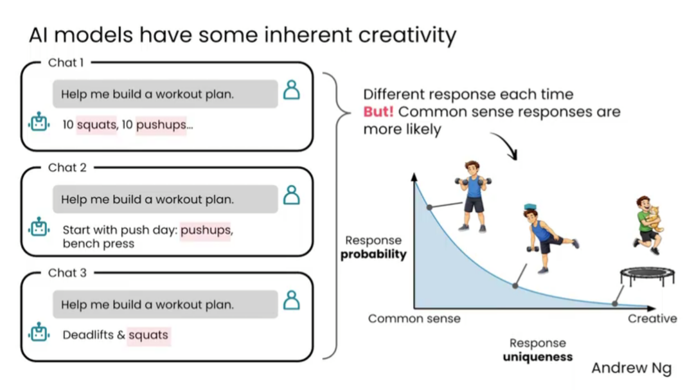
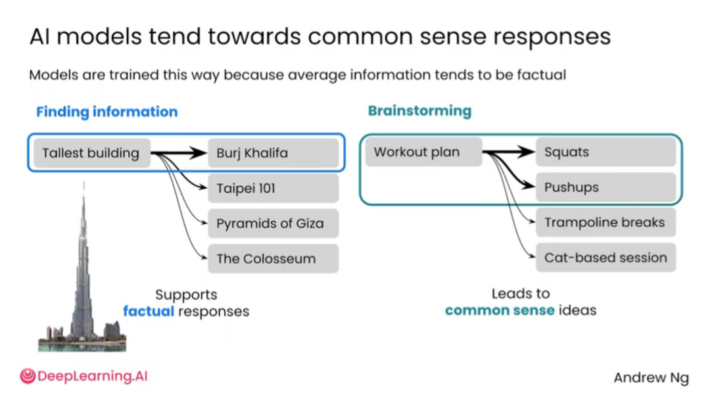
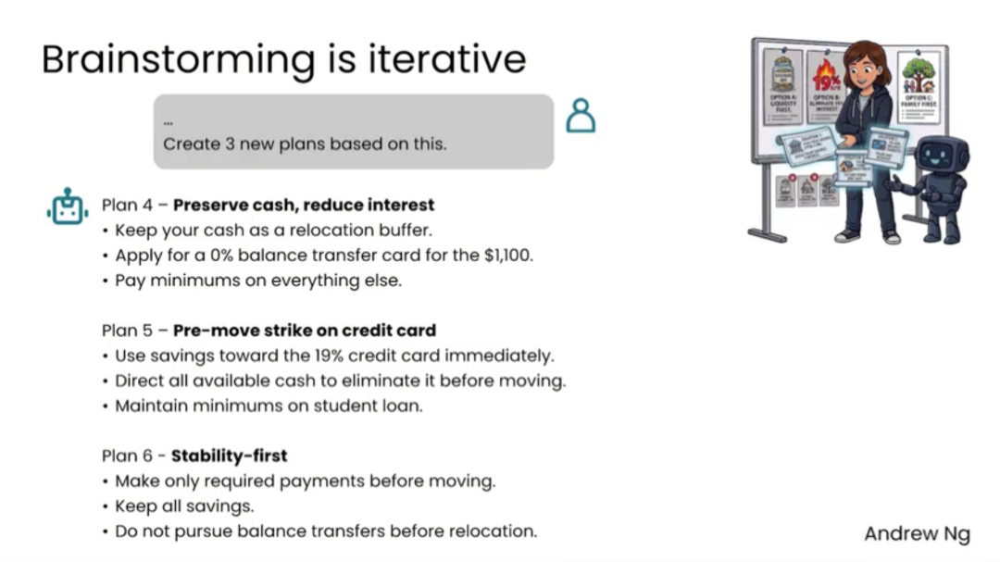
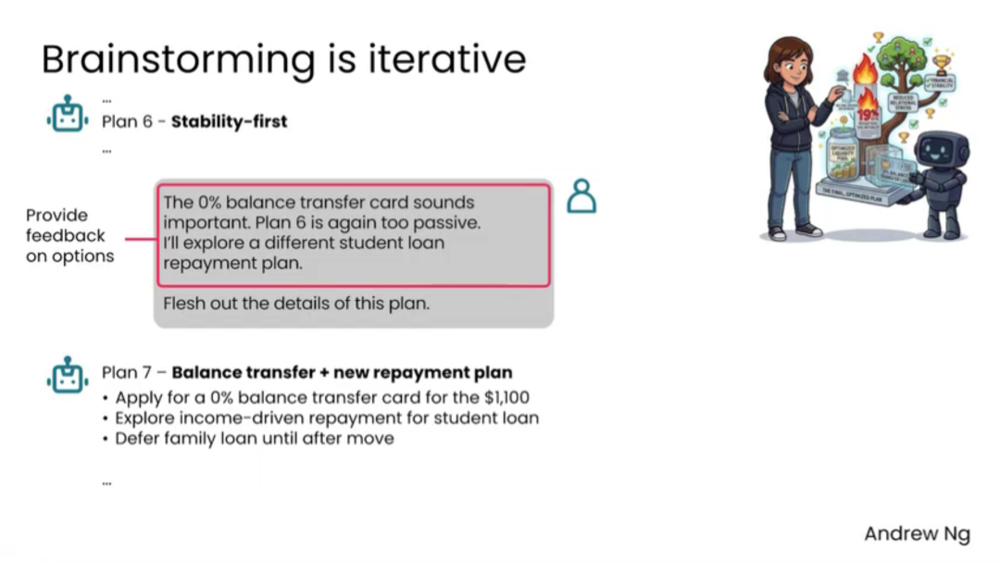
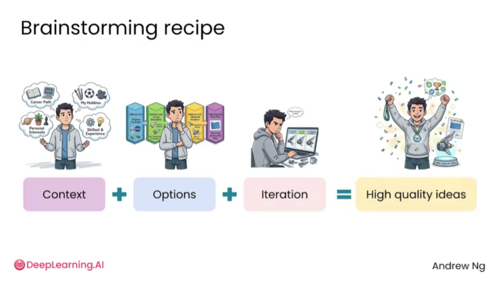

# 2.1 用AI头脑风暴 [Brainstorming with AI]


> **主题：** 用 AI 扩展想法空间，快速获得多个候选方向，再由人进行筛选、判断和深化。




AI 很适合做头脑风暴，因为它可以在很短时间内给出大量选项。人类在思考一个问题时，容易受已有经验、常见案例和个人视角限制，而 AI 可以快速从不同身份、不同场景、不同策略出发，补充更多方向。

但是，AI 生成的想法不等于天然更有创造力。模型通常会优先输出训练数据中更常见、更稳妥、更符合平均预期的答案。因此，AI 头脑风暴的重点不是“让 AI 替你决定”，而是“让 AI 帮你扩大可选空间”。



高质量头脑风暴首先需要上下文。只说“帮我制定健身计划”，AI 往往会给出普通计划；如果补充年龄、训练经验、器械条件、每天可用时间、受伤情况和个人偏好，AI 才能生成更贴近真实情况的建议。



AI 的输出具有一定随机性。同一个问题，多次询问可能得到不同答案。常见回答通常出现概率更高，独特回答概率更低。因此，如果希望获得更有创意的结果，需要明确要求 AI 跳出常规方案。



AI 默认偏向常识性回答。在事实问答中，这种倾向是优点，因为用户需要稳定、可靠的信息；但在头脑风暴中，过度常识化会限制创意，导致答案“正确但普通”。


高质量想法通常来自“具体上下文 + 多样化要求”。例如，要求 AI 同时给出常规方案、低成本方案、反直觉方案、适合学生完成的方案和适合商业落地的方案，可以显著提升结果的可选性。

## 头脑风暴提示词应包含的信息

| 信息类型 | 作用 | 示例 |
| --- | --- | --- |
| 背景 | 让 AI 知道任务发生在什么场景 | 我正在做一个校园 AI 创新项目 |
| 目标 | 说明最终想解决什么问题 | 想设计一个能落地的小工具 |
| 受众 | 说明想法服务谁 | 面向大学生、老师或比赛评委 |
| 限制 | 防止方案不现实 | 开发周期 2 周，预算低，不能依赖复杂硬件 |
| 偏好 | 控制想法风格 | 希望方案实用、有传播性、容易展示 |
| 输出形式 | 规定结果格式 | 给我 10 个方向，并按可行性排序 |

## 让 AI 生成更多样的选项


AI 适合先给多个策略，再由用户根据现实情况筛选。例如在债务规划中，AI 可以分别提出“优先降低高息负债”“优先保证现金流”“优先处理家庭关系”等不同路径。每种路径背后都有不同价值取舍，不能只看一个表面答案。


第一轮结果通常不是终稿。用户可以告诉 AI 哪些方案太保守、哪些不可执行、哪些方向值得展开，让 AI 基于反馈继续生成下一版。



迭代的价值在于把“普通答案”逐步推向“更符合个人限制的答案”。用户反馈越具体，AI 下一轮结果越可能接近真实需求。



当某个方案看起来有潜力时，不要立刻结束，可以继续要求 AI 补充执行步骤、风险、成本、失败原因和替代方案。




可以把 AI 头脑风暴理解为一个公式：

```text
上下文 + 多个选项 + 多轮迭代 = 更高质量的想法
```

## 可直接套用的 Prompt 模板

### 模板 1：通用头脑风暴

```text
我想围绕【主题】做头脑风暴。背景是【背景】，目标是【目标】，受众是【受众】。限制条件包括【时间/预算/技术/资源限制】。请先给我 20 个候选方向，并按“实用性、创新性、可执行性”进行简单标注。
```

### 模板 2：多角度发散

```text
请从 5 个角度重新思考这个问题：用户需求、低成本实现、反常识方案、长期价值、展示效果。每个角度给出 5 个想法，并说明适合什么场景。
```

### 模板 3：从发散到收敛

```text
请根据以下标准评估这些想法：可执行性、成本、创新性、风险、用户价值。每项按 1-5 分评价，并推荐最值得继续推进的 3 个方向。
```

## 小结

AI 头脑风暴的重点不是一次生成最终答案，而是帮助用户扩大思路。第一轮结果通常只是起点，真正有效的做法是补充上下文、要求多样化、持续反馈、不断迭代。

---