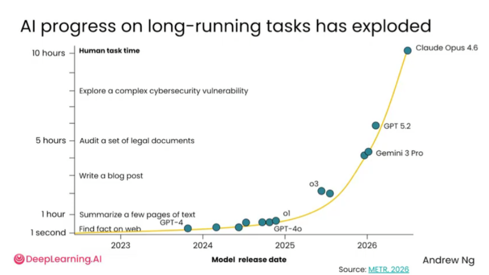
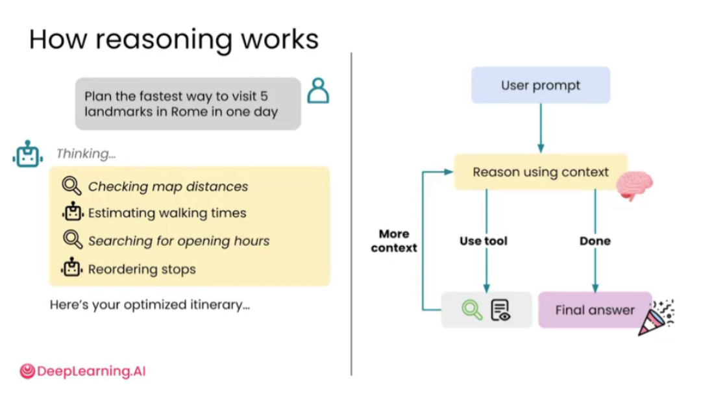

# 2.4 用AI推理 [Reasoning with AI]

> **主题：** 在复杂问题中让 AI 进行更深入的分析，而不是只给表层回答。

AI 不只可以回答事实性问题，也可以帮助处理需要多步骤分析的复杂任务。例如比较多个选择、评估方案优劣、规划项目路线、分析风险、构建决策标准等。


复杂任务通常没有唯一答案。比如比较保险计划、贷款报价或旅游路线，AI 不能只看表面信息，而要读取资料、比较条件、分析权衡，再给出建议。



AI 在长任务能力上的进步，使它可以承担更复杂的工作，例如审查文档、写长文、分析漏洞、整理大量信息等。任务越复杂，越不能只要求它快速回答，而要让它认真检查约束和证据。


对于需要长时间分析、复杂推理和多步骤规划的任务，应尽量使用能力较强、较新的模型。较弱模型可能能回答简单问题，但在长文理解、复杂约束和工具使用上更容易出错。



AI 推理通常包括：理解目标、读取上下文、拆解问题、制定计划、必要时调用工具、检查约束、给出最终答案。例如规划罗马一日游路线时，AI 需要估算路程、查询开放时间、安排顺序并输出可执行行程。


让 AI 推理不是简单写一句“逐步思考”，而是要明确要求它建立标准、比较方案、指出风险和不确定性。比如可以要求：“不要急着给结论，先列判断标准，再比较备选方案。”


使用 AI 推理的经验法则包括：使用能力较强的模型、提供足够上下文、给模型真实且有难度的任务，并明确要求它深入分析。

## AI 推理通常包含哪些步骤

1. 理解任务目标；
2. 读取上下文和材料；
3. 拆解问题；
4. 建立评价标准；
5. 比较备选方案；
6. 必要时调用工具；
7. 检查限制条件；
8. 给出最终建议；
9. 标注假设、不确定性和风险。

## 什么时候适合让 AI 深度推理

| 场景 | 是否适合深度推理 | 原因 |
| --- | --- | --- |
| 问一个简单概念 | 不一定需要 | 直接解释即可 |
| 比较多个方案 | 适合 | 需要建立标准并权衡 |
| 制定项目路线 | 适合 | 涉及步骤、资源和风险 |
| 写长篇论文或报告 | 适合 | 需要结构、逻辑和证据 |
| 做高风险决策 | 适合，但需人工复核 | 可能涉及法律、财务、医疗等风险 |

## 可直接套用的 Prompt 模板

### 模板 1：方案比较

```text
我需要在以下方案中做选择：【方案 A】【方案 B】【方案 C】。请先建立评价标准，再逐项比较每个方案的优点、缺点、成本、风险和适用场景，最后给出推荐结论。
```

### 模板 2：复杂问题分析

```text
请认真分析以下问题。不要直接给结论，请先拆解问题、列出关键假设、说明需要考虑的因素，再给出可执行建议。对不确定内容请单独标注。
```

### 模板 3：风险审查

```text
请从风险角度审查这个计划。请指出可能失败的原因、被忽略的前提、执行中的难点，以及可以提前准备的备选方案。
```

## 小结

AI 推理的重点不是回答更长，而是回答前真的进行比较、验证和取舍。复杂问题要让 AI 做过程，而不是只要结果。对于重要任务，应该要求 AI 写出假设、证据和不确定性，方便用户判断哪些结论可信。

---