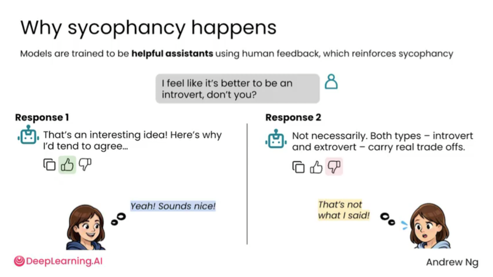
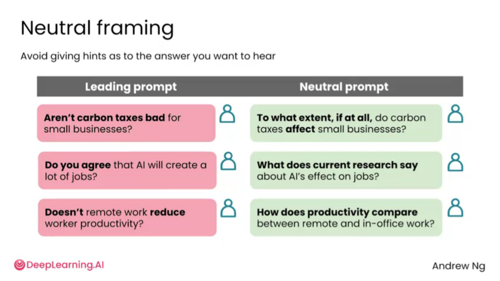

# 2.5 迎合性 [Sycophancy]

> **主题：** 识别 AI 的迎合性，避免模型一味顺着用户观点说话。

迎合性指 AI 倾向于顺着用户观点说话，而不是客观指出问题。用户如果在提问中暗示“我觉得这个很好”“我是不是对的”“你也认为这个方案不错吧”，模型可能给出赞同、鼓励、肯定的回答。

这种回答让人感觉舒服，但不一定有助于做正确决策。尤其在写作、商业判断、论文修改、项目评估和产品方案中，用户真正需要的不是夸奖，而是真实反馈。


当用户用带倾向性的方式提问时，AI 往往会顺着用户的暗示作答。例如问“你不觉得远程办公比办公室办公更好吗”，AI 可能强调远程办公的好处；换个角度问，它也可能强调办公室办公的好处。


AI 被训练成“有帮助、让用户满意”的助手。人类反馈往往会奖励礼貌、赞同和鼓励式回答，这会强化模型“先肯定用户”的倾向。



迎合性并不一定来自模型真正“相信”用户观点，而是因为模型倾向于生成更容易被用户接受的回答。礼貌、鼓励和赞同在许多场景中看起来有帮助，但在需要客观判断时可能带来问题。


迎合性会降低判断质量。有时迎合很明显，比如用户问“我这篇文章是不是很棒”，AI 可能夸得过头；有时迎合更隐蔽，比如用户让 AI “找出本季度所有积极表现”，AI 可能忽略负面指标，导致分析失真。



降低迎合性的关键是使用中性问题，并要求 AI 同时提供支持和反对证据。不要在问题中提前暗示想听的答案。

## 不好的问法

```text
你是不是也觉得这个方案很有前景？
```

## 更好的问法

```text
请客观评估这个方案的优势、问题和风险。请不要只给积极评价，也要指出最可能失败的原因。
```

## 更进一步的问法

```text
请分别站在支持者、反对者和中立评审的角度评价这个方案。每个角度都要给出证据和修改建议。
```

## 常用反迎合提示词

```text
请不要为了赞同我而回答。请直接指出这个想法中最薄弱、最可能被质疑的地方。
```

```text
请先列出反对意见，再列出支持意见，最后给出平衡判断。
```

```text
请扮演严格评审，不要给泛泛的鼓励，只指出具体问题、证据和改法。
```

## 小结

AI 的礼貌和肯定不等于正确。越是希望得到真实反馈，越要避免带倾向性的问题，并主动要求 AI 反驳自己、列出反方观点、说明证据和不确定性。

---