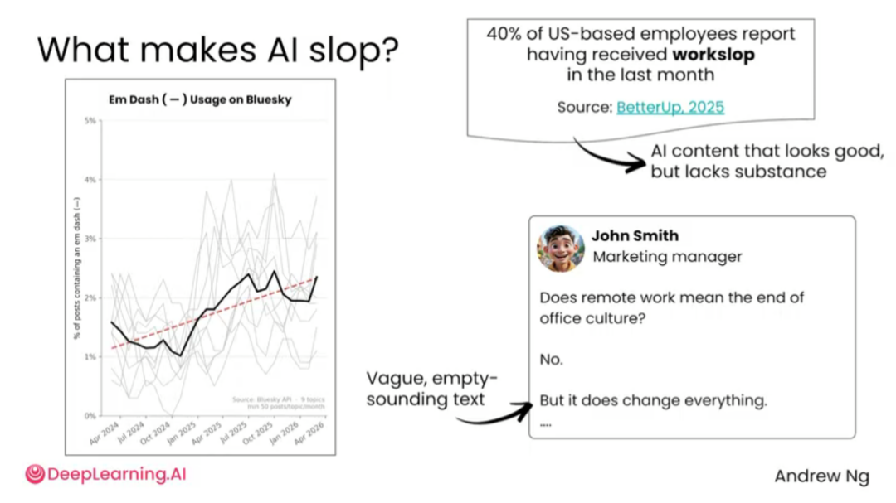
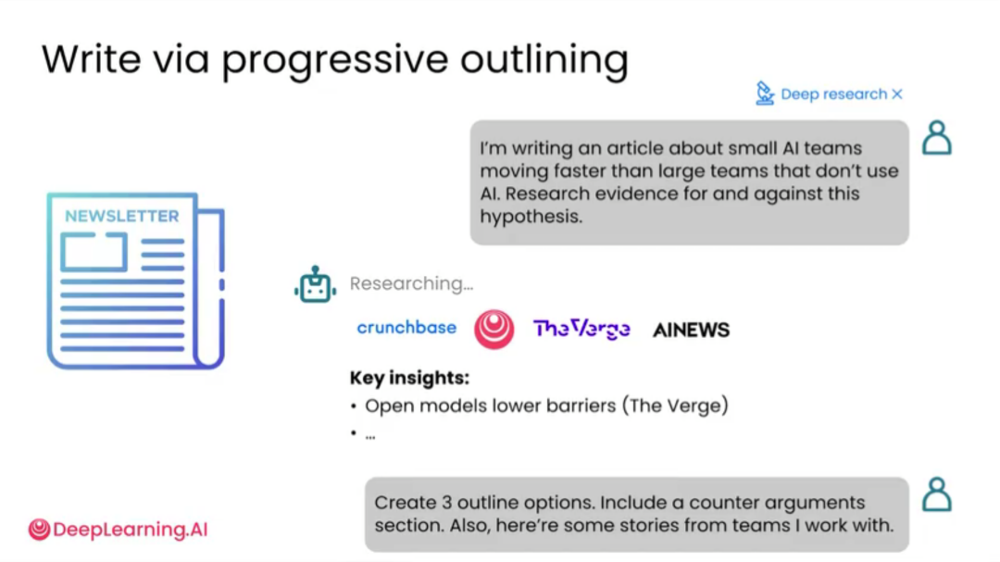
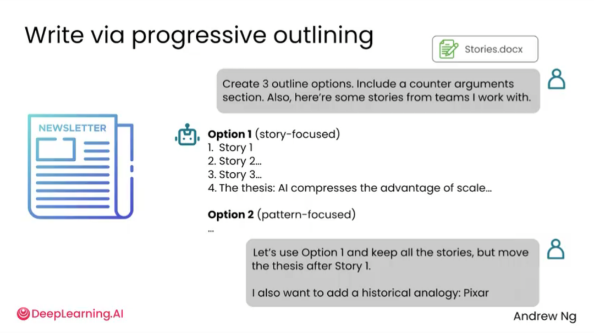
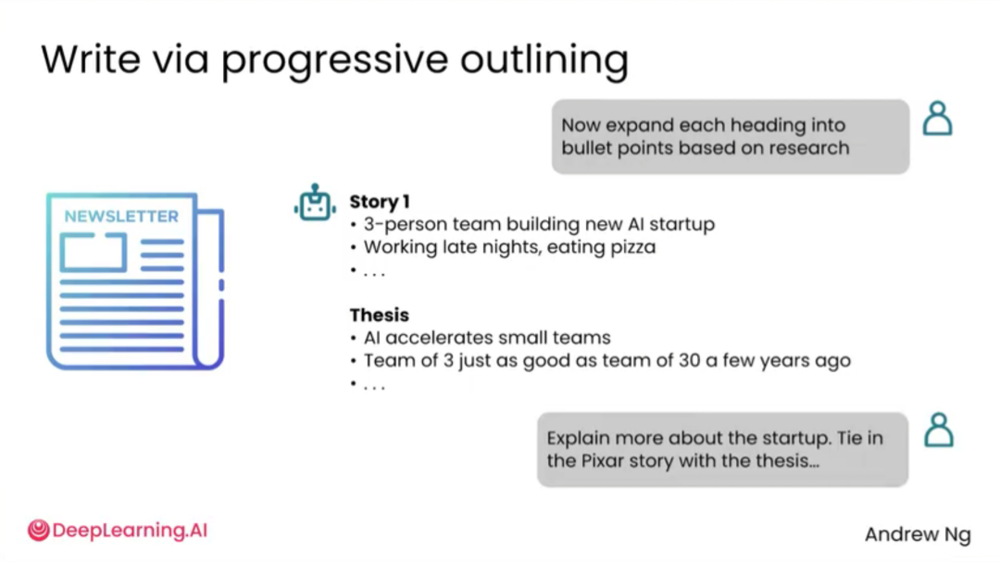
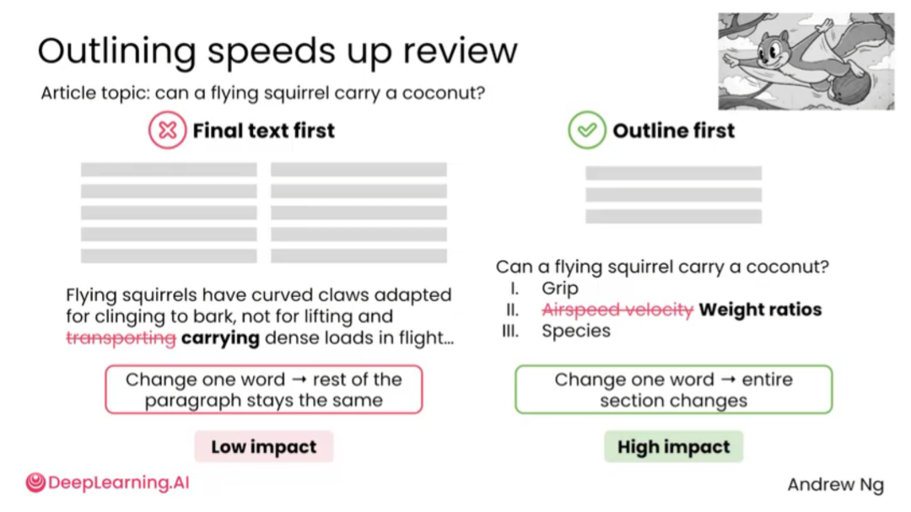

# 2.6 用AI写作 [Writing with AI]

> **主题：** 用 AI 写作时保留人的判断和风格，减少模板化和“机器味”。

AI 可以帮助写作，但最好的用法不是直接让它一键生成最终稿。更有效的方式是把 AI 放进写作流程中的不同环节：找角度、列提纲、整理素材、生成初稿、改写段落、调整语气、压缩字数、检查逻辑、润色表达。



“AI slop”可以理解为常见的 AI 腔文本：表面流畅、结构完整，但内容空泛、缺少真实细节和个人判断。它看起来像文章，却往往没有足够的信息密度。


AI 腔常来自高频词和固定句式，例如过度使用“深入探讨”“清晰、简洁且引人入胜”“这不是……而是……”等表达。它们单独看没有问题，但反复出现会让文章显得机械。


AI 写作不仅会影响文本本身，也会反过来影响人类表达。有些 AI 常用词开始更多出现在演讲、播客和文章中。这提醒我们：使用 AI 写作时，不能只追求完整，还要关注真实观点和个人风格。

## 为什么不能只让 AI 直接写全文

如果不给上下文，AI 写出来的内容容易空泛、模板化、过度正式，甚至出现明显“AI 味”。常见表现包括：

- 大量使用抽象词；
- 喜欢写宽泛总结；
- 表达完整但缺少具体事实；
- 段落结构机械，像模板填空；
- 观点安全、平均、缺少鲜明判断。

## 更好的写作流程：先结构，后正文



AI 写作更适合用在结构、素材和论证上。可以先让 AI 帮助整理资料、提出角度和生成多个大纲，而不是直接写最终稿。



用户可以先把团队故事、写作目标和读者对象提供给 AI，然后要求它生成 3 种大纲方案。这样用户可以先判断文章逻辑，而不是在完整正文里费力改结构。


选择大纲后，可以继续调整顺序、补充故事、移动论点、加入案例。这个阶段改动成本低，适合处理结构问题。



大纲确定后，再让 AI 把每个小标题扩展成要点。这样可以避免一开始生成大段正文后再大面积返工。


只有当结构、素材和重点明确后，才适合让 AI 生成正文。此时 AI 更像执行者，而不是替用户决定文章怎么写。



大纲优先可以显著降低修改成本。结构层面的问题越早发现，越容易调整；如果直接生成终稿，后面再改往往会变成大面积重写。

## 用 AI 写作时应提供的信息

| 信息 | 作用 | 示例 |
| --- | --- | --- |
| 写作目的 | 决定文章重点 | 用于公众号科普、比赛答辩、论文摘要 |
| 目标读者 | 决定解释深度 | 面向初学者、老师、投资人、同学 |
| 语气风格 | 控制表达方式 | 专业、轻松、幽默、学术、简洁 |
| 材料来源 | 避免空泛 | 给出真实经历、数据、案例、观点 |
| 禁用表达 | 减少 AI 味 | 不要写“随着时代发展”“总的来说” |
| 输出格式 | 方便直接使用 | 标题、分段、小标题、要点、表格 |

## 可直接套用的 Prompt 模板

### 模板 1：生成多个大纲

```text
我想写一篇关于【主题】的文章，读者是【读者】，目标是【目标】。请先不要写正文，先给我 3 种不同结构的大纲，并说明每种结构适合什么表达重点。
```

### 模板 2：减少 AI 味

```text
请改写下面这段文字，要求更自然、更像真人写作。保留原意，减少空泛套话，不要使用“随着……”“总的来说”“具有重要意义”等模板化表达。
```

### 模板 3：补充真实细节

```text
请根据以下素材扩写成一段正文。要求保留具体细节和个人判断，不要写成泛泛的总结。
```

### 模板 4：检查文章逻辑

```text
请检查这篇文章的结构和论证。重点指出哪里逻辑跳跃、哪里证据不足、哪里读者可能看不懂，并给出具体修改建议。
```

## 小结

AI 写作最好用于结构、素材、论证和改写，而不是一键生成终稿。先控结构，再写正文，能明显降低 AI 味。最终文章仍然需要人来判断内容是否真实、观点是否准确、表达是否符合自己的风格。

---