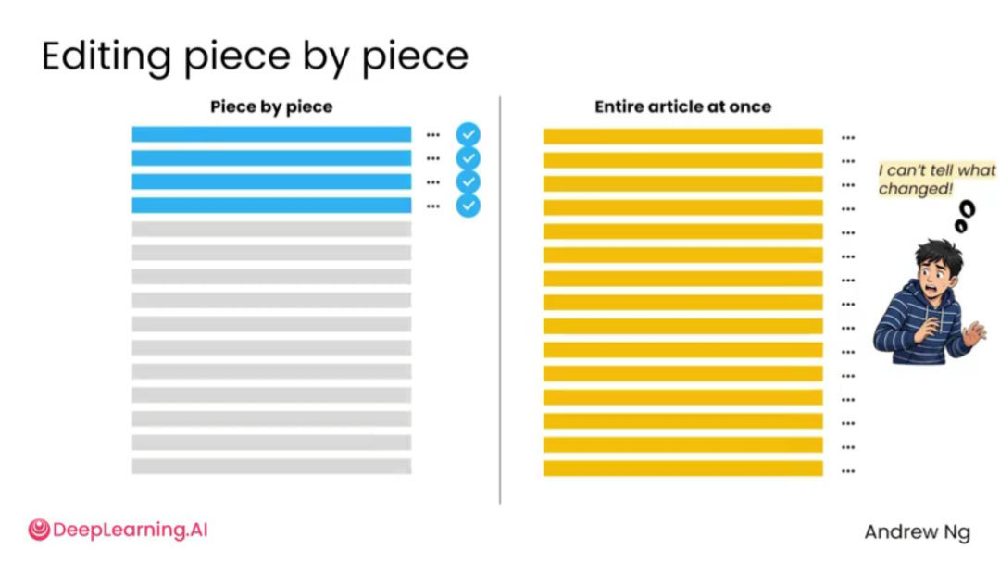
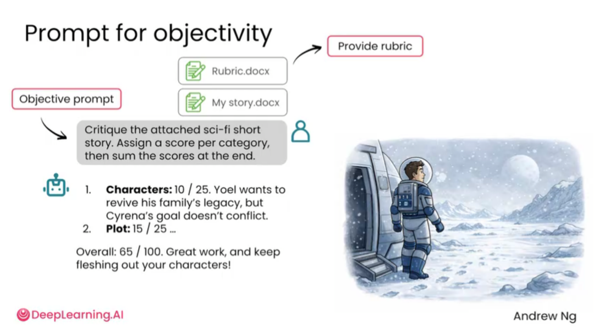
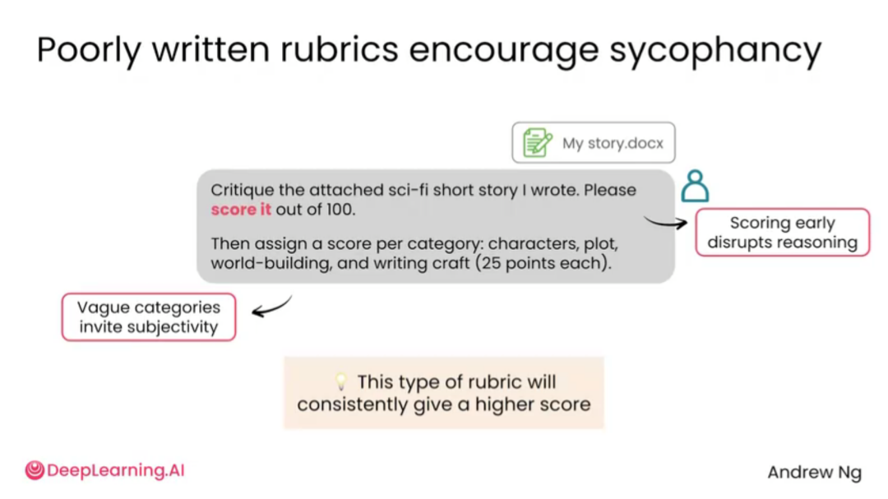
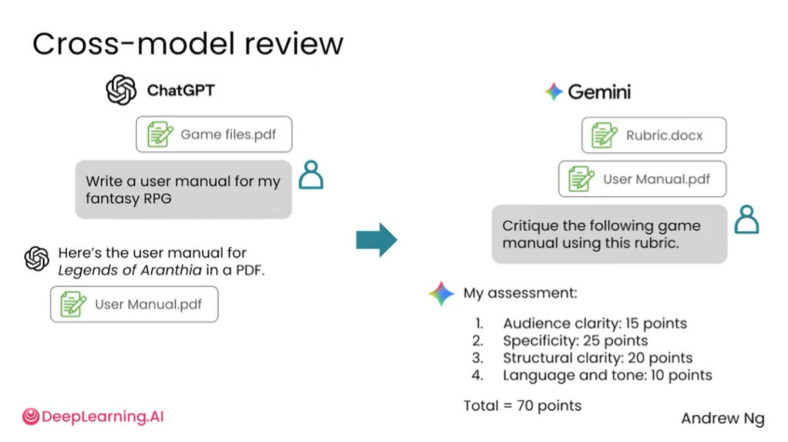
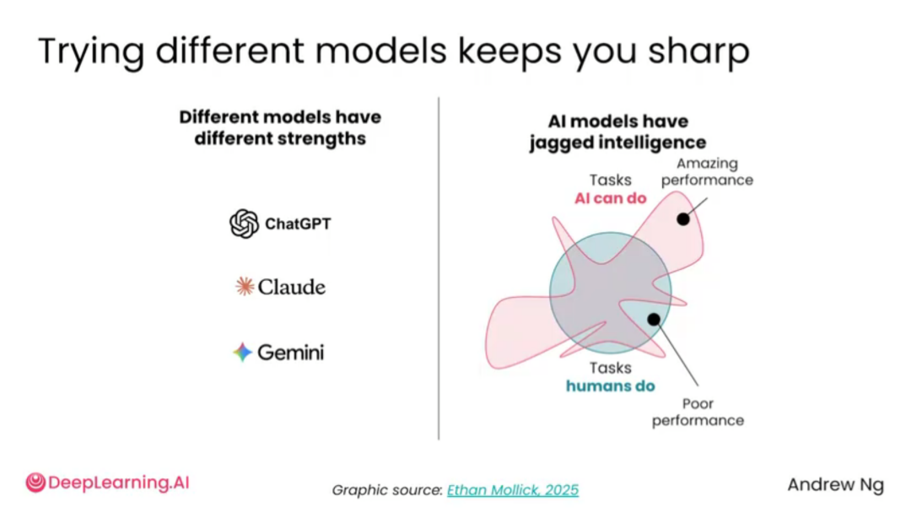

# 2.7 AI评审 [AI critique]

> **主题：** 让 AI 扮演编辑或评审者，指出方案、文章或想法中的具体问题。

AI 不仅能生成内容，也能评审内容。评审能力在写作、项目设计、产品方案、论文修改、商业计划和演示文稿中都很有价值。相比直接让 AI “帮我改”，更好的方式是先让它指出问题，再决定如何修改。


AI 可以帮助用户对同一段文字生成不同表达版本，例如更有冲击力、更有愿景感、更适合对话场景。这样做适合局部改写，而不是让 AI 一次性接管整篇文章。



分块修改通常比整篇重写更可控。逐段修改可以让用户清楚知道哪里变了；如果一次性让 AI 改完整篇，可能很难判断它改动了哪些内容，也更容易偏离原意。


AI 并不天然客观。它可能因为礼貌和迎合性而少指出问题，也可能在缺少评价标准时给出笼统反馈。因此，用户需要提供清晰的评价维度。


Rubric 可以理解为评审标准。它把“好不好”拆成多个可判断的维度，让 AI 不再只凭感觉评价。



更客观的评审提示词应该同时包含：明确任务、评价标准、打分维度、证据要求和修改建议。不要只让 AI 说“这篇文章怎么样”。



不好的 rubric 也会制造问题。如果只要求“给我打 100 分制评分”，模型可能先给分再找理由，导致评审过程被分数牵着走。更好的方式是先逐项找证据、列问题、提出修改建议，最后再给分。



对于重要材料，可以使用跨模型评审。一个模型生成内容后，让另一个模型基于同一 rubric 进行评审。不同模型能力并不完全一致，交叉使用可以减少单一模型盲点。



不同模型的能力不是完全线性一致的，而是呈现“锯齿状智能”。某个模型可能擅长写作，另一个可能擅长长文理解或逻辑审查。因此，重要材料可以用多个模型交叉检查。

## AI 评审应该评什么

高质量评审不是简单说“不错”“可以优化”，而是要指出：

- 哪些地方不清楚；
- 哪些地方逻辑跳跃；
- 哪些地方证据不足；
- 哪些地方读者可能不理解；
- 哪些地方可能被评委、老师、用户或客户质疑；
- 哪些修改动作最有效。

## Rubric 示例

| 维度 | 关注点 |
| --- | --- |
| 主题 | 主题是否明确，是否偏题 |
| 结构 | 段落顺序是否合理，是否有逻辑跳跃 |
| 证据 | 是否有数据、案例或材料支撑 |
| 语言 | 表达是否自然，是否有模板化套话 |
| 读者体验 | 读者是否容易理解，是否知道重点 |
| 可修改性 | 是否给出具体可执行的修改动作 |

## 不推荐的问法

```text
请给我的文章打分，满分 100 分。
```

## 更推荐的问法

```text
请先按照以下标准逐项评审我的文章：主题是否明确、结构是否清晰、论证是否充分、语言是否自然、读者是否容易理解。每一项都要指出具体证据和修改建议。最后再给出综合评价。
```

## 可直接套用的 Prompt 模板

### 模板 1：文章评审

```text
请扮演严格编辑，按照以下标准评审这篇文章：主题清晰度、结构逻辑、证据充分性、语言自然度、读者理解难度。每一项都要指出具体问题、对应原文位置和修改建议。不要只给鼓励。
```

### 模板 2：项目方案评审

```text
请扮演比赛评委，评审以下项目方案。请从用户痛点、技术可行性、创新性、落地成本、展示效果和风险六个维度进行评价。每个维度都要写出优点、问题和改进动作。
```

### 模板 3：论文评审

```text
请扮演研究生论文评审老师，检查以下论文内容。重点关注研究问题是否明确、方法是否与题目一致、公式是否解释充分、实验设计是否合理、结果分析是否有证据、语言是否学术规范。请直接指出问题并给出修改建议。
```

### 模板 4：先找问题再评分

```text
请不要一开始打分。请先逐项找问题、列证据、给修改建议，最后再根据问题严重程度给出综合评分。
```

## 小结

AI 评审的质量取决于标准。不要只问“好不好”，要问“按这些标准，哪里不达标，证据是什么，怎么改”。AI 的评审建议也需要人工判断，不能不加选择地全部接受。
