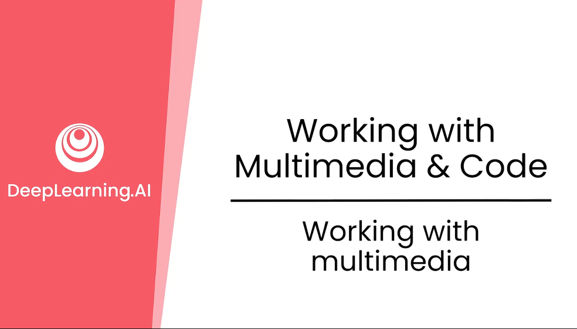
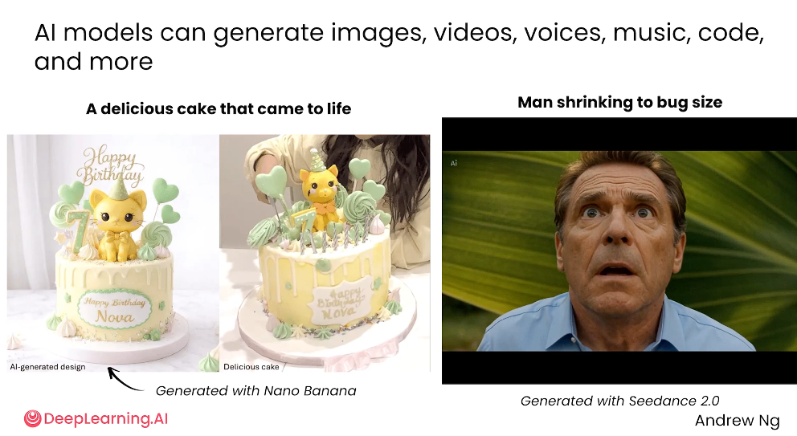
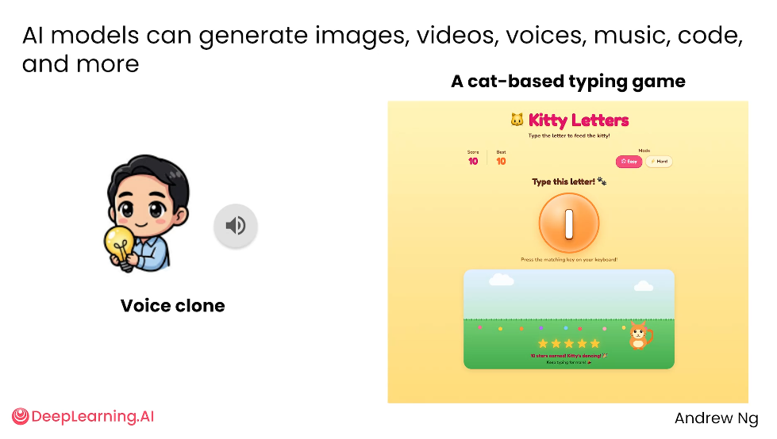
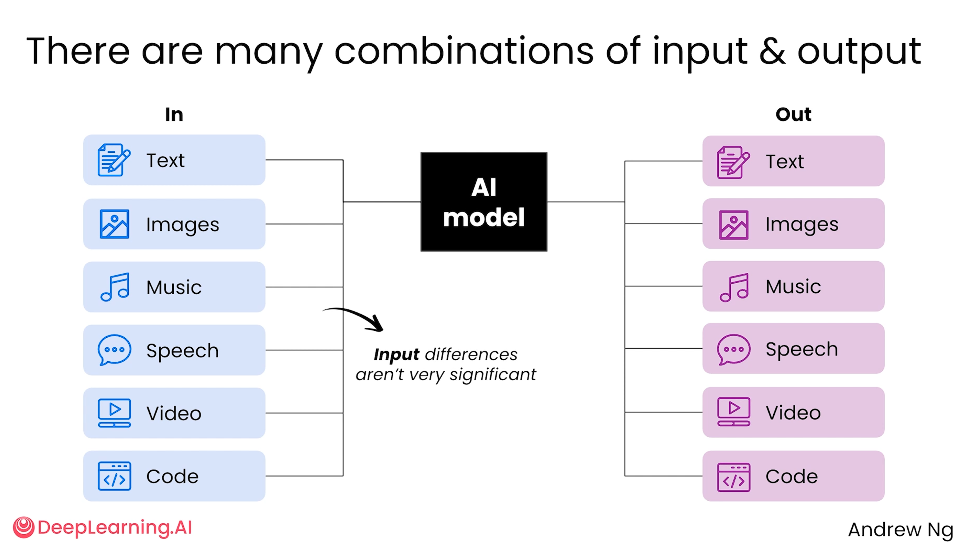
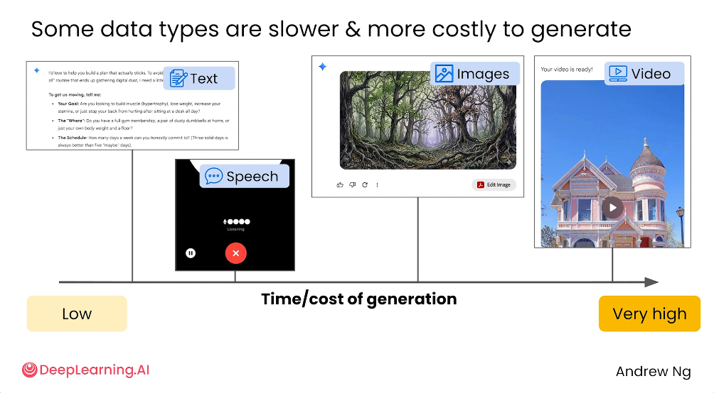
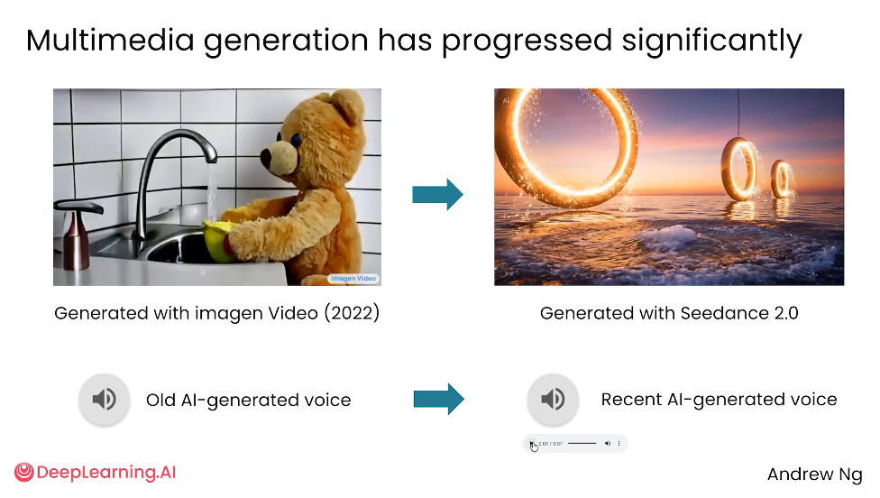
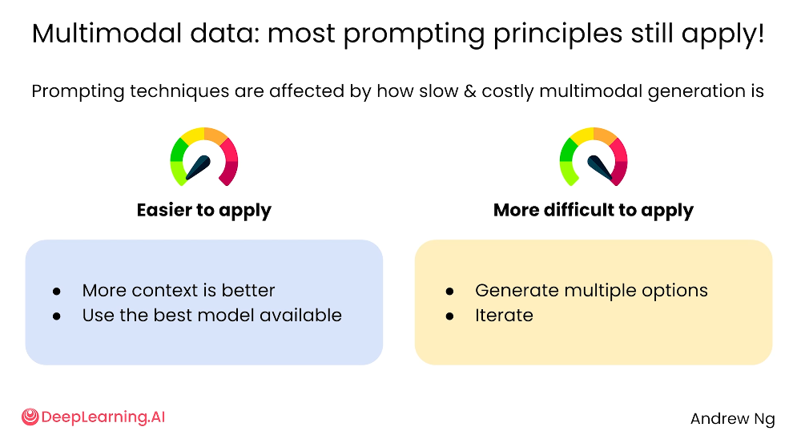
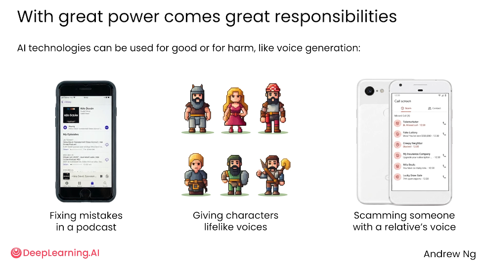

# 3.1 处理多媒体数据 [Working with multimedia data]

> 主题：多模态 AI 与代码生成能力，以及在实际使用 Prompt 时需要注意的方法和责任边界。

## AI工具的多模态生成能力 

AI 不只能生成文字，也可以生成更丰富的输出形式，包括图像、视频、声音、音乐和代码等,如下面两张图所示：

文生图和文生视频

语音克隆和小游戏生成

随着多模态模型能力提升，用户可以用自然语言把想法转化为图片、短视频、语音、小游戏或程序原型。多模态生成虽然能力很强，但不同模态的生成成本、速度、稳定性不同，因此使用 Prompt 时仍然要遵循清晰描述、提供上下文、反复迭代等基本原则。

AI 模型可以生成多种类型的内容：

- **文本**：文章、说明、总结、创意方案等。
- **图像**：根据文字描述生成图片，或基于已有图片继续改造。
- **视频**：根据图片、文字或脚本生成动态画面。
- **语音/声音**：生成配音、克隆声音、修复音频片段。
- **音乐**：生成旋律、背景音乐或音频素材。
- **代码**：生成网页、小游戏、脚本、工具程序等。

于是 AI 从"2022年回答问题的工具"进一步变成"如今内容生产与原型制作工具"

## 输入输出组合与成本

关于输入和输出的组合，其实非常灵活。输入可以是文本、图片、音频、语音、视频、代码中的任意一种或几种，输出也可以是这些形式的任意组合。比如你可以输入文字加图片让 AI 设计万圣节服装，也可以输入房屋照片加语音描述让 AI 生成改造方案或效果视频。核心在于 AI 不再只能处理文字，它能理解不同类型的信息，也能生成对应形式的结果。

不过有一点需要注意：不同模态的生成成本差别很大。

文本生成最快最便宜，语音和图像就贵一些慢一些，视频通常是最慢最贵的，因为涉及连续画面、动作变化、时间一致性等等，计算资源消耗更大。

所以在设计 Prompt 或者做产品的时候，不能把所有模态都当成一样轻量的输出来用。

## Prompt 使用与责任

对比了一下2022年与2026年模型发展速度，大家可以肉眼可见的是现在模型生成图片的能力越来越N，做语言克隆也越来越逼真，大家甚至会爱上和豆包聊天；

AI就在大家的不知不觉已经日新月异的快速进化~

虽然多模态生成更复杂，但 Prompt 的基本原则基本没变。

描述要尽量清楚，比如生成图片或视频时说清楚主体、风格、场景、动作、画面比例、用途。

要选对模型，因为不同模型擅长的任务不一样。还要多生成几个版本，因为多媒体生成有随机性，一次出的结果不一定最好，选一个最满意的再继续迭代调整。

- 1. 提供更多上下文

描述越清楚，AI 越容易生成符合预期的结果。例如生成图片或视频时，应说明主体、风格、场景、动作、画面比例、用途等。

- 2. 使用更合适的模型

不同模型擅长的任务不同。文本、图像、视频、声音、代码生成可能需要不同模型或不同版本的模型。

- 3. 生成多个候选方案

多媒体生成有随机性，一次生成不一定最好。可以让 AI 生成多个版本，再选择最符合需求的结果。

- 4. 反复迭代

如果生成结果不理想，可以基于上一版继续修改，例如调整风格、细节、色彩、人物动作、画面节奏等。

## 使用多模态模型责任边界（最最最重要~）

最后强调了一个很重要的点：能力越强，责任越大。

语音克隆这种能力用好了可以帮创作者降低成本提升效率，用不好就可能被拿去冒充别人声音搞诈骗，或者未经授权使用公众人物的声音。

所以用 AI 生成图像、视频、声音的时候，一定要注意授权、隐私和真实性的问题。

