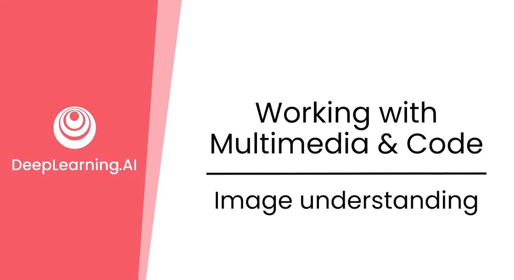
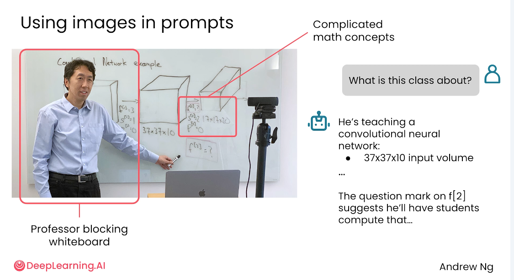
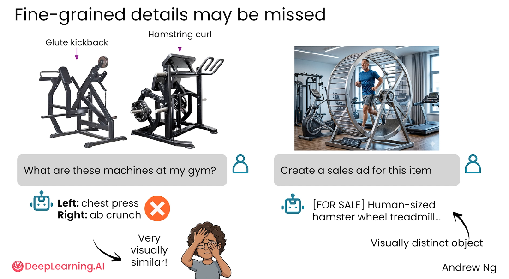
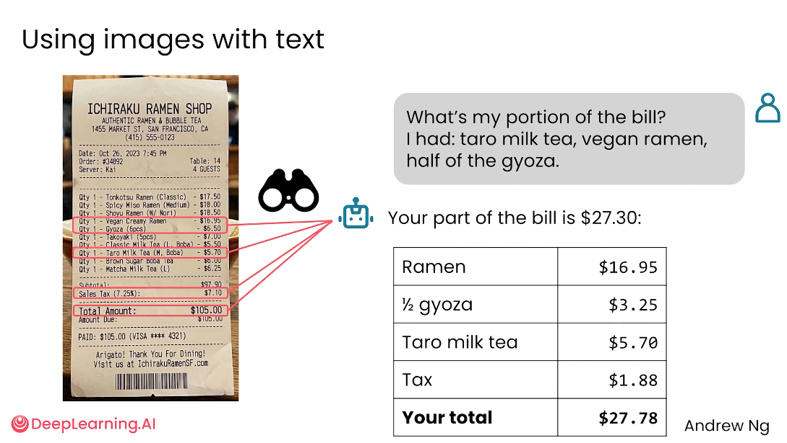
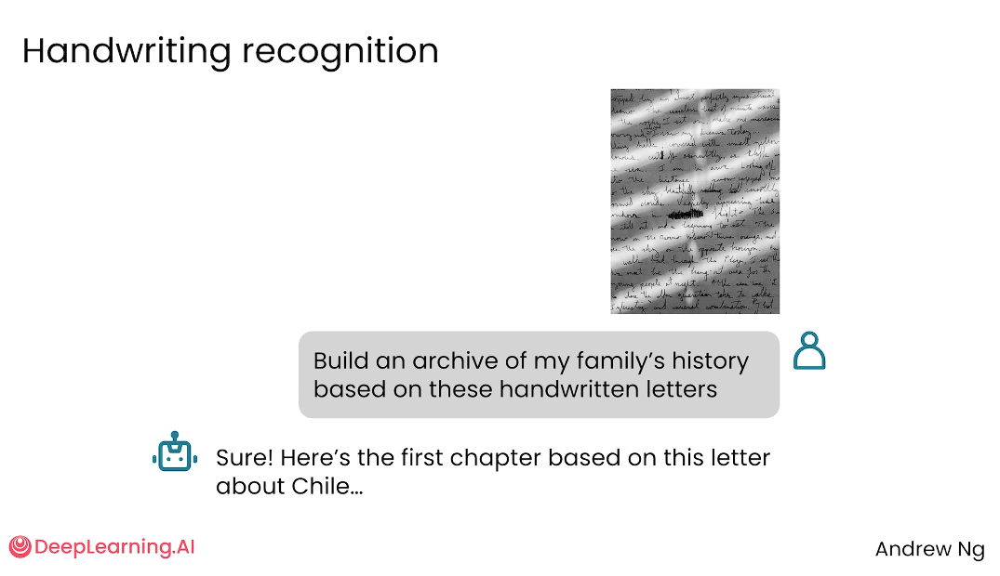
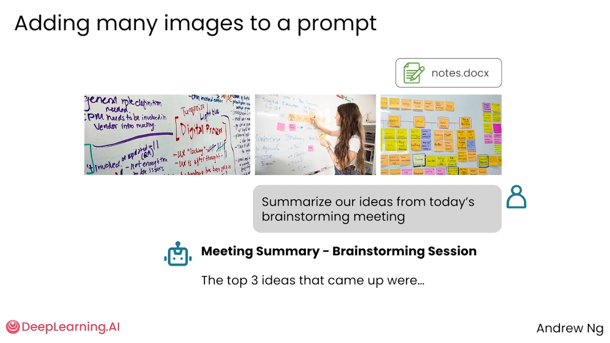
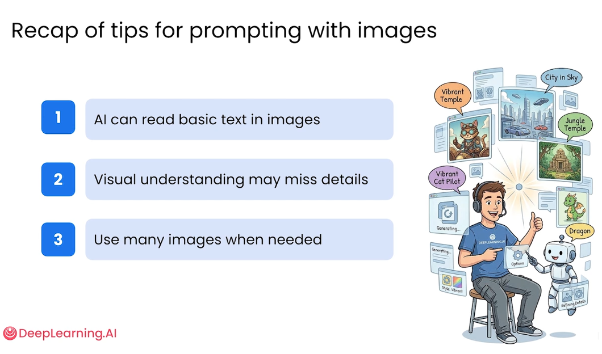

# 3.2 图像理解 [Image understanding]

> 主题：如何在 Prompt 中加入图片，让 AI 读取图像信息、理解图像内容，并结合文字指令完成解释、识别、计算、转写和总结等任务。




用户不仅可以向 AI 输入文字，还可以上传图片，把图片作为 Prompt 输入，让 AI 根据图片中的视觉信息进行分析、解释、提取文字或生成总结。

AI 已经具备一定的图像理解能力，能够读取图像中的基本文字，也能够对图像内容进行较合理的解释；

但它并不总能准确识别细粒度细节，尤其是图片模糊、信息被遮挡、物体外观相似或任务具有高风险时，仍然需要人工核查。


## 图片可以作为 Prompt 的一部分

传统 Prompt 主要依赖文字输入，而多模态模型允许用户把图片也放进 Prompt 中。

图片可以提供文字无法充分描述的上下文，例如：

- 白板上的课程内容；
- 手写笔记；
- 餐厅账单；
- 会议白板和便利贴；
- 家庭旧信件或手写食谱；
- 商品、设备、场景或截图。

使用图片的价值在于：用户不需要先把图像内容完整转写成文字，而是可以直接上传图片，让 AI 从图像中提取可用信息，再根据问题给出回答。




如上图示例所示：让 AI 理解教学场景图片

视频中展示了一个课堂白板的例子。用户上传一张教授站在白板前的图片，并询问：“这节课在讲什么？”

AI 能够从图片中识别出一些关键信息，例如：

- 图片中有人在讲课；
- 白板上包含卷积神经网络相关内容；
- 图中可能涉及输入体积、卷积计算等概念；
- 即使教授挡住了部分白板，AI 仍能根据可见内容做出较合理推断。

这个例子说明，AI 可以结合图像中的文字、图形和场景关系进行综合理解，而不只是机械地读取图片上的文字。


## 图片理解的局限：细节可能被忽略

AI 对图片的理解并不总是可靠，尤其容易遗漏细粒度细节。

### 案例1：

例如，在健身器械图片中，用户询问“这些是什么器械”。由于两台器械外观看起来相似，如果图片较模糊，AI 可能把左边器械识别为胸推器械，把右边识别为卷腹器械，但这个判断可能是错误的。



这说明：

- AI 更擅长识别整体轮廓和明显特征；
- 对外观相近的物体，AI 可能混淆；
- 图片模糊、角度不清、细节不足时，识别错误概率会增加；
- 对专业设备、医学图像、法律文件、财务票据等高风险内容，不能完全依赖 AI 结果。

### 案例2

餐厅账单图片上显示：用户上传账单，并询问：“我应该付多少钱？我吃了拉面、芋泥奶茶和一半煎饺。”

AI 可以读取账单中的文字与金额，并结合用户描述完成计算。例如：

- 识别账单项目；
- 找到对应价格；
- 计算一半煎饺的费用；
- 加上税费或相关费用；
- 输出用户应付金额。




所以目前的 AI 能够处理“图片文字读取 + 用户条件 + 简单推理计算”的组合任务。

但这类结果仍然不适合直接用于高风险场景，最终金额最好人工核对。


### 案例3

当我们的手写文字给 AI 进行识别转写时：

> 此番言：对手写文字写别经常会有两种处理方式，比如目前版本的deepseek不是多模态模型，但是它对用户上传的图片是进行OCR进行识别；像KIMI这种多模态就是下面所讲的识别方法



AI 可以识别部分手写文字，并生成大致转写结果。

手写识别的应用场景包括：

- 转写旧日记；
- 整理家族信件；
- 数字化手写食谱；
- 从课堂笔记中提取内容；
- 从白板照片中整理会议记录。

但手写内容的识别准确率受很多因素影响，例如字迹清晰度、拍摄角度、纸张污渍、光照、字体连笔程度等。

因此，手写转写结果需要人工校对，不能默认完全准确。

### 案例4

一次 Prompt 中加入多张图片



如：

- 白板照片；
- 便利贴照片；
- 会议现场图片；
- 手写草稿；
- 文档截图或文件。

然后让 AI 完成类似任务：

> “总结今天头脑风暴会议中的想法。”

AI 可以综合多张图片的信息，提取其中的主题、要点和行动项，生成会议总结。这种用法适合整理分散资料，把原本零碎的视觉信息整合为结构化文本。

不过，多图输入也可能出现遗漏或误读，因此视频建议对 AI 输出进行复查，尤其是会议纪要、决策记录、报价单、合同条款等重要内容。


## 当你的Prompt中使用图片（划重点）

1、图片要尽量清晰：

上传图片时，应保证主体完整、文字清楚、光线充足、角度稳定。如果图片模糊或被遮挡，AI 的判断会更容易出错。

2、问题要具体

不要只问“这是什么”，可以明确说明自己想知道什么，例如：

- “请提取图片中的文字。”
- “请判断这张图中的设备名称。”
- “请根据这张账单计算我应该支付的金额。”
- “请把这些白板和便利贴内容整理成会议纪要。”

问题越具体，AI 越容易给出符合需求的回答。

3、 告诉 AI 关注重点

如果图片中信息很多，可以指定重点区域或任务目标。例如：

- “只看右上角的表格。”
- “重点识别红框中的文字。”
- “忽略背景，只分析账单内容。”
- “请把手写内容转成可编辑文本。”

4、对重要结果进行复核

凡是涉及金额、身份、法律、医疗、安全、考试、合同等内容，都应人工核查。AI 可以作为辅助工具，但不应替代最终判断。


## 可直接套用的 Prompt 模板

**图片内容理解**

```markdown
请分析这张图片，说明图片中主要对象、文字信息和场景含义。请区分“图片中明确可见的信息”和“你推测的信息”。
```

**图片文字提取**

```markdown
请提取图片中的所有可见文字，尽量保持原有顺序。如果有看不清的地方，请用【无法识别】标注，不要自行编造。
```

**账单计算**

```markdown
请读取这张账单，并根据我的消费项目计算我应支付的金额。我的消费项目是：____。请列出每一项金额、计算过程和最终总额。无法确认的费用请单独说明。
```

**手写笔记整理**

```markdown
请把这张手写笔记转写成可编辑文本，并在转写后整理成结构化笔记。无法确认的字词请保留疑问标记，不要强行补全。
```

**多图会议总结**

```markdown
请综合这些图片中的白板、便利贴和笔记内容，整理成会议纪要。输出结构包括：会议主题、核心观点、待办事项、责任人、未确定问题。
```

## 此番言小结

图片可以直接加入 Prompt，成为 AI 理解任务的重要上下文。

AI 可以读取图片中的基础文字，理解图片场景，并根据用户问题完成说明、转写、计算和总结等任务。

但图像理解并不等于完全准确。AI 对粗粒度信息通常表现较好，对细节、模糊图像、相似物体和复杂手写内容仍可能出错。

在使用图片 Prompt 时，应尽量提供清晰图片、提出具体问题、明确关注区域，并对重要输出进行人工复核。

