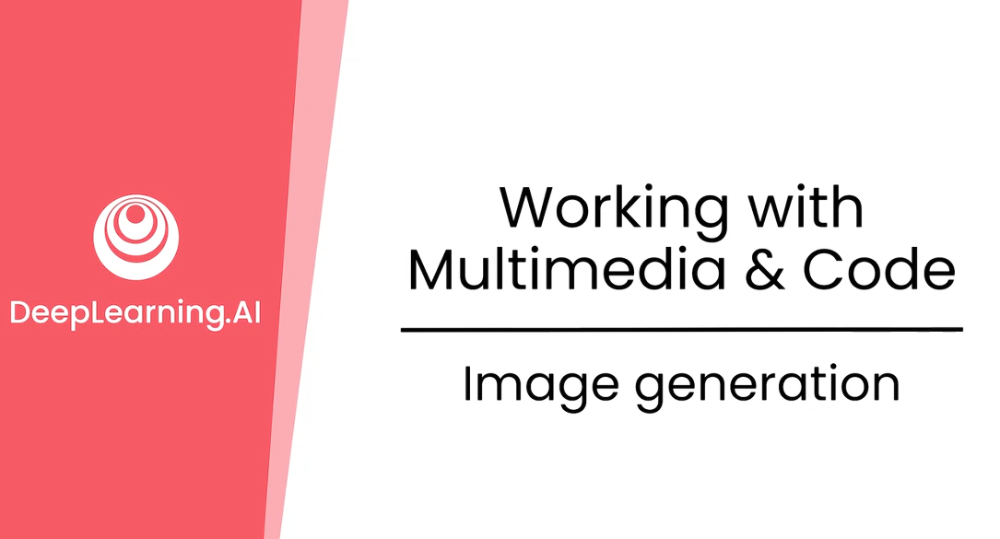
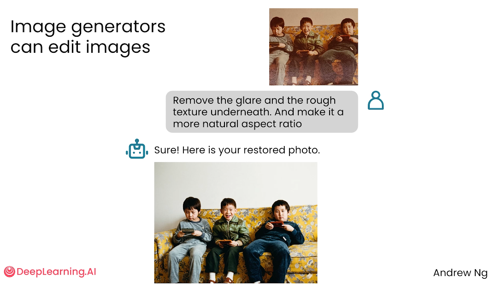
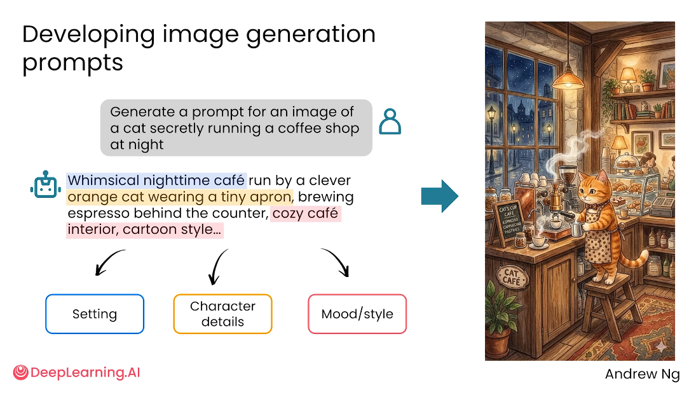
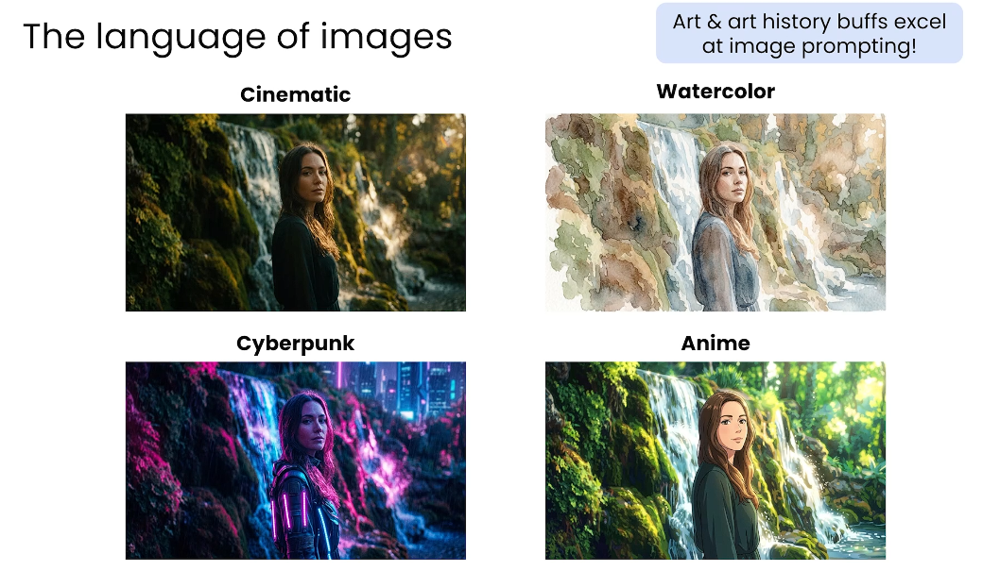
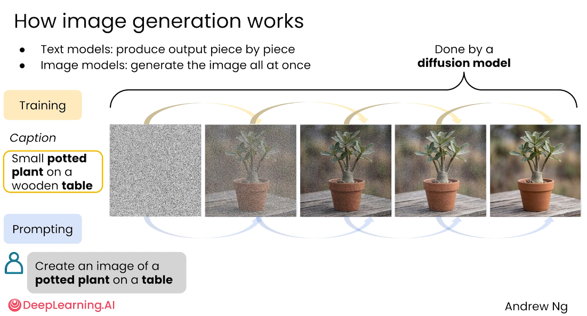
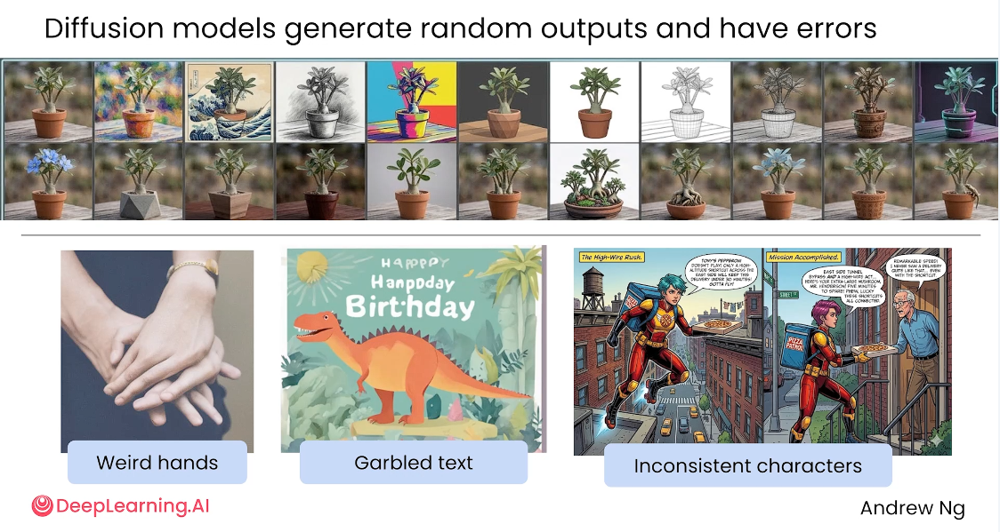
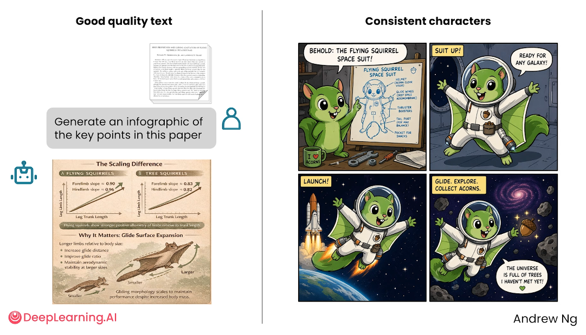
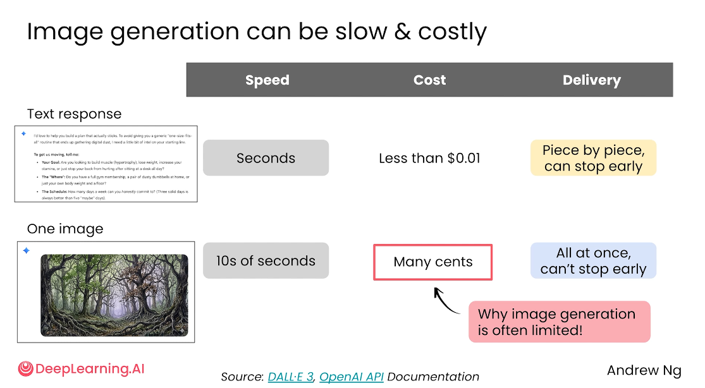

# 3.3 图像生成 Image generation

>主题：如何使用 AI 生成和编辑图片，如何编写更有效的图像生成 Prompt，以及扩散模型生成图片的基本原理与局限。



目前的 AI （比较出色的模型例如：Nano Banana、gpt image 2）不仅可以根据文字生成图片，也可以基于已有图片进行编辑，可以用自然语言删除画面中的人物、补全背景、改变风格或调整局部细节。

其实生成高质量 AI 图片并不是单纯输入一句话就结束，而是一种可以学习的技能。

好的图像 Prompt 通常需要明确主体、场景、动作、风格、构图、细节和约束；

由于图像生成存在随机性和误差，你需要通过多次生成和反复修改来获得更好的结果。


## 对已有图片进行编辑

图像生成模型不仅能“从零生成图片”，还能对已有图片进行修改。

你可以上传一张图片，并用文字说明想改哪里、怎么改。




图片编辑 Prompt 通常包含两个部分：

- **编辑对象**：要删除、替换、扩展或调整的内容；
- **编辑目标**：希望最终画面呈现出的效果，例如更自然、更协调、更符合某种比例。

图像编辑的关键是让 AI 明确知道“保留什么”和“改变什么”。

如果只说“帮我改好看一点”，模型可能会过度修改，导致结果偏离原图。


## 让 AI 帮你写图像 Prompt

如果你还不知道如何写图像生成 Prompt，可以先让文本模型帮忙扩写提示词。



你想生成“一个猫咪偷偷经营咖啡店”的图片，直接描述可能过于简单。

可以先让文本 AI 生成更详细的 Prompt，让它补充完整：

- 角色细节；
- 场景环境；
- 角色动作；
- 画面风格；
- 光线氛围；
- 构图与镜头感。

这样做的好处是：你只需要提出核心想法，AI 可以把它转化为更适合图像模型理解的描述。


## 一个完美的图像 Prompt 应该描述哪些要素？

一个质量较高的图像 Prompt，通常需要明确以下几个方面：

- **主体**：画面中最重要的人、动物、物体或场景，例如"一只橘猫""一个复古咖啡馆""一台老式咖啡机"；
- **场景**：画面发生在哪里，环境是什么样的，例如"夜晚的小巷""温暖灯光下的咖啡店""窗外有细雨"；
- **动作**：主体正在做什么，例如"猫咪站在吧台后面，偷偷为客人制作咖啡"；
- **风格**：希望呈现出的视觉风格，例如 cinematic、watercolor、cyberpunk、anime、photorealistic；
- **细节与氛围**：光线、色彩、情绪、镜头、构图等视觉细节，例如 soft warm lighting, cozy atmosphere, shallow depth of field, highly detailed。

这些要素写得越具体，图像模型越容易生成符合预期的结果。


## 图像也有自己的“语言”

图像生成模型能够理解很多视觉艺术相关的表达方式。例如：

- **Cinematic**：电影感，强调光影、镜头和叙事氛围；
- **Watercolor**：水彩风格，画面柔和、有手绘质感；
- **Cyberpunk**：赛博朋克风格，常见霓虹灯、未来城市、强对比色；
- **Anime**：动漫风格，强调角色线条、表情和二次元视觉特征。

这些词不是普通修饰语，而是图像模型学习过的视觉风格标签，你掌握得越多，就越容易控制生成结果。

学习图像生成 Prompt，不只是学习“怎么描述内容”，还要学习“怎么描述画面语言”。




## 为什么图像比文本生成更贵?

在训练阶段，模型会学习大量图片与文字描述之间的关系。

它需要理解什么样的像素组合对应“猫”，什么样的图像结构对应”咖啡店”，什么样的视觉特征对应”水彩风格”，什么样的画面符合”桌上的盆栽”。

训练的目标是让模型学会”文字描述”和”视觉图像”之间的映射关系。

在生成阶段，扩散模型通常不是像人画画那样从轮廓开始一步步描线，而是从随机噪声开始，逐步去除噪声，让图像越来越接近 Prompt 描述的目标。可以理解为：

```markdown
随机噪声 → 粗略轮廓 → 主体成形 → 细节增强 → 最终图片
```

当 Prompt 是“桌子上的一盆植物”时，模型会逐步把噪声转换成带有桌子、花盆、植物等元素的图像。




## 那么这种扩散模型是有随机性与错误出现

图像生成不是完全确定的。同一个 Prompt 反复生成，可能得到不同图片。

这种随机性既是优点，也是限制。

好的一面是，可以一次生成多个创意版本，适合探索不同构图和风格，用户可以从多个候选中挑选最合适的结果。

但模型也可能生成错误或不稳定细节，例如：

- 手部结构异常；
- 文字乱码或不清晰；
- 多张图中的角色形象不一致；
- 物体数量、位置或细节不符合要求；
- 画面局部看似合理，但仔细看会有问题。

比如：“奇怪的手”、“乱码文字”、“角色不一致”等，说明图像模型虽然视觉效果越来越强，但仍然不保证每个细节都准确。




## 把文字生成到图片里的难点

>此番言回顾：在Nano Banana没有出来之前，让AI生成带文字的图片，特别是中文图片，就非常困难；但是在Nano Banana出来之后，大家眼前一亮，发现中文文字也可以直接AI生成了，但是需要给Banana非常完整的提示词，生成的效果还得看你的运气；再到最近的gpt image 2，随便一句话可以任意修改图片中的文字，不管是中文还是英文，不管是人物画像还是物品风景，简直超乎你的想象~

图像模型可以生成看起来像文字的区域，但不一定能稳定生成真正可读、准确的文字。

例如，如果想让图片里出现海报、邀请函、菜单或标牌时，模型可能生成“看起来像文字”的内容，但具体字母、单词或排版可能错误。

因此，如果图片中必须出现准确文字，更稳妥的方法是：

- 先生成不带文字的背景图；
- 再用设计软件或排版工具添加文字；
- 或者在后续编辑中单独处理文字区域。




## 角色一致性的难点

图像模型在多张图中保持同一角色的一致性并不容易。

要生成漫画分镜、角色连续动作图或同一人物的多场景图片时，模型可能让角色的衣服、脸型、发型或配饰发生变化。

这说明图像生成模型更擅长生成“单张好看的图”，但在“连续画面一致性”和“角色长期保持一致”方面仍然需要更强的控制手段。


## 图像生成与文本生成的不同

文本生成和图片生成的输出方式不同。

文本模型通常是一个词、一个词地生成，所以用户可以看到回答逐步出现。

图像模型则更接近“一次性生成整张图片”，用户往往需要等待一段时间才能看到最终结果。

这也带来两个影响：

- 图片生成通常比文本生成更慢；
- 图片生成通常比文本生成更贵；

在实际使用中，文本回复可能几秒完成，成本很低；而一张图片可能需要更长时间，并消耗更多计算资源。





## 使用图像生成 AI 的实践建议

### 1. 先写清楚核心目标

不要只写“生成一张好看的图片”，而要说明图片用途和主题。

```markdown
为一篇介绍 AI Prompt 学习的文章生成封面图，画面需要科技感、简洁、适合公众号头图。
```

### 2. 明确主体与场景

```markdown
主体是一名正在电脑前学习 Prompt 的学生，旁边有浮动的关键词卡片，背景是简洁的未来感书房。
```

### 3. 添加风格词

```markdown
clean illustration, soft lighting, modern tech style, high detail, 16:9.
```

### 4. 加入限制条件

```markdown
不要出现多余文字，不要复杂背景，不要夸张表情，不要水印。
```

### 5. 多生成几版再筛选

图像生成具有随机性，一次结果不一定最好。更好的做法是生成多个版本，再从中选择构图、风格和细节最合适的一张。

### 6. 对关键细节进行二次编辑

如果整体效果不错，但局部有问题，可以继续要求模型局部修改，例如：

```markdown
保留整体构图和风格，只修改人物的手部，让手指更自然。
```

## 可直接套用的 Prompt 模板

### 从零生成图片

```markdown
请生成一张图片：主题是【主题】。主体包括【主体细节】。场景是【场景描述】。画面风格为【风格】，光线为【光线】，构图为【构图】。图片用途是【用途】。不要出现【不需要的元素】。
```

### 让文本 AI 帮你扩写图像 Prompt

```markdown
我想生成一张关于【核心想法】的图片。请帮我写一个适合图像生成模型使用的英文 Prompt，要求包含主体、场景、动作、风格、光线、构图和细节，同时给出 3 个不同风格版本。
```

### 编辑已有图片

```markdown
请基于这张图片进行编辑：保留【需要保留的内容】，修改【需要修改的内容】，最终效果要求【目标效果】。不要改变【不能改变的内容】。
```

### 控制图片风格

```markdown
请将这张图改成【风格】风格，保留主体形象和主要构图，增强【光线/色彩/材质/氛围】，不要添加无关元素。
```

### 批量生成候选方案

```markdown
请根据以下主题生成 5 个不同方向的图像 Prompt：
主题：【主题】
用途：【用途】
目标风格：【风格】
要求：每个 Prompt 的构图、色彩和氛围都要不同。
```


## 小结

此番言小小汇总一下内容：

AI 可以根据文字生成图片，也可以编辑已有图片。

想得到高质量图片，Prompt 需要具体描述主体、场景、动作、风格、光线、构图和限制条件。

图像模型理解很多视觉风格语言，例如 cinematic、watercolor、cyberpunk、anime 等。

扩散模型的生成过程可以理解为从随机噪声开始，逐步去噪并形成符合 Prompt 的图片。

但图像生成仍有局限，包括随机性、手部错误、文字乱码、角色不一致、生成速度慢和成本更高等。

实际使用时应通过多版本生成、局部修改和人工筛选来提升最终质量。