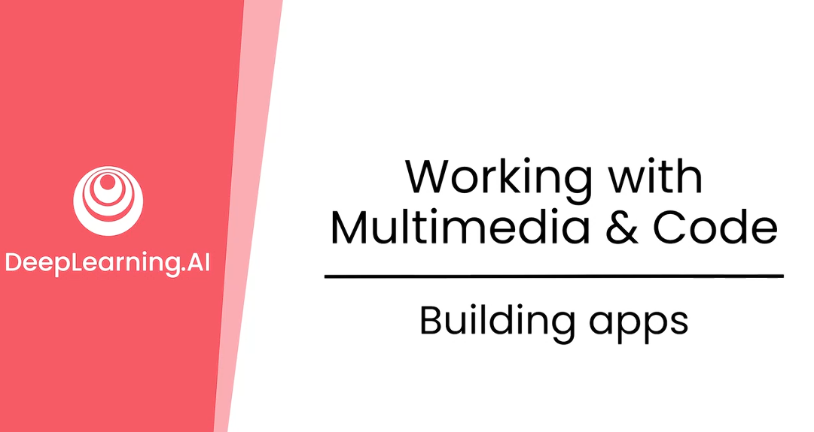
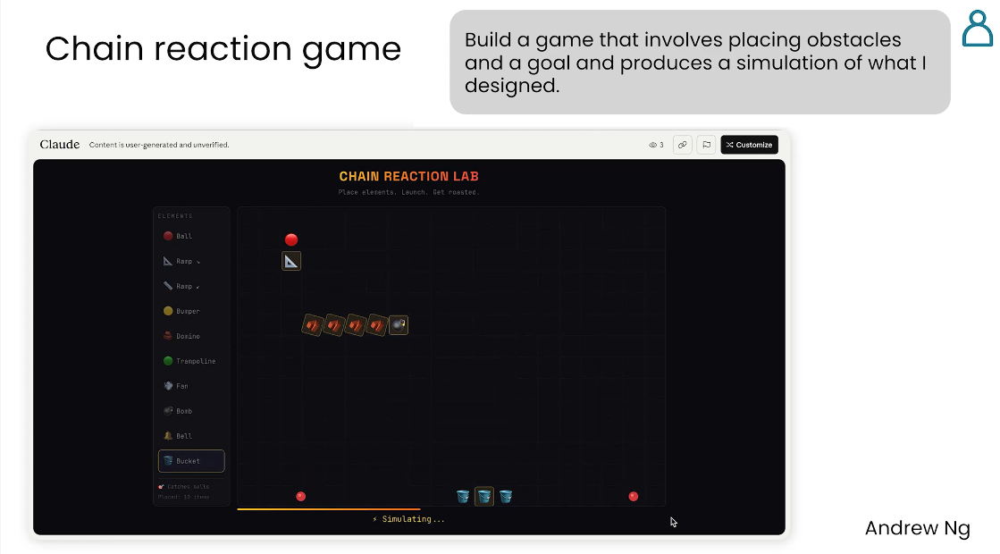
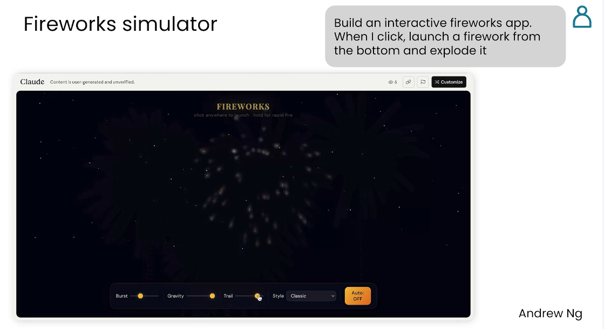
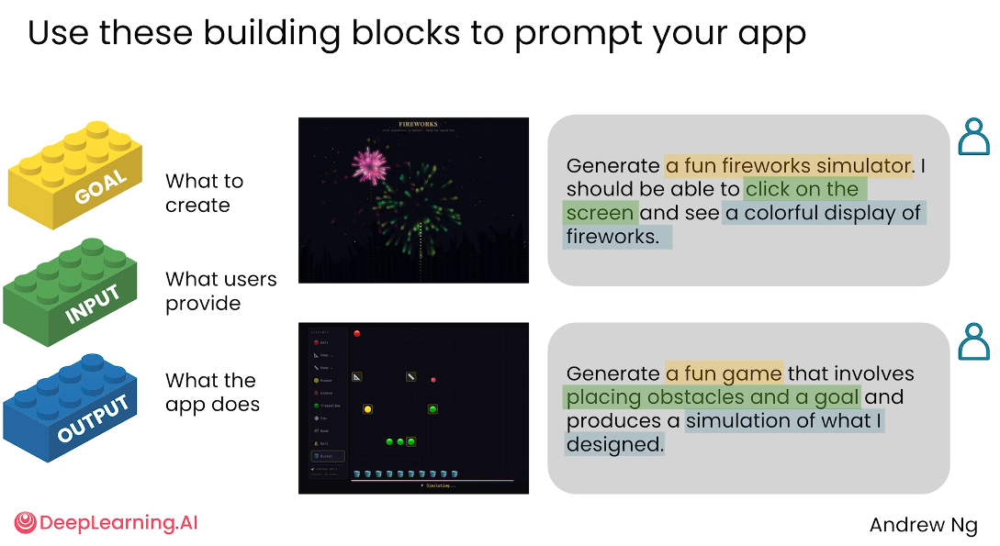
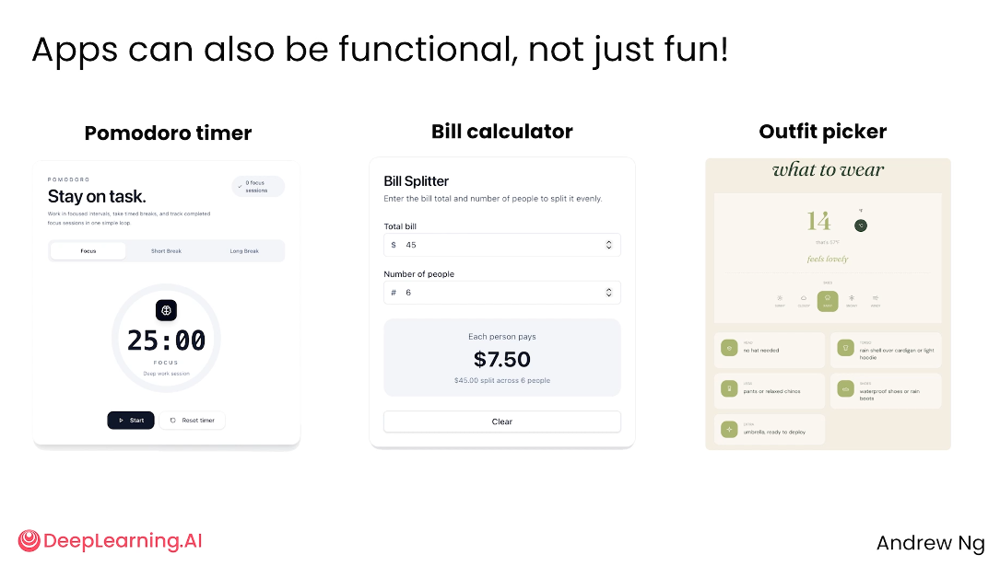
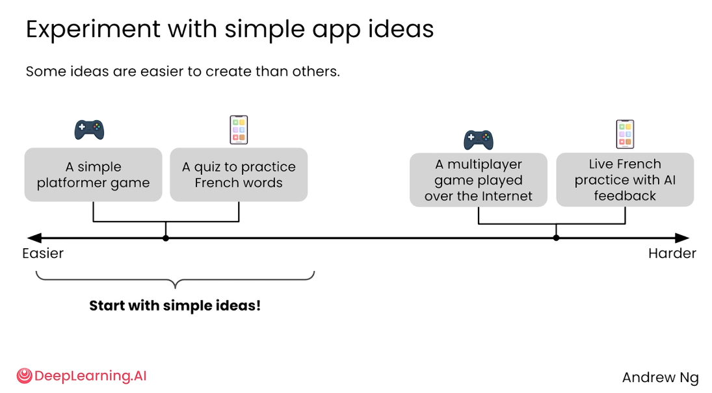

# 3.4 构建应用 Building apps

>主题：现在不一定需要完整掌握传统软件开发流程，用户可以通过清晰的自然语言提示词，让 AI 生成游戏、网页、小工具或数据分析类应用。课程强调从简单、可执行的应用想法开始练习，而不是一开始就尝试复杂系统。




AI 正在让“构建应用”的能力变得更加大众化。

用户即使只有一个简单提示词，也可能让 AI 生成一个可以运行的模拟程序、小游戏或网页应用。

这并不是说开发变得完全不需要思考，而是说入门门槛显著降低。




比如创建一个烟花模拟器，你可以这么发给AI：

> 生成一个有趣的烟花模拟器，用户点击屏幕后，可以看到彩色烟花显示。




提示词中同时包含了应用目标、用户交互方式和输出效果，AI 更容易理解要生成什么。


## 提示词的三个组成部分

用积木图解释了应用提示词的结构：

| 组成部分 | 含义         | 示例             |
| -------- | ------------ | ---------------- |
| Goal     | 要创建什么   | 一个烟花模拟器   |
| Input    | 用户提供什么 | 用户点击屏幕     |
| Output   | 应用做什么   | 展示彩色烟花效果 |




## 可复用提示词模板

```text
Generate a [应用类型].
Users should be able to [用户如何操作或输入].
The app should [应用产生的结果或核心功能].
```

中文写法可以是：

```text
请生成一个[应用类型]。
用户可以通过[输入方式/交互方式]使用它。
应用需要实现[输出结果/核心功能]。
```


这三个部分越清晰，AI 生成的应用越接近预期。

对于初学者来说，不需要一开始写复杂需求文档，但至少要把“做什么、用户怎么操作、结果是什么”讲清楚。


生成的应用不仅可以是小游戏，也可以是实用工具：

- **番茄钟 Pomodoro timer**：帮助用户专注工作，进行倒计时管理。
- **账单分摊计算器 Bill calculator**：用户输入总金额和人数，应用计算每个人应付多少钱。
- **穿搭选择器 Outfit picker**：根据天气、场景或用户偏好，帮助用户决定穿什么。

AI 适合从小型、边界明确的任务开始落地。

应用目标越具体，交互越简单，越容易成功生成。


示例提示词

示例 1：烟花模拟器

```text
请生成一个有趣的烟花模拟器。用户点击屏幕后，可以看到彩色烟花在屏幕上绽放。
```

示例 2：账单分摊计算器

```text
请生成一个账单分摊计算器。用户输入账单总金额和用餐人数后，应用自动计算每个人需要支付的金额。
```

示例 3：番茄钟

```text
请生成一个番茄钟应用。用户可以设置专注时间和休息时间，应用需要显示倒计时，并在时间结束时提醒用户。
```





## 不同应用想法的难度不同

并不是所有应用都同样容易创建。

简单工具或小游戏更适合初学者，而联网、多用户、实时反馈、复杂逻辑类应用难度更高。

从简单到复杂的大致顺序可以理解为：

| 难度   | 应用示例                 | 原因                                  |
| ------ | ------------------------ | ------------------------------------- |
| 较简单 | 简单平台跳跃小游戏       | 逻辑较直观，交互较少                  |
| 较简单 | 法语单词练习测验         | 输入输出明确，功能边界清楚            |
| 较复杂 | 联网多人游戏             | 涉及网络通信、状态同步和多人交互      |
| 较复杂 | 带 AI 反馈的实时法语练习 | 涉及语音/文本理解、反馈生成和实时交互 |





## 给初学者的建议

初学者应该先从“一个提示词就能表达清楚”的简单应用开始。

这样可以更快看到结果，也更容易理解 AI 在代码生成、网页构建和数据分析中的作用。

AI 不仅可以写网页和小游戏，也可以编写代码完成数据分析任务。

学习重点不是只会写一句提示词，而是学会把需求拆成明确的目标、输入和输出。

**此番言总结**：使用 AI 构建应用时，不要只给出模糊想法，而要明确说明应用目标、用户输入和输出结果。对于初学者，最适合从功能单一、交互简单、边界清楚的小应用开始，例如小游戏、测验、计时器、计算器等。随着提示词设计能力和代码理解能力提升，再逐步尝试联网、多用户、实时反馈或复杂数据分析类应用。

