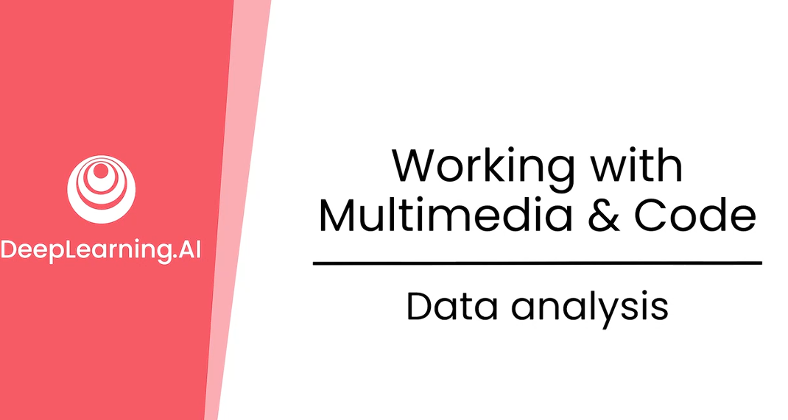
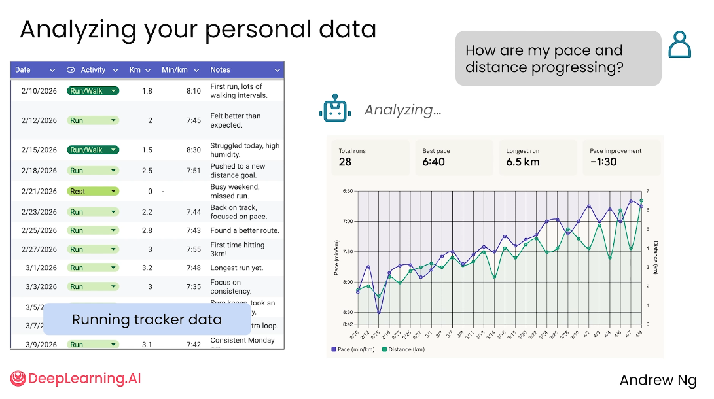
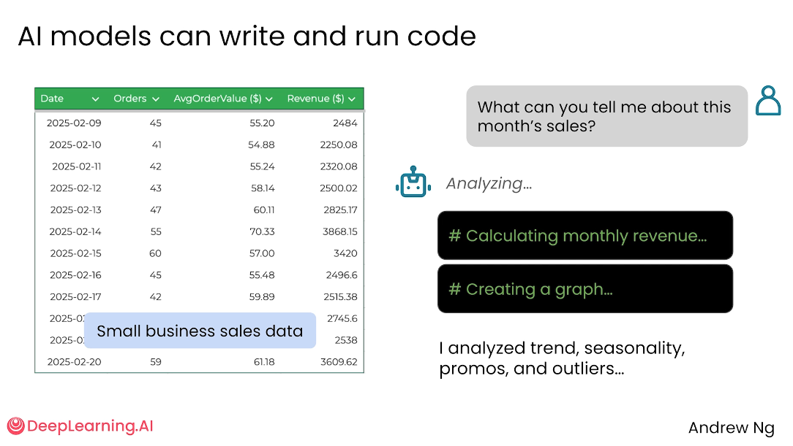
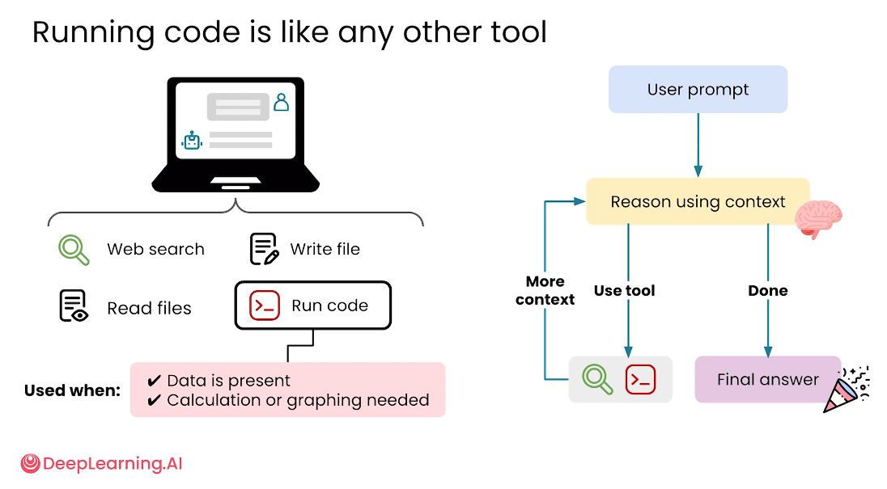
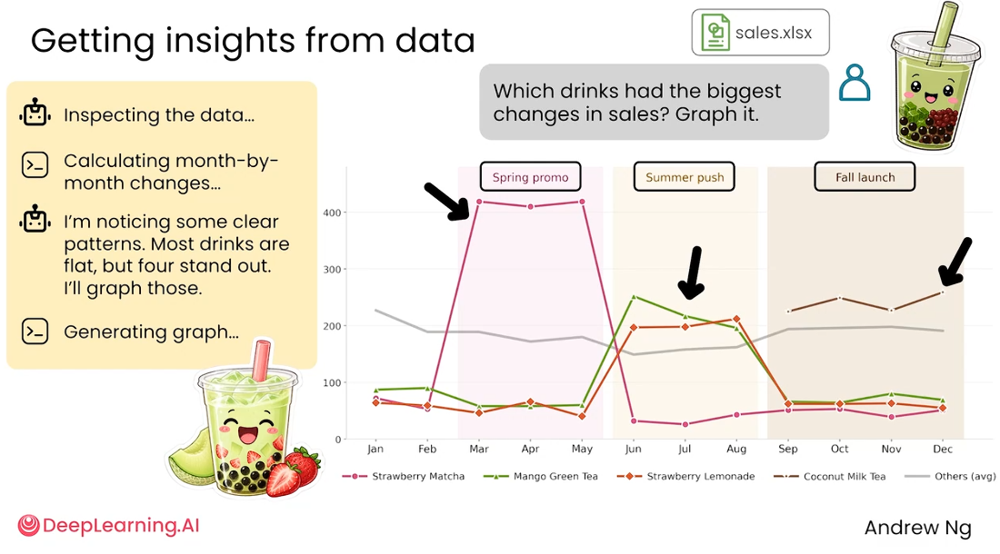
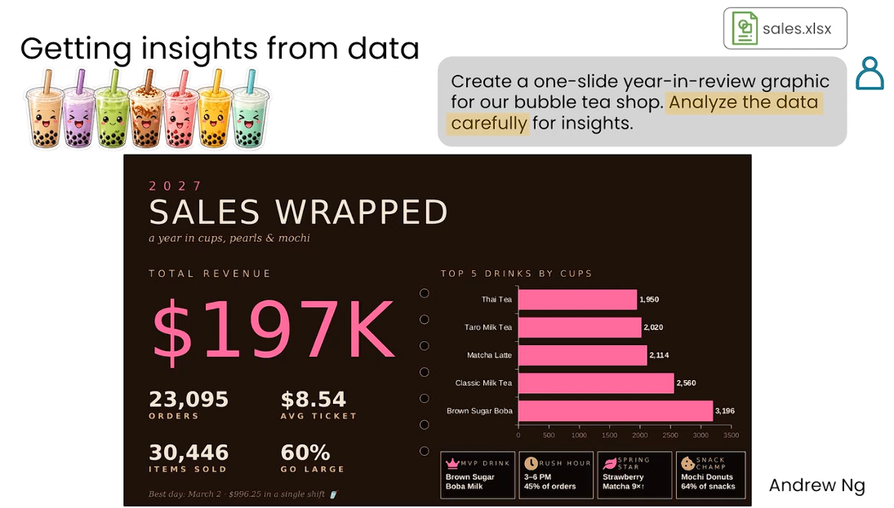
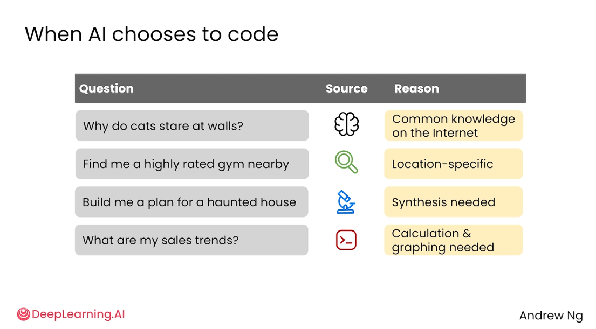

# 3.5 数据分析 Data analysis

>主题：AI 不只是聊天工具，也可以像使用网页搜索、读写文件一样调用“运行代码”工具，对表格数据进行计算、绘图、异常发现和洞察总结。




当用户提供表格、销售记录、运动记录等结构化数据时，AI 可以自动判断是否需要写代码、运行代码，并用代码完成统计计算、趋势分析和图表生成。

对于普通用户来说，不需要自己会写 Python、Excel 公式或复杂的数据分析流程，只要把数据和目标说明清楚，AI 就能帮助完成基础甚至较复杂的数据洞察任务。


---

## AI 可以分析个人或企业数据

用户可以把自己的数据交给 AI 分析，例如：

- 个人运动追踪数据；
- 企业销售记录；
- 小商家的月度销售表；
- 不同产品、不同时间段的销售变化数据。

AI 不只是读取表格内容，还可以进一步生成图表，例如根据运动记录绘制趋势图，或者根据销售记录分析某个月的销售额变化、季节性变化和异常点。

传统情况下，用户需要在 Excel 或 Google Sheets 中手动筛选、写公式、画图。

AI 可以把这些操作自动化，尤其适合不熟悉数据分析工具但有明确分析需求的用户。




---

## AI 模型可以“写代码并运行代码”

视频展示了一个小型商家销售数据表，并提出问题：

> What can you tell me about this month’s sales?  
> 你能告诉我这个月的销售情况吗？

AI 在分析这类问题时，可能会自动执行以下操作：

- 计算月度收入；
- 创建图表；
- 分析趋势；
- 发现季节性变化；
- 找出促销活动或异常值；
- 给出总结性结论。

所以 AI 不一定只是“看表格后凭感觉回答”，而是可以真的写出代码、运行代码，并基于计算结果回答问题。

代码运行能力让 AI 的回答更可靠，尤其是在涉及数字、表格、图表和计算时。

它能减少人工计算错误，也能比用户自己在表格软件中慢慢操作更快。



---

## 运行代码和其他工具一样，是 AI 的一种工具调用能力

视频将“运行代码”放在 AI 工具体系中理解：

- Web search：网页搜索；
- Read files：读取文件；
- Write file：写入文件；
- Run code：运行代码。

当任务中出现数据文件、计算需求或绘图需求时，AI 可能会选择调用运行代码工具。




### 适合运行代码的情况

- 用户上传了数据表；
- 需要计算汇总指标；
- 需要生成图表；
- 需要找出趋势、异常或规律；
- 需要把大量数据转成可读结论。

### 不一定需要运行代码的情况

- 只是问一个常识问题；
- 只需要简单文本解释；
- 不涉及复杂计算或数据处理。


## 案例从表格到洞察：奶茶店销售数据

一个奶茶店销售数据案例，提问：

> Which drinks had the biggest changes in sales? Graph it.  
> 哪些饮品的销售变化最大？请画图展示。



AI 的分析过程大致包括：

- 检查数据；
- 计算不同月份的销售变化；
- 找出变化明显的饮品；
- 生成折线图；
- 解释不同饮品在不同季节的销售变化。

示例洞察包括：

- 草莓抹茶在春季表现明显更好；
- 夏季促销可能提升了相关饮品销量；
- 秋季部分饮品出现变化，需要结合上下文进一步判断原因。

AI 的价值不只是“画出图”，而是把图表和业务语境结合起来，帮助用户理解：

- 哪个产品增长快；
- 哪个产品可能受季节影响；
- 哪个促销活动可能有效；
- 哪些变化值得进一步调查。

然后继续提问：

> Create a one-slide year-in-review graphic for our bubble tea shop. Analyze the data carefully for insights.  
> 为奶茶店创建一页年度回顾图，并认真分析数据以提炼洞察。

AI 可能会花几分钟完成分析，因为它需要：

- 读取全年销售数据；
- 计算年度总收入；
- 统计订单数量；
- 分析平均客单价；
- 找出最受欢迎的饮品；
- 总结复购率或增长指标；
- 将结果整理成一页可展示的视觉化图表。

示例年度回顾图包含：

- 年度销售额：约 **$197K**；
- 订单数量；
- 平均订单金额；
- 顾客数量；
- 复购或留存相关指标；
- 最受欢迎饮品排行。




> 此番言：较复杂的数据任务不一定能立即完成，AI 需要先进行计算和分析，再把结果组织成图文并茂的输出。用户在提示词中写清楚“认真分析数据”“提炼洞察”“生成一页总结图”，能提高结果质量。

---


## AI 什么时候会选择写代码？



常识问题，例如：

> Why do cats stare at walls?  
> 为什么猫会盯着墙看？

这类问题通常依赖常识或网络知识，不需要运行代码。

实时位置相关问题，例如：

> Find me a highly rated gym nearby.  
> 帮我找附近评分较高的健身房。

这类问题更依赖搜索、地图或位置工具，不一定需要运行代码。

综合生成类问题，例如：

> Build me a plan for a haunted house.  
> 帮我设计一个鬼屋方案。

这类问题更偏向方案整合和创意生成，也不一定需要运行代码。

数据分析类问题，例如：

> Create a one-slide year-in-review graphic for our bubble tea shop. Analyze the data carefully for insights.  
> 为奶茶店创建一页年度回顾图，并认真分析数据以提炼洞察。

当用户上传了表格，并要求 AI 计算、比较、画图、找规律时，就更可能触发代码运行工具。

---


## 如何让 AI 更好地分析数据

1. 明确上传的数据是什么

不要只说“帮我看看这个表”，而是说明数据含义

- 这是某奶茶店 2025 年每月销售数据；
- 每一行代表一种饮品在某个月的销量；
- 表中包含订单数、销售额、客单价和顾客数。

2. 明确分析目标

可以直接提出具体问题：

- 哪些产品销量变化最大？
- 哪些月份销售额最高？
- 是否存在季节性规律？
- 哪些促销活动可能有效？
- 请生成一张趋势图并解释。

3. 要求 AI 输出“结论 + 图表 + 依据”

比较好的提示方式是：

```text
请分析这份销售数据，找出销售额变化最大的产品，生成一张趋势图，并用 3-5 条要点解释主要变化原因。结论需要基于数据，不要只做泛泛总结。
```

4. 对复杂任务给 AI 足够的分析空间

例如年度回顾、商业报告、数据仪表盘等任务，可以提示：

```text
请认真分析这份全年销售数据，提炼最重要的业务洞察，并生成一页年度回顾总结。请包含总销售额、订单数量、平均客单价、热门产品排行和关键趋势说明。
```

---


## 提示词模板

模板 1：销售数据分析

```text
请分析我上传的销售数据，找出本月销售额、订单数量和平均客单价的变化情况。请生成图表，并总结 3 个最重要的业务洞察。
```

模板 2：产品销量变化分析

```text
请根据这份销售表，找出销量变化最大的产品，并画出它们按月份变化的趋势图。请说明哪些变化可能与季节、促销或用户偏好有关。
```

模板 3：年度回顾图生成

```text
请基于我上传的全年销售数据，生成一页年度回顾图。请认真分析数据，提炼关键指标和业务洞察，包括年度销售额、订单数量、平均客单价、热门产品排行和主要趋势。
```

模板 4：个人运动数据分析

```text
请分析我的运动追踪数据，总结最近一段时间的运动趋势，找出运动量变化、异常点和可以改进的地方，并生成一张趋势图。
```

---

## 总结

AI 的代码运行能力让它从“回答问题的聊天工具”扩展为“能处理数据的分析工具”。

当任务涉及表格、计算、图表和规律发现时，AI 可以自动写代码并运行代码，帮助用户快速完成数据分析。

对于普通用户而言，关键不是自己会不会写代码，而是能否把数据背景、分析目标和输出形式描述清楚。
