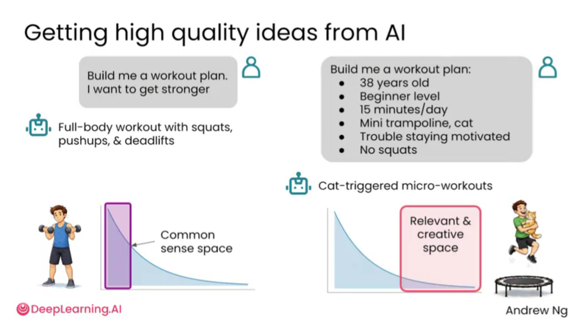
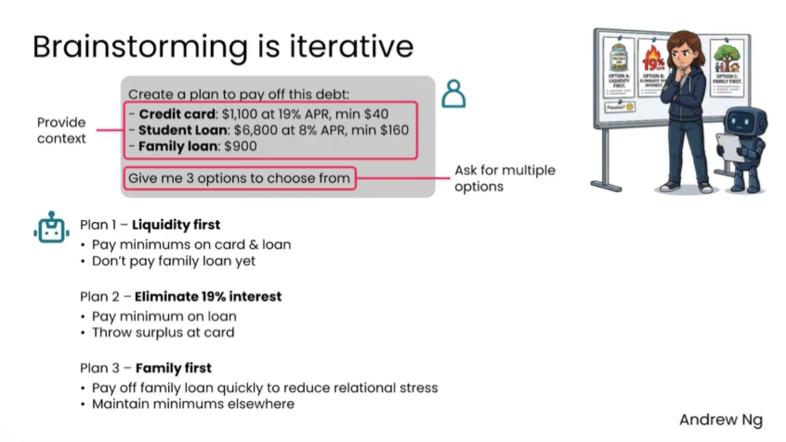
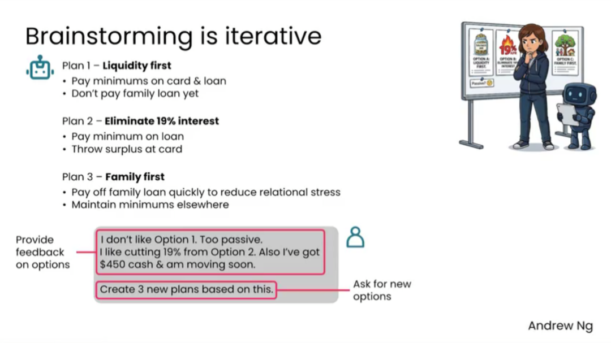

# 2.1 用 AI 头脑风暴｜Brainstorming with AI

> 主题：用 AI 进行发散式头脑风暴，快速得到多个候选方向。

AI 很适合生成选项，但它默认更容易给出“常识性、安全性、平均化”的答案。做头脑风暴时，不能只问一句“帮我想想”，而要提供具体背景、目标、限制和偏好，并通过多轮反馈把方案推向更有用的方向。

人类可能很快只能想到几个常见用途，而 AI 可以快速列出大量选项。不过，这不代表 AI 的想法天然更有创造力。模型通常会优先生成在训练数据中更常见、更合理、更符合平均预期的内容，所以它容易给出“普通但正确”的答案。

头脑风暴的关键不是“让 AI 替你决定”，而是“让 AI 帮你扩大可选空间”。例如让 AI 制定健身计划时，如果只说“帮我制定健身计划”，结果会很泛；如果补充年龄、训练经验、器械、每天可用时间、受伤情况、个人偏好，AI 才能给出更贴合实际的建议。

AI 在“查找事实”时偏向常识是优点，因为事实问答需要稳定可靠；但在“头脑风暴”中，过度常识化会限制创意。因此，用户要主动要求 AI 给出多样化选项，例如“给我 10 个常规方案、10 个反直觉方案、10 个低成本方案”，或者要求它从不同身份视角出发，如学生、产品经理、创业者、老师等。

AI 适合先给多个策略，再由用户根据现实情况筛选。例如信用卡、学生贷款、家庭借款的利率、最低还款额不同，AI 可以提出“优先降低高息负债”“优先保证现金流”“优先处理家庭关系”等不同策略。

真正高质量的头脑风暴是迭代式的。用户看完第一批方案后，要继续反馈：哪些太保守、哪些不可执行、哪些方向值得展开、哪些条件需要重新考虑。AI 的价值在于不断吸收反馈，生成更贴近目标的下一版。

AI 很适合作为头脑风暴对象。它不是最终决策者，也不是替代人的创意来源，而是一个可以持续给出候选方向、补充角度、扩展想法的协作对象。人在头脑风暴中容易受已有经验限制，AI 可以快速生成不同风格、不同路径、不同受众视角下的想法，帮助人把问题想开。

使用 AI 头脑风暴时，不应该只问一句“给我一些想法”。更好的方式是先告诉 AI：我要解决什么问题、目标用户是谁、有什么限制、希望想法偏实用还是偏创新、需要多少个方向、每个方向需要解释到什么程度。这样 AI 生成的内容才不会停留在泛泛而谈。

## 使用方法

头脑风暴可以分为三个阶段：

**发散阶段**：先让 AI 多给方向，不急着筛选。可以要求它从用户需求、商业价值、技术可行性、传播效果、低成本落地等不同角度生成想法。

**收敛阶段**：让 AI 根据评价标准对候选想法打分或排序。标准可以包括可执行性、成本、创新性、风险、用户价值、差异化程度等。

**深化阶段**：选择几个较好的方向，让 AI 继续扩展为方案、提纲、实验计划、产品功能、文案草稿或项目路线图。

## 关键提醒

头脑风暴的第一轮结果通常不应该直接使用。AI 的第一轮回答往往比较平均、保守、常见。更有效的做法是继续追问：

- 再给我 10 个更大胆的方向。
- 从反常识角度重新思考。
- 只保留成本最低、最快能验证的方案。
- 站在用户反对者的角度，指出这些想法为什么可能失败。
- 把最有潜力的三个方向扩展成可执行计划。