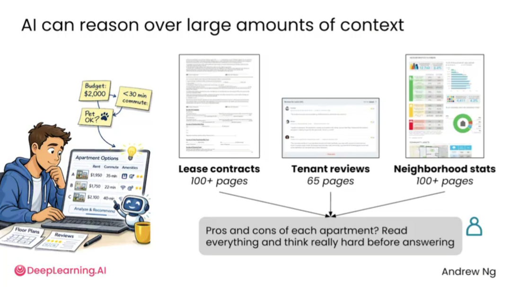
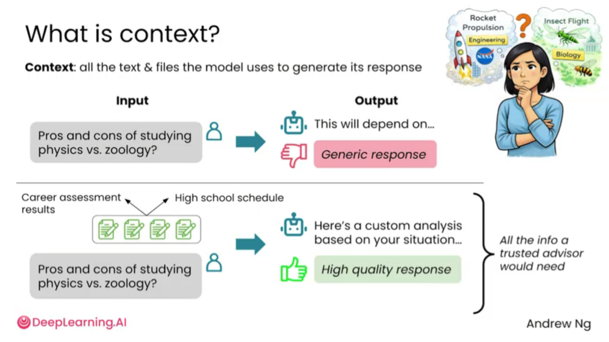
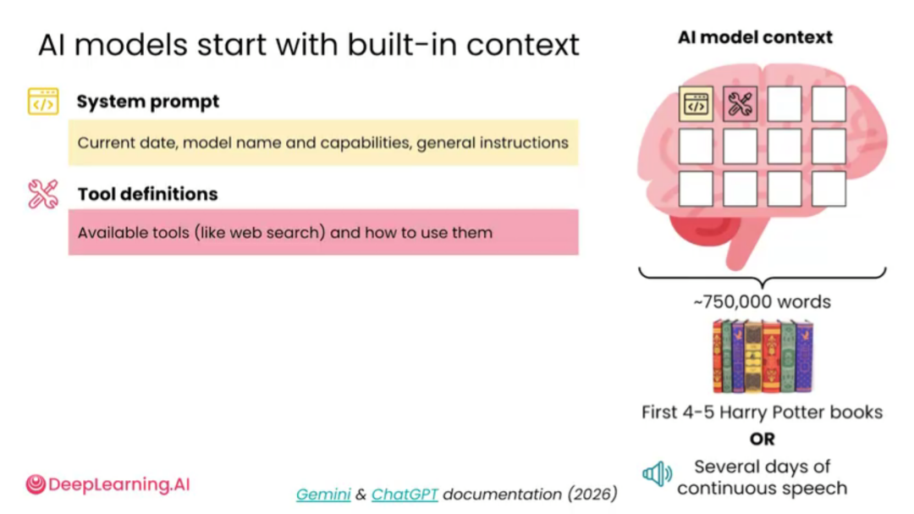
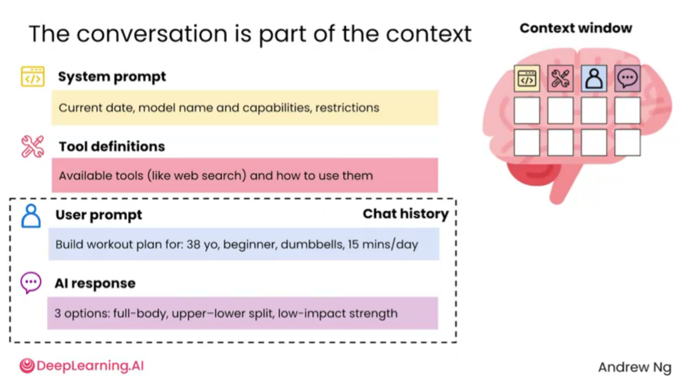
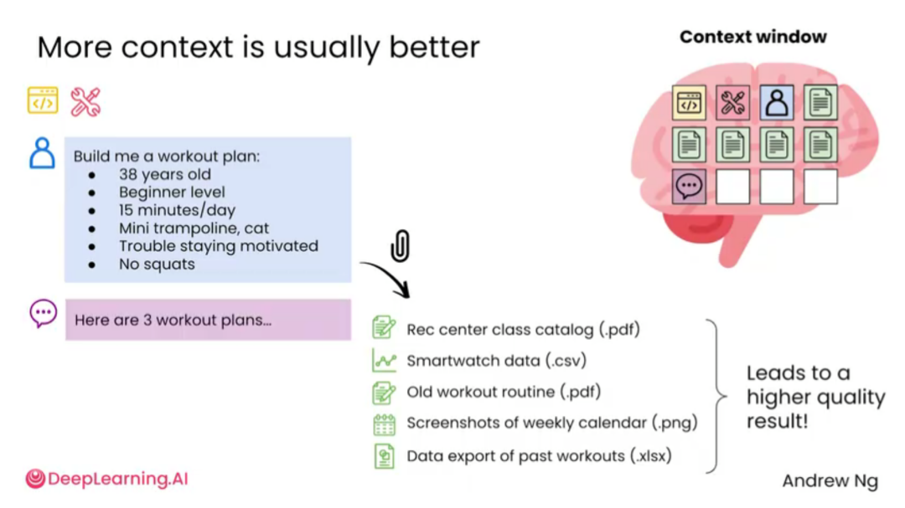
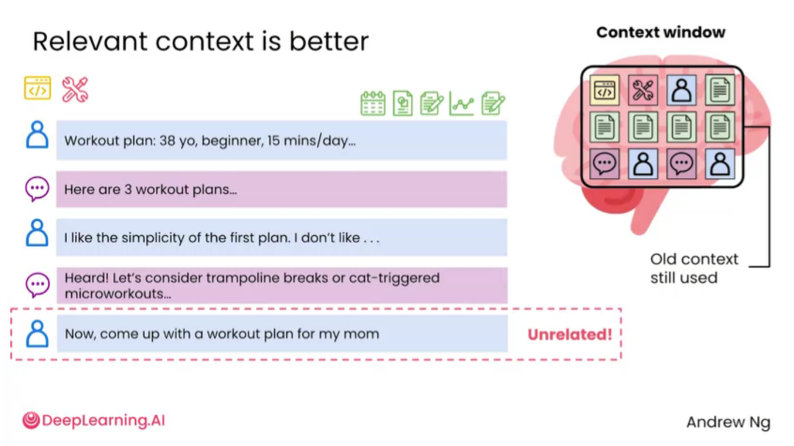
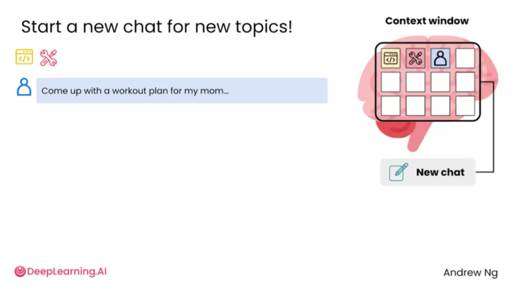

# 2.2 上下文[Context]


> 主题：给 AI 足够的上下文，使输出更贴合真实任务。

AI 的回答质量很大程度上取决于上下文。上下文就是模型在当前任务中能够看到、读取和参考的信息，包括用户输入的问题、前面对话、上传的文件、给出的示例、目标要求、格式限制、评价标准等。

很多人觉得 AI 回答不好，其实不是模型能力不够，而是给的信息太少。只说“帮我写一段文案”时，AI 不知道文案给谁看、用于什么平台、希望读者做什么、语气应该正式还是轻松、有没有禁用词、长度是多少、是否有参考样例。缺少这些信息，模型只能生成通用内容。

上下文是 AI 输出质量的基础。模型不是凭空理解用户的真实需求，而是根据当前对话、系统信息、文件、工具说明和用户输入来生成回答。相关上下文越准确，回答越可靠；无关上下文越多，反而可能干扰输出。


现代 AI 可以处理大量上下文，例如长合同、用户评价、统计资料、时间表、评估结果等。用户可以把复杂资料交给 AI，让它在这些资料之间建立联系、比较取舍、输出建议。




“上下文”可以理解为模型生成回答时看得到的一切文本和文件。它包括用户输入的提示词，也包括上传的文件、之前的对话、系统提示、工具定义以及 AI 已经生成过的内容。



对话本身也是上下文。前面聊过的内容会影响后面回答，因此同一个对话里，AI 会默认沿用此前的目标、偏好和限制。这个特性对连续工作很有用，例如持续修改健身计划、论文、商业方案等。




但上下文并不是越多越好，而是“相关上下文越多越好”。如果一个对话里混入了太多不相关主题，AI 可能会把旧信息错误带入新任务，导致回答跑偏。



当开启一个明显不同的新任务时，最好新建对话。这样可以避免旧上下文污染新问题，让 AI 更专注于当前目标。




>提示词不是孤立的一句话，而是上下文管理。会用 AI 的人，本质上是在管理 AI 能看到什么、忽略什么、如何组织信息。


## 上下文不是越多越好

上下文要相关、清楚、有结构。如果把大量无关信息全部丢给 AI，模型可能会抓错重点。比较好的写法是使用标题分块，例如“背景”“目标”“限制条件”“已有材料”“输出要求”。这样模型更容易理解信息之间的关系。

## 示例：差的提问与好的提问

差的提问：

```text
帮我写一个项目介绍。
```

好的提问：

```text
我需要写一个面向比赛评委的项目介绍。项目主题是【本地路线智能规划】，目标用户是周末出游但不想自己筛选路线的年轻人。项目通过 AI 结合地点数据、用户偏好和评价信息，生成可执行的一日游路线。
请写一段 300 字以内的项目介绍，语气专业但不要太宣传化，重点突出用户痛点、AI 能力和实际价值。