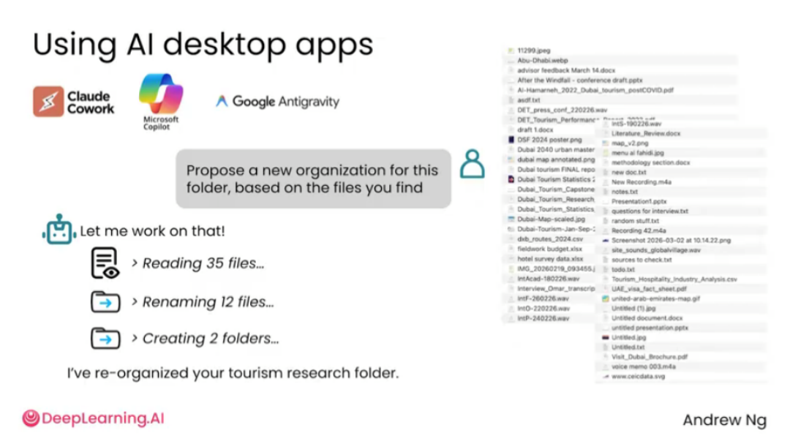
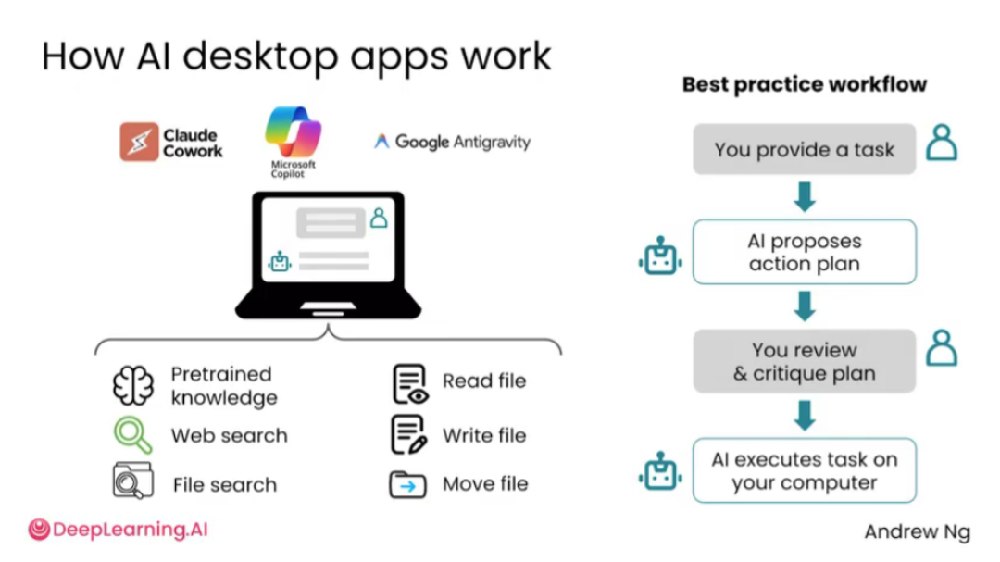
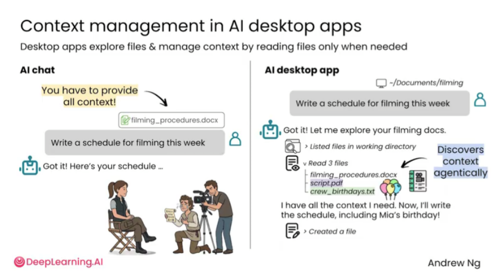
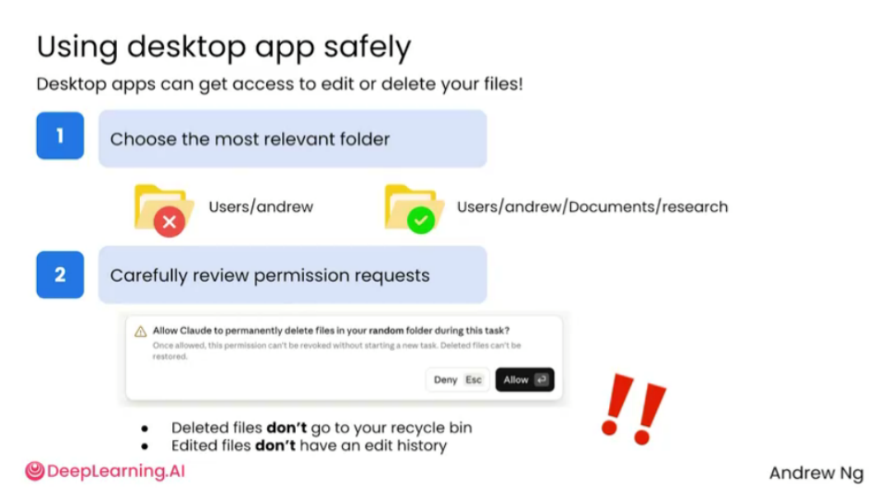

# 2.3 上下文[Context]

> 主题：使用桌面端 AI 应用读取文件、图片、网页或本地资料，减少来回复制。

AI 桌面应用把模型能力和本地文件系统连接起来，可以读取、整理、移动、改写文件，也可以基于文件提出行动方案。但这类工具同时涉及文件权限，因此必须明确授权范围，并让 AI 先提出计划，再执行修改。

与普通聊天不同，桌面应用可以接触用户文件、项目资料和工作文件夹，因此更适合处理“整理文件夹、生成计划、检查材料、写报告草稿”等任务。

AI 桌面应用的推荐流程是：用户提出任务，AI 读取必要文件，形成行动计划，用户检查计划，确认后再执行。这个流程可以降低误删、误改、误移动文件的风险。

桌面应用不会天然知道你的所有背景。即使它有文件访问能力，也需要用户提供任务目标和相关文件夹。AI 会按需读取文件，而不是一次性把所有内容都装入上下文。这样既能节省上下文，也能减少无关文件带来的干扰。

AI 桌面应用适合处理真实文件工作流，但必须遵循“最小权限、先计划、再确认、后执行”的原则。

与网页聊天相比，桌面应用更像一个随时可调用的工作助手。用户可以把文档、PDF、表格、截图、网页内容交给 AI，让它总结、比较、提取、改写、检查或生成下一步内容。

AI 只有在获得材料后才能准确处理任务。如果希望它基于某个文件回答，就要明确告诉它读取哪个文件、重点关注什么内容、输出什么格式。不要只说“看看这个文件”，而要说明具体任务。

> 桌面应用虽然方便，但仍然需要注意资料权限和隐私。敏感文件不应随意上传或分享。涉及合同、医疗、财务、法律等内容时，AI 可以辅助理解和整理，但最终判断仍应由专业人士或用户本人确认。