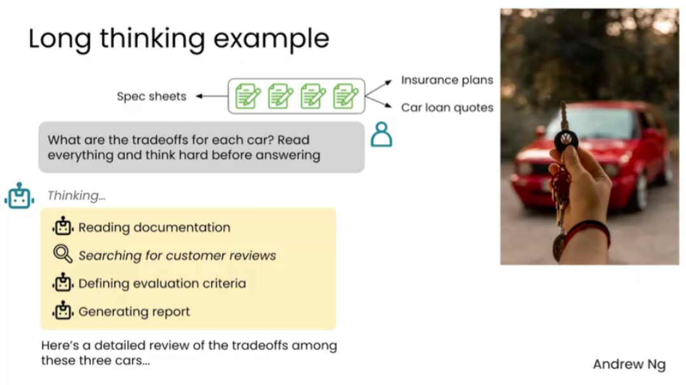
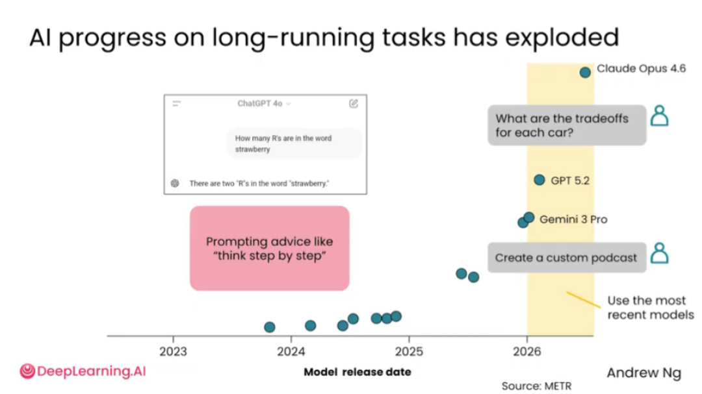
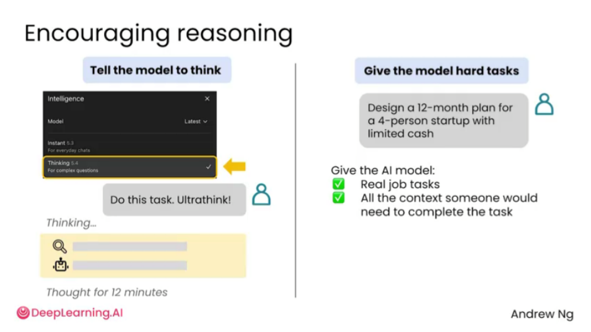
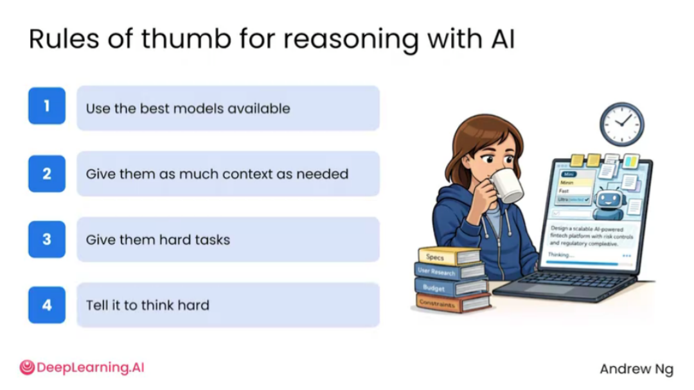

# 2.4 用AI推理[Reasoning with AI]

> 主题：在复杂问题中让 AI 进行更深入的推理，而不是只给表层回答。

AI 不只可以回答事实性问题，也可以帮助处理需要多步骤思考的复杂任务。例如比较多个选择、评估方案优劣、规划项目路线、分析风险、构建决策标准等。

对于复杂任务，关键不是简单写一句“逐步思考”，而是给 AI 足够的背景、材料和判断标准，并明确告诉它要谨慎分析。复杂问题通常没有唯一答案，因此 AI 的价值在于帮助用户把问题拆开、建立评估框架、列出假设、指出风险、比较取舍。

图中举例保险计划、规格说明、贷款报价等材料说明长思考任务：用户可以要求 AI 读完多份资料后，分析每个方案的权衡，而不是只做表面总结。

AI 在长任务能力上的快速进步。过去模型更擅长秒级问答，现在逐渐能承担更长的任务，如审查文档、写长文、分析复杂漏洞、整理大量信息等。

AI 推理通常包括：理解目标、读取上下文、拆解任务、制定计划、必要时调用工具、检查约束、给出最终答案。比如规划罗马一日游路线时，AI 需要估算路程、查询开放时间、安排顺序并输出可执行行程。

在复杂任务中可以明确要求模型深入思考，例如“think hard”“ultrathink”等表达。中文使用时可以写成“请认真推理，不要急着给结论；先列出判断标准，再给最终方案”。

使用 AI 推理的经验法则包括：尽量使用能力较强的模型；提供足够上下文；把任务设定得具体且有难度；要求 AI 在输出前检查约束、比较备选方案并说明原因。

AI 推理的重点不是“回答更长”，而是“回答前真的比较、验证和取舍”。复杂问题要让 AI 做过程，而不是只要结果。

复杂任务不要只让 AI 快速回答，而要让它进行推理：阅读资料、建立评价标准、比较方案、使用工具、验证结论。任务越复杂，越要给足上下文，并明确要求模型“认真思考”。

> AI 的推理结果不等于事实真相。它可以帮助你梳理思路，但可能遗漏信息，也可能基于错误假设得出结论。因此，对重要决策要让 AI 明确写出假设、证据和不确定性。这样用户才能判断哪些结论可信，哪些需要进一步验证。