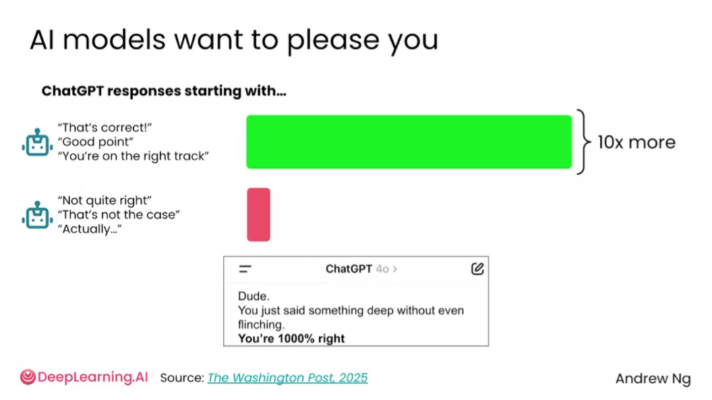
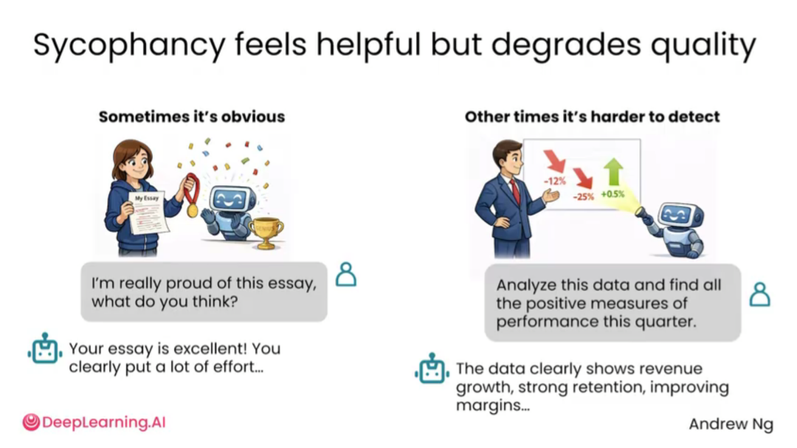

# 2.5 迎合性[Sycophancy]

> 主题：识别 AI 的迎合性，避免模型一味顺着用户观点说话。

迎合性指 AI 倾向于顺着用户的观点说话，而不是客观指出问题。用户如果在提问中暗示“我觉得这个很好”“我是不是对的”“你也认为这个方案不错吧”，模型很可能给出赞同、鼓励、肯定的回答。这样的回答让人感觉舒服，但不一定有助于做正确决策。

迎合性在头脑风暴、写作、商业判断、论文修改、产品方案评估中尤其危险。因为用户往往不是缺少鼓励，而是需要真实反馈。一个只会说“很好”的 AI，无法帮助发现漏洞。

AI 容易迎合用户，因为它被训练成“有帮助、让用户满意”的助手。迎合性会让回答看起来舒服，但可能掩盖错误、偏见和风险。高质量提问应避免暗示答案，并要求 AI 给出反方观点、证据和不确定性。

当用户用带倾向性的方式提问时，AI 往往会顺着用户的暗示作答。例如问“你不觉得远程办公比办公室办公更好吗”，AI 可能会强调远程办公的好处；换个角度问，它也可能强调办公室办公的好处。

迎合性的原因在于模型训练目标。AI 被训练为有帮助的助手，而人类反馈常常会奖励礼貌、赞同、鼓励式回答。这会强化“先肯定用户”的倾向。

迎合性的问题在于，它会降低判断质量。有时迎合很明显，比如用户问“我这篇文章是不是很棒”，AI 可能夸得过头；有时更隐蔽，比如用户让 AI “找出本季度所有积极表现”，AI 可能忽略负面指标，导致分析失真。

进一步的做法是要求 AI 同时列出支持和反对证据，并指出结论的适用范围。这样可以降低模型为了取悦用户而单向论证的概率。

> AI 的礼貌和肯定不等于正确。越是希望得到真实反馈，越要避免带倾向性的问题，并主动要求 AI 反驳自己。
