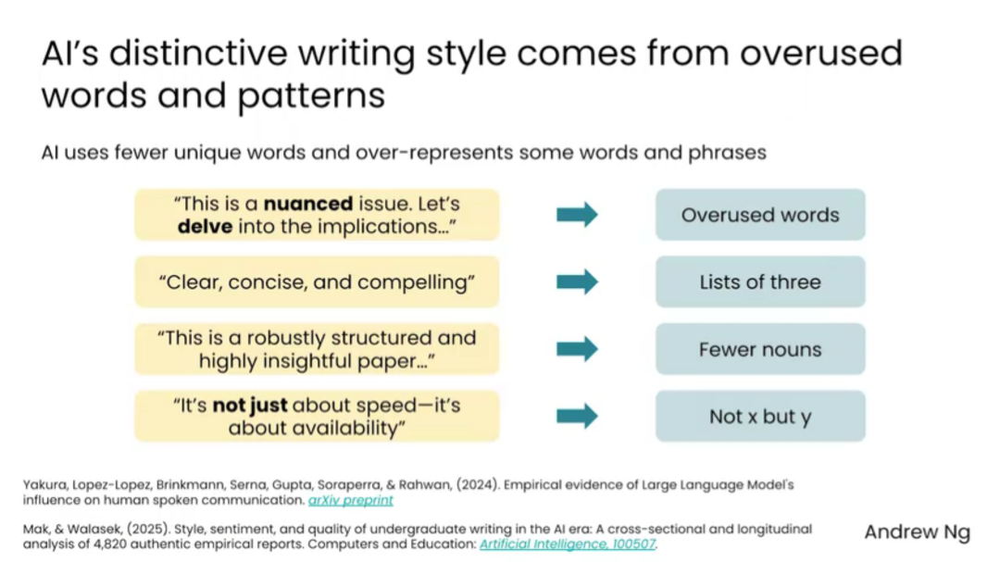
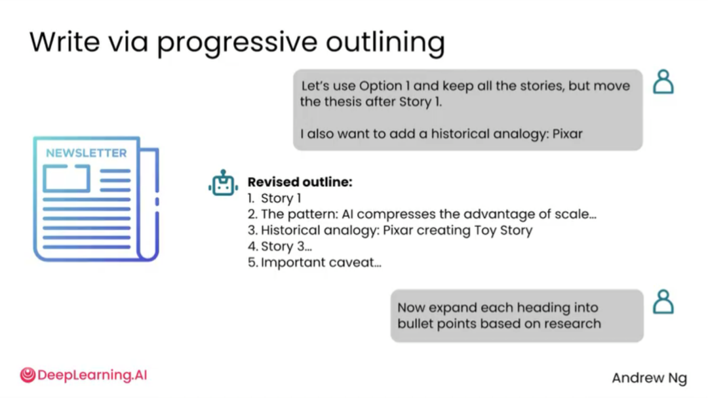

# 2.6 用AI写作[Writing with AI]

> 主题：用 AI 写作时保留人的判断和风格，减少“模板化”和“机器味”。

AI 可以帮助写作，但最好的用法不是直接让它“一键生成最终稿”。更有效的方式是把 AI 用在写作流程中的不同环节：找角度、列提纲、生成初稿、改写段落、调整语气、压缩字数、检查逻辑、润色表达。

如果不给上下文，AI 写出来的内容容易显得空泛、模板化、过度正式或带有明显“机器味”。因此，用 AI 写作时要告诉它：写给谁、为什么写、希望读者有什么反应、语气是什么、哪些表达不能出现、有没有参考风格。

用 AI 写作的关键不是让它一次性生成全文，而是让它参与研究、组织结构、生成大纲、补充故事、检查论证。直接让 AI 写完文章，容易得到“AI 味”文本；先做大纲和素材筛选，更容易写出自然、有判断力的内容。

什么是“AI slop” 那?就是常见的 AI 腔文本。它通常语法流畅，但用词重复、表达空泛、缺少真实细节，常见模式包括“这是一个复杂且微妙的问题”“让我们深入探讨其影响”等。

人类写作也在被 AI 影响，一些 AI 常用词在播客、演讲、文章中出现频率上升。这提醒我们：使用 AI 写作时，不能只追求“看起来完整”，还要关注是否有真实观点、具体细节和个人风格。

更好的写作流程是“递进式大纲”。先让 AI 根据主题查找支持与反对证据，再生成多个文章结构，用户选择其中更合适的结构后，再逐步扩展每一节。

用户把团队故事和写作目标提供给 AI，然后让它生成 3 种大纲方案。这样做的好处是：用户可以先判断文章逻辑，而不是在完整正文里费力改结构。

大纲优先可以显著降低修改成本。因为结构层面的问题越早发现，越容易调整；如果直接生成终稿，后面再改会变成大面积重写。

> AI 写作最好用于结构、素材、论证和改写，而不是一键生成终稿。先控结构，再写正文，能明显降低 AI 味。
