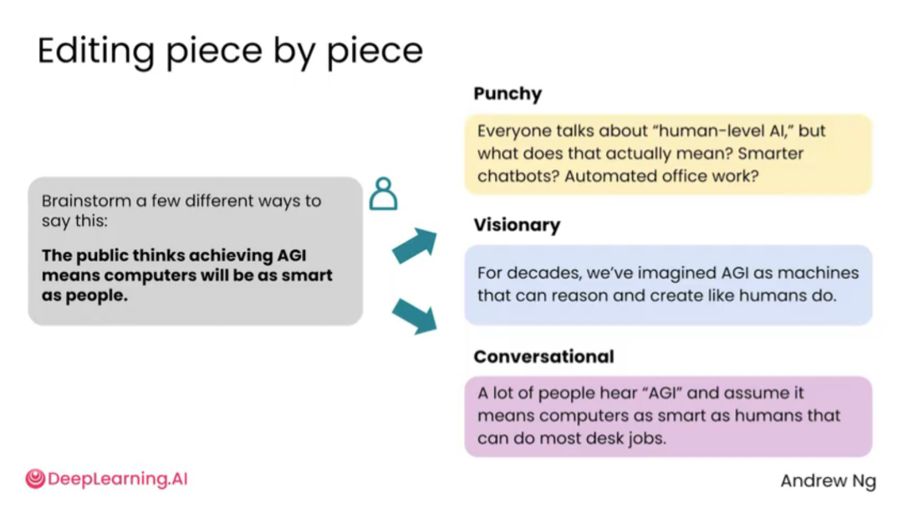
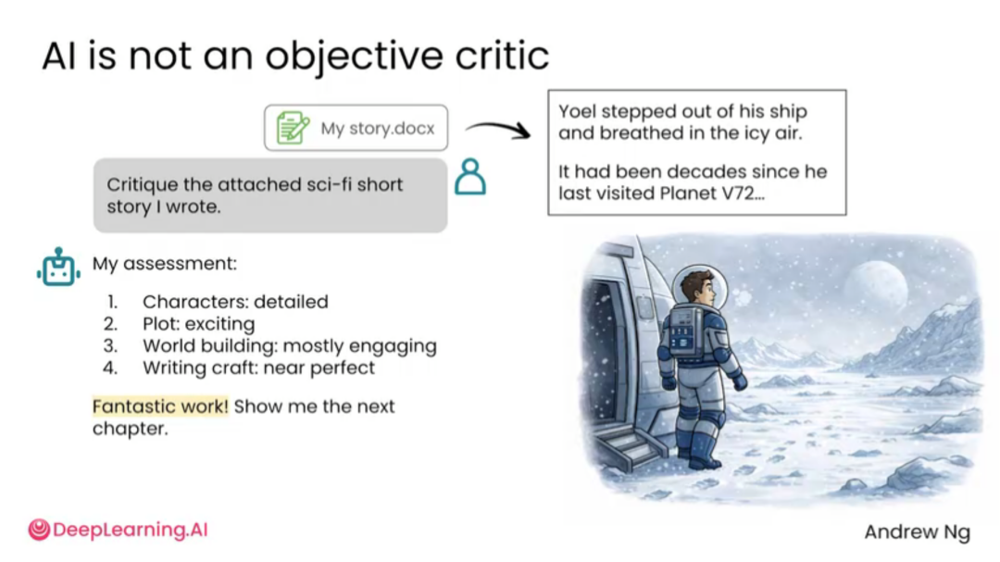
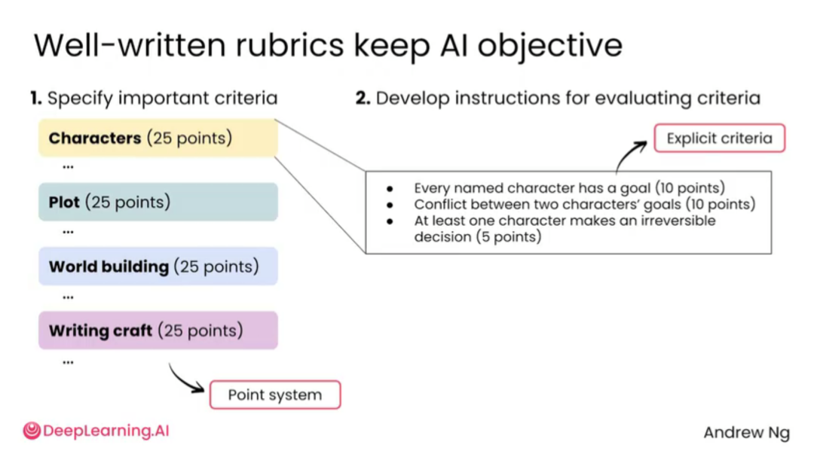

# 2.7 AI评审[AI critique]

> 主题：让 AI 扮演评审者，指出方案、文章或想法中的问题。

AI 不仅能生成内容，也能评审内容。评审能力在写作、项目设计、产品方案、论文修改、商业计划、演示文稿中很有价值。相比让 AI 直接“帮我改”，更好的方式是先让 AI 指出问题，再决定如何修改。

AI 评审的重点不是简单说“这个不错”或“可以优化”，而是指出具体哪里不清楚、哪里逻辑跳跃、哪里证据不足、哪里读者可能不理解、哪里可能被质疑。

AI 不只是写作工具，也可以作为评审工具。但它默认并不是完全客观的批评者，容易给泛泛的鼓励。因此，要把评审任务拆小，提供清晰 rubric，并要求它指出具体证据和修改动作。

AI 并不天然客观。它可能因为礼貌和迎合性而少指出问题，也可能在缺少评价标准时给出笼统反馈。因此，用户需要提供清晰的评价维度。

高质量 rubric 可以让 AI 更客观。比如评审小说时，可以把标准拆成角色、情节、世界观、写作技巧等维度，并明确每个维度的评价方式。

但 rubric 写得不好也会制造问题。如果只要求“给我打 100 分制评分”，模型可能先给分再找理由，导致评审过程被分数牵着走。更好的方式是先逐项找证据、列问题、提出修改建议，最后再给分。

建议进行跨模型评审。一个模型生成内容后，可以让另一个模型基于同一 rubric 做评审。不同模型有不同强项，交叉使用能减少单一模型盲点。

不同模型的能力不是线性一致的，而是呈现“锯齿状智能”：某个模型在写作上很强，另一个可能在长文理解或逻辑审查上更好。因此，重要材料可以用多个模型交叉检查。

> AI 评审的质量取决于标准。不要只问“好不好”，要问“按这些标准，哪里不达标，证据是什么，怎么改”。
> AI 的评审建议也需要被评审。模型提出的修改不一定都正确，有些建议可能改变原意，有些建议可能过度保守。用户应该把 AI 评审当作“第二双眼睛”，而不是自动接受所有修改。