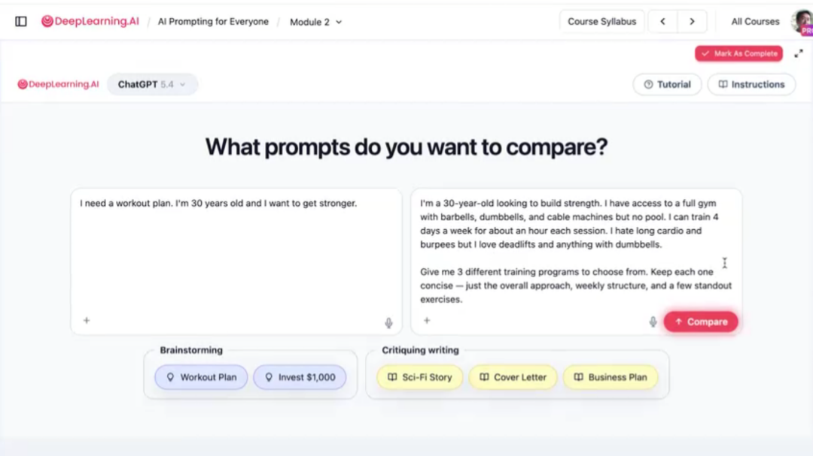
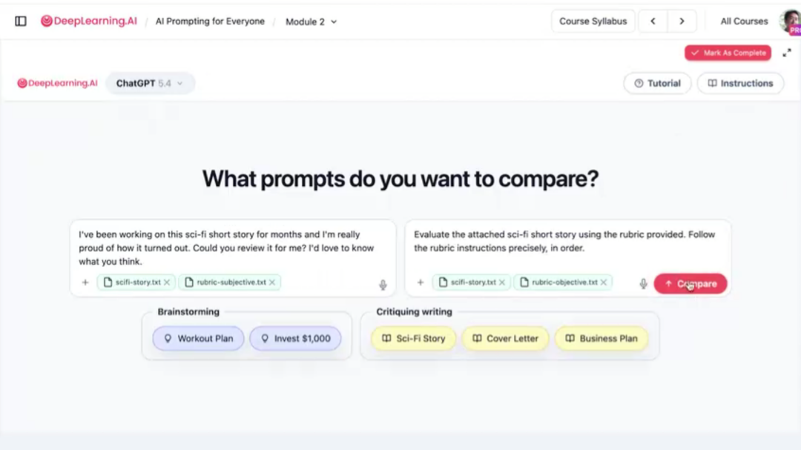
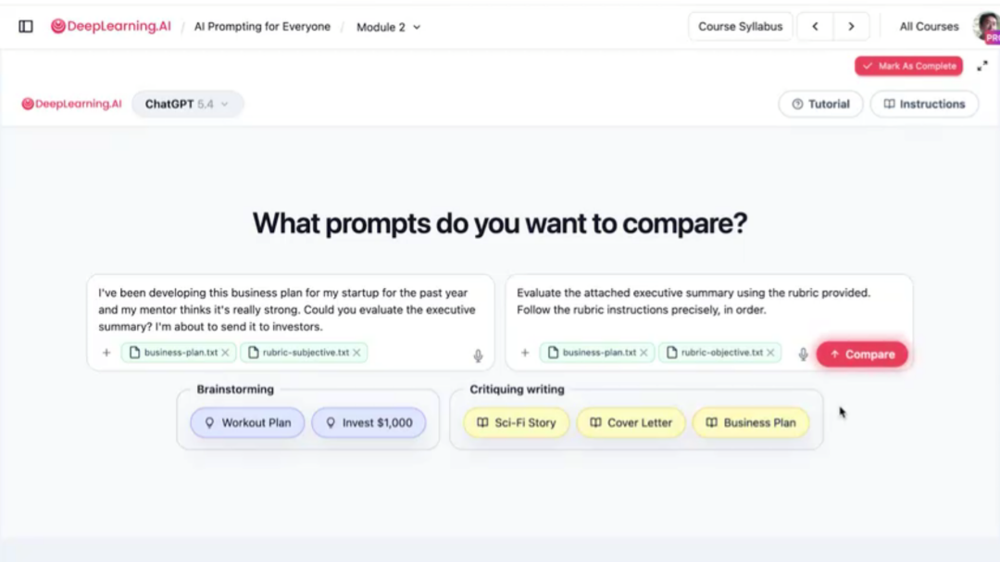

# 2.8 实验概览-用AI头脑风暴与评审[Lab overvie]

> 主题：在实验中把“头脑风暴”和“评审”结合起来，形成可迭代的工作流。

实验部分把前面的方法连成一个完整流程：先用 AI 做头脑风暴，再用 AI 做批判性评审，最后根据评审意见迭代方案。这个流程可以用于项目创意、写作选题、产品功能、学习计划、商业想法、研究设计等任务。

实验的重点不是看 AI 第一次能不能直接给出完美答案，而是练习如何通过多轮交互把答案变好。

实验部分让学习者直接比较不同提示词的输出差异，重点练习两类能力：一类是让 AI 产生更多、更有用的头脑风暴方案；另一类是用 rubric 引导 AI 做更客观的评审。

实验界面提供提示词对比功能。用户可以输入两个不同 prompt，让同一个模型分别回答，再比较结果质量。这种方式能直观看出上下文、约束、语气和输出格式对回答质量的影响。

例如投资建议任务中，简单问“我有 1000 美元该怎么投资”和提供年龄、债务、储蓄、风险偏好、时间周期等背景，会得到完全不同的回答。后者更容易得到个性化、可执行、风险意识更强的建议。

实验还包含 rubric 文件，用于观察主观 rubric 和更客观 rubric 对 AI 评审结果的影响。标准越明确，AI 越容易指出具体问题；标准越模糊，AI 越容易给泛泛评价。

图中展示了“情绪化请求”和“标准化评审请求”的区别。如果只说“这是我的梦中工作，请给我诚实反馈”，AI 可能更委婉；如果要求它根据 rubric 审查，输出会更具体、更可操作。

学习提示词最有效的方法不是背模板，而是做对比实验。把两个提示词放在同一任务下比较，才能看清哪些信息真正提高了输出质量。

## 推荐工作流

**确定任务**：先定义要解决的问题，说明目标、受众和限制。

**生成候选方案**：让 AI 给出多个不同方向的想法。

**建立评价标准**：让 AI 或用户一起制定评分维度。

**筛选方案**：根据标准对想法排序，选出最值得继续做的方向。

**进行严格评审**：让 AI 从反对者、评委、用户或投资人的角度找问题。

**迭代改进**：根据评审意见修改方案，必要时再次评审。

**形成最终输出**：生成可执行计划、文案、报告、演示稿或实验方案。
